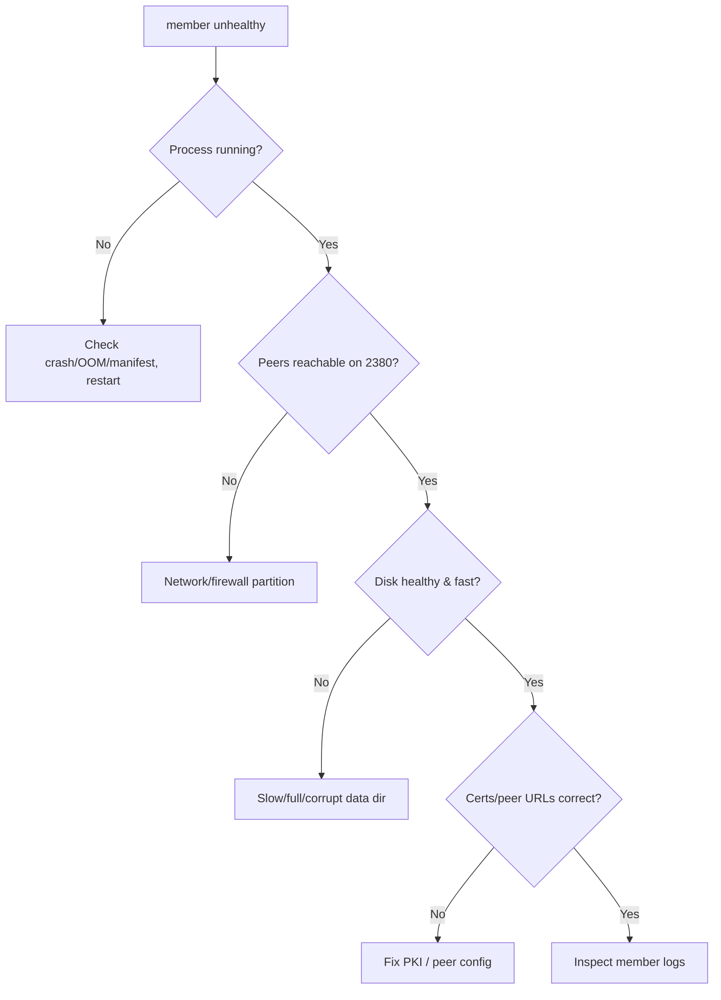

# etcd Member Unhealthy

> **Severity:** High · **Typical recovery time:** 15–60 min · **Affected versions:** 1.19+

## Error Message

```text
https://10.0.0.12:2379 is unhealthy: failed to commit proposal: context deadline exceeded
https://10.0.0.13:2379 is unhealthy: failed to connect: connection refused
member 9a1b... is unreachable
```

## Description

`endpoint health` reports a member unhealthy when it cannot serve requests:
it's down, partitioned, too slow to commit, or has a broken data dir. As long
as a majority of members remain healthy, the cluster keeps quorum and continues
serving — but it is now running with reduced fault tolerance. A single unhealthy
member in a 3-node cluster means one more failure causes a full outage.

This is the early-warning state before [etcd No Leader](./etcd-no-leader.md).
Treat it with urgency even though the cluster is "up": you want to restore the
member (or replace it) and get back to full redundancy before a second failure.

## Affected Kubernetes Versions

All etcd v3 clusters (Kubernetes 1.19+). `endpoint health` / `member list`
output and the unhealthy/unreachable reporting are consistent across etcd
3.4/3.5. Kubeadm stacked etcd ties member health to control-plane node health.

## Likely Root Causes

- Member process down (crash, OOM, node reboot, bad manifest)
- Network partition / firewall blocking peer port 2380 to that member
- Slow disk on that member so it can't commit in time (see slow fdatasync)
- Corrupted or full data directory preventing startup
- Certificate/peer URL mismatch after a node rebuild

## Diagnostic Flow



## Verification Steps

Confirm which specific member is unhealthy and why — down vs. partitioned vs.
slow vs. corrupt — and verify the remaining members still hold quorum before
deciding to restart or replace.

## kubectl Commands

```bash
kubectl get pods -n kube-system -l component=etcd -o wide
kubectl describe pod -n kube-system <etcd-pod>
kubectl logs -n kube-system <etcd-pod> --tail=200

# Read-only health and membership
ETCDCTL_API=3 etcdctl --endpoints=https://127.0.0.1:2379 \
  --cacert=/etc/kubernetes/pki/etcd/ca.crt \
  --cert=/etc/kubernetes/pki/etcd/server.crt \
  --key=/etc/kubernetes/pki/etcd/server.key \
  endpoint health --cluster
ETCDCTL_API=3 etcdctl ... member list -w table
ETCDCTL_API=3 etcdctl ... endpoint status --cluster -w table
crictl ps -a | grep etcd
journalctl -u kubelet -n 300 | grep -i etcd
```

## Expected Output

```text
https://10.0.0.11:2379 is healthy: successfully committed proposal: took = 4.1ms
https://10.0.0.12:2379 is healthy: successfully committed proposal: took = 5.3ms
https://10.0.0.13:2379 is unhealthy: failed to connect: connection refused
Error: unhealthy cluster
# member list still shows 3 members; one started=false / no leader response
```

## Common Fixes

1. Restart the failed member's process / node and let it rejoin
2. Restore peer connectivity (firewall, route) on port 2380
3. Fix slow or full disk on that member
4. Correct cert/peer URL mismatch from a node rebuild

## Recovery Procedures

**etcd is the source of truth — snapshot a healthy member before changes.**

1. **Restart the single unhealthy member** (blast radius: that member only;
   quorum preserved because the majority is healthy). Never restart multiple
   members at once.
2. If the data dir is corrupt/lost but quorum is healthy, **replace the member**:
   `member remove <id>`, wipe its data dir, then `member add` and start it fresh
   (blast radius: temporarily reduced fault tolerance during the window — do
   ONE member at a time; removing two from a 3-node cluster loses quorum).
3. If a node is permanently gone, provision a replacement and add it as above.
4. If multiple members are unhealthy and quorum is at risk, escalate to the
   [etcd No Leader](./etcd-no-leader.md) recovery path (snapshot restore).

## Validation

`endpoint health --cluster` shows all members healthy, `member list` reflects
the correct membership with `started=true`, and full fault tolerance (odd,
all-healthy) is restored.

## Prevention

- Alert on per-member health and `etcd_server_has_leader`
- Spread members across failure domains; keep an odd count
- Monitor each member's disk fsync and resource usage
- Regular snapshots and rehearsed member-replace procedure

## Related Errors

- [etcd No Leader](./etcd-no-leader.md)
- [etcd Cluster Unavailable](./etcd-cluster-unavailable.md)
- [etcd Data Corruption](./etcd-data-corruption.md)
- [etcd Slow fdatasync](./etcd-slow-fdatasync.md)

## References

- [etcd — Runtime reconfiguration](https://etcd.io/docs/latest/op-guide/runtime-configuration/)
- [etcd — Disaster recovery](https://etcd.io/docs/latest/op-guide/recovery/)
- [Kubernetes — Operating etcd clusters](https://kubernetes.io/docs/tasks/administer-cluster/configure-upgrade-etcd/)

## Further Reading

- [DevOps AI ToolKit — Kubernetes guides](https://devopsaitoolkit.com/blog/)
