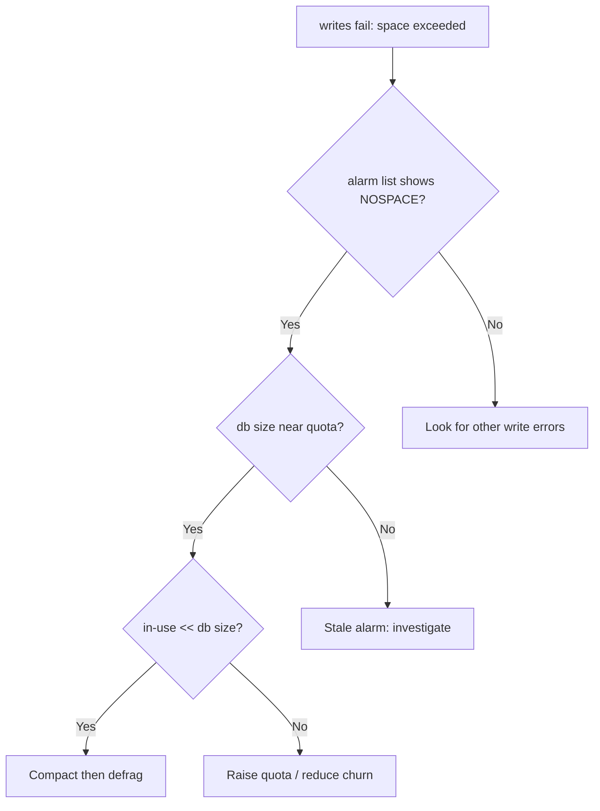

# etcd Database Space Exceeded

> **Severity:** Critical · **Typical recovery time:** 10–30 min · **Affected versions:** 1.19+

## Error Message

```text
etcdserver: mvcc: database space exceeded
rpc error: code = ResourceExhausted desc = etcdserver: mvcc: database space exceeded
```

## Description

etcd enforces a backend storage quota (`--quota-backend-bytes`, default 2 GiB
in many distributions). When the on-disk database reaches that quota, etcd
raises a `NOSPACE` alarm and switches to a **read-only / alarmed** state: all
writes are rejected with `mvcc: database space exceeded`. The cluster keeps
serving reads, but the kube-apiserver can no longer persist any change —
creating pods, updating status, lease renewals, all fail.

The quota counts the MVCC history (every revision) plus free pages from
deletions. So the database can hit the quota even when the *logical* keyspace
is small — accumulated revisions and fragmentation consume the space. Recovery
requires compaction, defragmentation, and clearing the alarm, in that order.

## Affected Kubernetes Versions

All etcd v3 deployments (Kubernetes 1.19+). Default quotas vary by distribution
(kubeadm typically leaves the etcd default of 2 GiB; managed providers often
raise it). Behaviour and the alarm mechanism are consistent across 3.4/3.5.

## Likely Root Causes

- Auto-compaction disabled or set too infrequently, so revisions accumulate
- Database never defragmented, leaving large free space the quota still counts
- Churny workloads (frequent Event/Lease/secret writes, CRD controllers) inflating revisions
- Quota set too low for cluster size and object count
- A backup/restore or large bulk write that pushed the db over quota

## Diagnostic Flow



## Verification Steps

Confirm a `NOSPACE` alarm is set, compare current db size to the quota, and
check how much space is in use vs. free so you know whether compaction+defrag
alone will recover headroom.

## kubectl Commands

```bash
kubectl get events -A --sort-by=.lastTimestamp | grep -i "space exceeded\|etcd"
kubectl logs -n kube-system -l component=etcd --tail=200 | grep -i "space\|alarm\|NOSPACE"

# Read-only etcd inspection
ETCDCTL_API=3 etcdctl --endpoints=https://127.0.0.1:2379 \
  --cacert=/etc/kubernetes/pki/etcd/ca.crt \
  --cert=/etc/kubernetes/pki/etcd/server.crt \
  --key=/etc/kubernetes/pki/etcd/server.key \
  alarm list
ETCDCTL_API=3 etcdctl ... endpoint status --cluster -w table
journalctl -u kubelet -n 200 | grep -i etcd
```

## Expected Output

```text
memberID:8e9e05c52164694d alarm:NOSPACE
+------------------------+------------------+---------+---------+
|        ENDPOINT        |        ID        | DB SIZE | IS LEAD |
+------------------------+------------------+---------+---------+
| https://127.0.0.1:2379 | 8e9e05c52164694d | 2.1 GB  | true    |
+------------------------+------------------+---------+---------+
etcd log: "alarm raised" alarmType:NOSPACE
```

## Common Fixes

1. Compact old revisions, then defragment to reclaim free pages
2. Clear the `NOSPACE` alarm once db size is below quota
3. Enable auto-compaction (`--auto-compaction-mode=periodic --auto-compaction-retention=1h`)
4. Raise `--quota-backend-bytes` (up to ~8 GiB max recommended) if genuinely needed

## Recovery Procedures

**etcd is the source of truth — take a snapshot before compaction/defrag.**

1. **Snapshot save** first (non-disruptive).
2. **Compact** to the current revision (blast radius: irreversibly discards
   historical revisions; in-flight watches on old revisions break). Get the
   revision from `endpoint status`, then run `etcdctl compact <rev>`.
3. **Defragment** each member, one at a time (blast radius: that member is
   briefly unavailable/blocked during defrag — never defrag all members
   simultaneously or you risk losing quorum). `etcdctl defrag --endpoints=<one>`.
4. **Disarm the alarm**: `etcdctl alarm disarm` once db size dropped below quota.
   Writes resume immediately after the alarm clears.

## Validation

`alarm list` returns empty, `endpoint status` shows db size well below quota,
and apiserver writes (e.g. creating a test ConfigMap) succeed again.

## Prevention

- Enable periodic auto-compaction on every cluster
- Schedule regular defrag (off-peak, one member at a time)
- Alert on `etcd_mvcc_db_total_size_in_bytes` vs quota (e.g. > 75%)
- Reduce write churn: tune Event TTL, avoid hot-loop controllers

## Related Errors

- [etcd Needs Defragmentation](./etcd-needs-defragmentation.md)
- [etcd Apply Took Too Long](./etcd-apply-took-too-long.md)
- [etcd Request Timed Out](./etcd-request-timed-out.md)
- [etcd Slow fdatasync](./etcd-slow-fdatasync.md)

## References

- [etcd — Maintenance (compaction, defrag, quota)](https://etcd.io/docs/latest/op-guide/maintenance/)
- [etcd FAQ](https://etcd.io/docs/latest/faq/)
- [Kubernetes — Operating etcd clusters](https://kubernetes.io/docs/tasks/administer-cluster/configure-upgrade-etcd/)

## Further Reading

- [DevOps AI ToolKit — Kubernetes guides](https://devopsaitoolkit.com/blog/)
