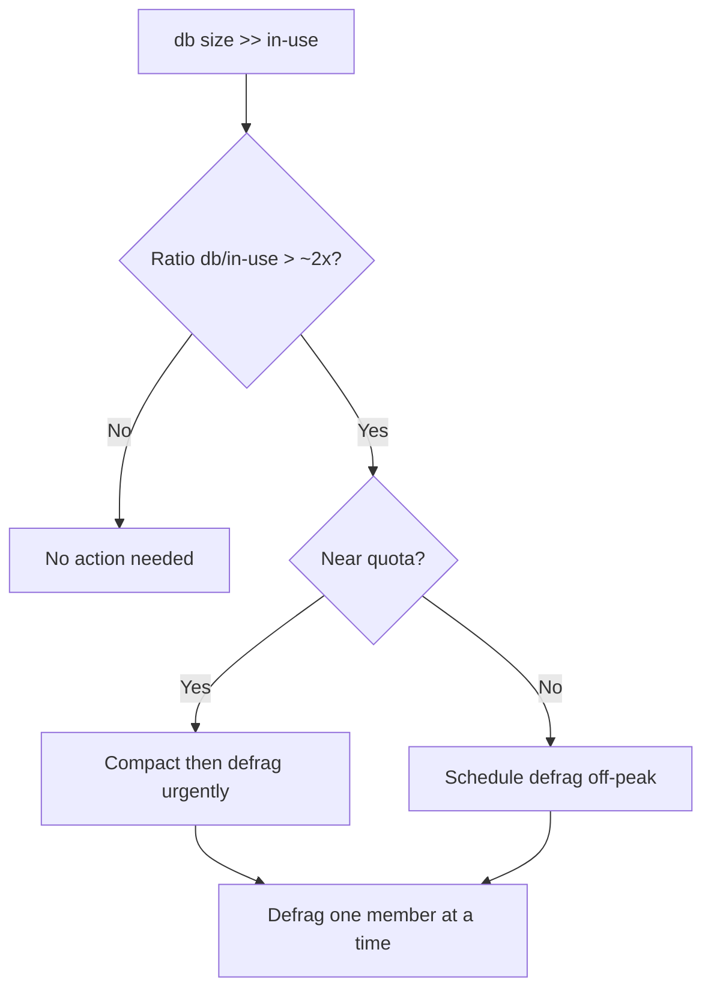

# etcd Needs Defragmentation

> **Severity:** Medium · **Typical recovery time:** 10–30 min · **Affected versions:** 1.19+

## Error Message

```text
database fragmented (db size >> in-use)
endpoint status: DB SIZE 4.1 GB, DB SIZE IN USE 380 MB
warning: etcd database size approaching quota due to fragmentation
```

## Description

etcd stores data in a bbolt B+tree file. When keys/revisions are deleted or
compacted, the pages are freed for reuse but the on-disk file does **not**
shrink — that space remains allocated to etcd. Over time, especially after
compaction, the physical `DB SIZE` can be many times larger than the
`DB SIZE IN USE` (the logical, in-use bytes). This is fragmentation.

Fragmentation matters because the backend quota counts the *physical* size, so a
fragmented db can trip `mvcc: database space exceeded` even with little real
data. It also slows backend commits and increases memory mapping. Defragmenting
rewrites the file compactly, returning free space to the OS and restoring quota
headroom. It is routine maintenance, not an emergency — but it is the fix once
fragmentation is significant.

## Affected Kubernetes Versions

All etcd v3 clusters (Kubernetes 1.19+). `endpoint status` exposes both
`DB SIZE` and `DB SIZE IN USE` in etcd 3.4/3.5, making fragmentation directly
measurable. Defrag semantics are unchanged across these versions.

## Likely Root Causes

- Compaction frees revisions but never reclaims file space (works as designed)
- No scheduled defragmentation policy
- High churn (Events, Leases, frequent updates) generating then deleting many revisions
- A one-off bulk delete leaving large free space
- Recovered-from-space-exceeded cluster that was compacted but not defragged

## Diagnostic Flow



## Verification Steps

Compare `DB SIZE` to `DB SIZE IN USE` from `endpoint status`. A ratio well above
~2x (or db size nearing the quota) indicates meaningful fragmentation worth
defragging. Confirm whether you also need to compact first.

## kubectl Commands

```bash
kubectl logs -n kube-system -l component=etcd --tail=200 | grep -i "fragment\|compact"
kubectl get events -A --sort-by=.lastTimestamp | grep -i etcd

# Read-only: compare physical vs in-use size
ETCDCTL_API=3 etcdctl --endpoints=https://127.0.0.1:2379 \
  --cacert=/etc/kubernetes/pki/etcd/ca.crt \
  --cert=/etc/kubernetes/pki/etcd/server.crt \
  --key=/etc/kubernetes/pki/etcd/server.key \
  endpoint status --cluster -w table
ETCDCTL_API=3 etcdctl ... alarm list
journalctl -u kubelet -n 200 | grep -i etcd
```

## Expected Output

```text
+------------------------+------------------+---------+-----------+
|        ENDPOINT        |     DB SIZE      | IN USE  | IS LEADER |
+------------------------+------------------+---------+-----------+
| https://10.0.0.11:2379 |      4.1 GB      | 380 MB  |   true    |
| https://10.0.0.12:2379 |      4.0 GB      | 379 MB  |   false   |
+------------------------+------------------+---------+-----------+
# DB SIZE ~10x IN USE -> heavily fragmented
```

## Common Fixes

1. Compact old revisions, then defragment to reclaim space
2. Enable periodic auto-compaction so revisions don't accumulate
3. Schedule recurring defrag (off-peak) as routine maintenance
4. Reduce churn sources (Event TTL, hot-loop controllers) to slow regrowth

## Recovery Procedures

**etcd is the source of truth — snapshot before compaction/defrag.**

1. **Snapshot save** first (non-disruptive).
2. **Compact** to the current revision if revisions are still held (blast
   radius: discards historical revisions; watches on old revisions break).
3. **Defragment each member ONE AT A TIME** (blast radius: the member being
   defragged is blocked/unavailable for the duration, typically seconds to a
   minute; defragging all members simultaneously can drop the cluster below
   quorum and cause an outage). Run `etcdctl defrag --endpoints=<single-endpoint>`
   per member, waiting for each to return healthy before the next.
4. If a `NOSPACE` alarm was set, **disarm it** after sizes drop below quota.

## Validation

`endpoint status` shows `DB SIZE` close to `DB SIZE IN USE` on every member,
free space returned to the OS, and any space alarm cleared. Backend commit
latency improves.

## Prevention

- Enable `--auto-compaction-mode=periodic --auto-compaction-retention=1h`
- Cron a rolling, one-member-at-a-time defrag during low traffic
- Alert on db size vs in-use ratio and vs quota
- Control write churn to slow fragmentation growth

## Related Errors

- [etcd Database Space Exceeded](./etcd-mvcc-database-space-exceeded.md)
- [etcd Apply Took Too Long](./etcd-apply-took-too-long.md)
- [etcd Slow fdatasync](./etcd-slow-fdatasync.md)
- [etcd Request Timed Out](./etcd-request-timed-out.md)

## References

- [etcd — Maintenance (defragmentation)](https://etcd.io/docs/latest/op-guide/maintenance/)
- [etcd FAQ](https://etcd.io/docs/latest/faq/)
- [Kubernetes — Operating etcd clusters](https://kubernetes.io/docs/tasks/administer-cluster/configure-upgrade-etcd/)

## Further Reading

- [DevOps AI ToolKit — Kubernetes guides](https://devopsaitoolkit.com/blog/)
