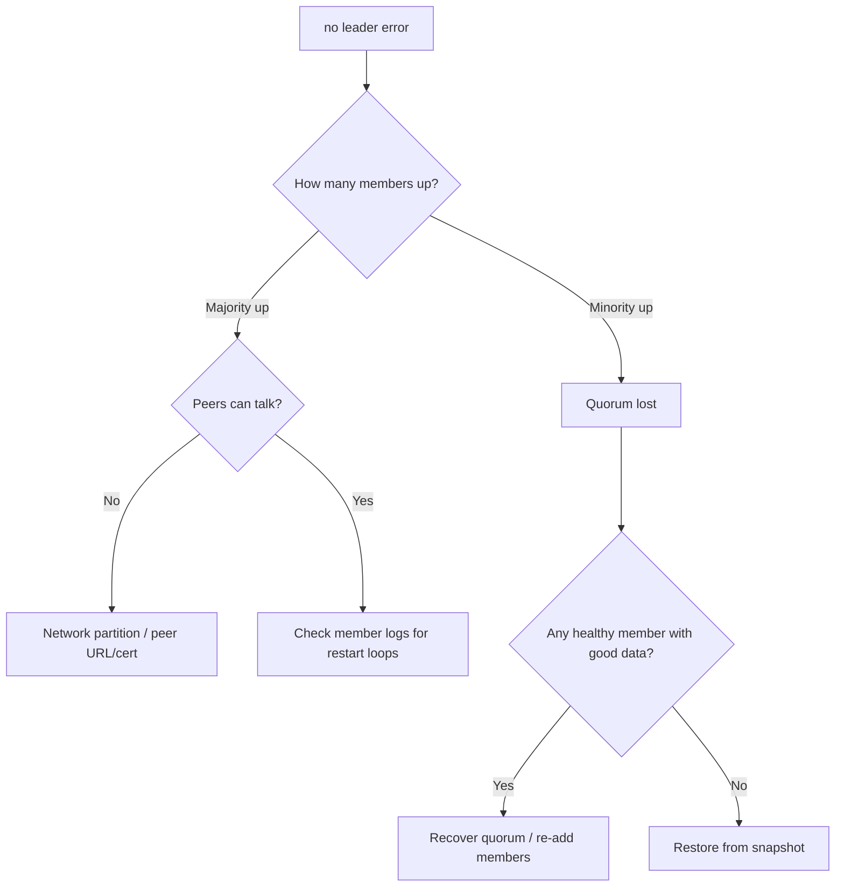

# etcd No Leader

> **Severity:** Critical · **Typical recovery time:** 15–60 min · **Affected versions:** 1.19+

## Error Message

```text
etcdserver: no leader
rpc error: code = Unavailable desc = etcdserver: no leader
```

## Description

`etcdserver: no leader` means the Raft cluster currently has no elected leader,
so it can serve neither writes nor linearizable reads. Without a leader the
cluster has lost quorum: a majority of members cannot communicate to elect one.
This is a control-plane outage — the kube-apiserver returns errors, controllers
stall, and `kubectl` write operations fail, though already-running workloads
keep serving traffic.

This almost always follows the simultaneous loss of more than `(N-1)/2`
members: e.g. losing 2 of 3, or 3 of 5. It can also occur transiently during a
storm of leader changes, but a persistent "no leader" indicates the cluster
cannot form a majority and needs operator intervention.

## Affected Kubernetes Versions

All etcd v3 deployments (Kubernetes 1.19+). Quorum math is identical across
etcd 3.3/3.4/3.5. Kubeadm-managed stacked etcd inherits this directly because
each control-plane node co-locates an etcd member.

## Likely Root Causes

- Loss of quorum: more than half the members down, crashed, or partitioned
- Network partition isolating members so no majority can communicate
- Corrupted/full data dirs causing multiple members to fail to start
- Misconfigured peer URLs / certs after a node rebuild preventing peer comms
- An even number of members where a single failure removes the majority

## Diagnostic Flow



## Verification Steps

Determine how many members are actually up and whether the surviving members
can reach each other. Distinguish a network partition (members alive, can't
talk) from genuine member loss before choosing a recovery path.

## kubectl Commands

```bash
kubectl get pods -n kube-system -l component=etcd -o wide
kubectl get componentstatuses
kubectl logs -n kube-system -l component=etcd --tail=200

# Read-only checks from each surviving control-plane node
ETCDCTL_API=3 etcdctl --endpoints=https://127.0.0.1:2379 \
  --cacert=/etc/kubernetes/pki/etcd/ca.crt \
  --cert=/etc/kubernetes/pki/etcd/server.crt \
  --key=/etc/kubernetes/pki/etcd/server.key \
  member list -w table
ETCDCTL_API=3 etcdctl ... endpoint health --cluster
ETCDCTL_API=3 etcdctl ... endpoint status --cluster -w table
journalctl -u kubelet -n 300 | grep -i etcd
crictl ps -a | grep etcd
```

## Expected Output

```text
{"level":"warn","msg":"failed to get leader","error":"etcdserver: no leader"}
https://10.0.0.11:2379 is unhealthy: failed to commit proposal: context deadline exceeded
https://10.0.0.12:2379 is unhealthy: failed to connect: connection refused
# endpoint health --cluster shows < majority healthy
Error: context deadline exceeded
```

## Common Fixes

1. Restore network connectivity / firewall rules on port 2380 between peers
2. Bring failed members' nodes back so a majority can re-form quorum
3. Fix peer URL or certificate mismatches introduced by a node rebuild
4. Move to an odd member count (3 or 5) to avoid fragile even-sized clusters

## Recovery Procedures

**Critical: etcd is the source of truth. Never bulk-restart all members
blindly. Snapshot any surviving member with intact data before acting.**

1. If a **majority is recoverable**, restart only the down members and let Raft
   re-elect (blast radius: those members; cluster resumes once majority forms).
2. If **quorum is permanently lost** but one member has good data: take a
   snapshot, then **restore** from it to bootstrap a new single-member cluster
   with `--force-new-cluster` (blast radius: full control-plane rebuild —
   discards any writes not on that member). Re-add other members one at a time.
3. If no member has good data: **restore from your latest snapshot backup**
   (blast radius: loses all changes since the snapshot was taken).

## Validation

`endpoint health --cluster` reports all members healthy, `endpoint status`
shows exactly one leader, and `componentstatuses` / apiserver writes succeed.
No `no leader` entries recur.

## Prevention

- Always run an odd number (3 or 5) of etcd members across failure domains
- Automated, frequent `snapshot save` with off-cluster storage and restore drills
- Alert on member health and `etcd_server_has_leader == 0`
- Protect peer port 2380 connectivity and monitor it

## Related Errors

- [etcd Leader Changed](./etcd-leader-changed.md)
- [etcd Cluster Unavailable](./etcd-cluster-unavailable.md)
- [etcd Member Unhealthy](./etcd-member-unhealthy.md)
- [etcd Request Timed Out](./etcd-request-timed-out.md)

## References

- [etcd — Disaster recovery](https://etcd.io/docs/latest/op-guide/recovery/)
- [etcd FAQ](https://etcd.io/docs/latest/faq/)
- [Kubernetes — Operating etcd clusters](https://kubernetes.io/docs/tasks/administer-cluster/configure-upgrade-etcd/)

## Further Reading

- [DevOps AI ToolKit — Kubernetes guides](https://devopsaitoolkit.com/blog/)
