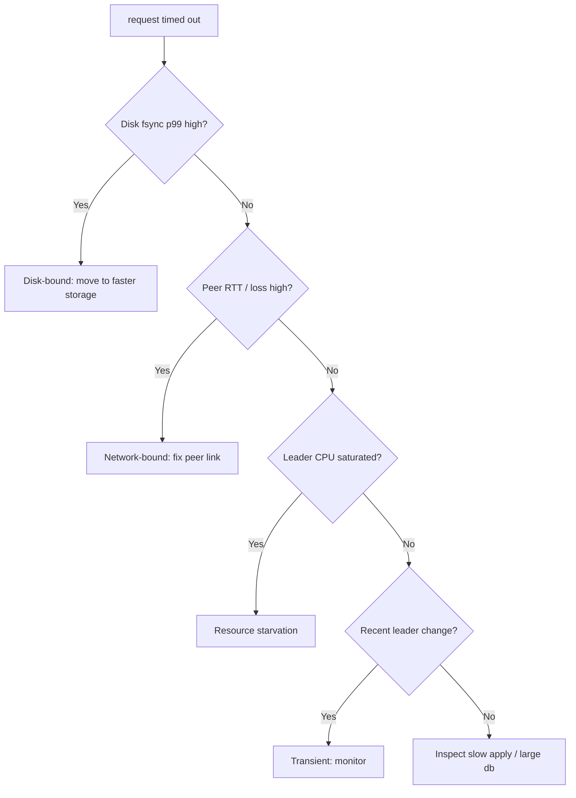

# etcd Request Timed Out

> **Severity:** High · **Typical recovery time:** 10–45 min · **Affected versions:** 1.19+

## Error Message

```text
etcdserver: request timed out
rpc error: code = Unavailable desc = etcdserver: request timed out
etcdserver: request timed out, possibly due to previous leader failure
```

## Description

A write proposal must be committed by a Raft majority and persisted to disk
within etcd's request timeout (default 7 s). If the leader cannot reach
consensus and durably store the entry in time, the request fails with
`etcdserver: request timed out`. The kube-apiserver surfaces this as 500s and
slow/failed writes; controllers retry and back off.

This is a performance/availability symptom, not a single root cause. It means
the write path is too slow somewhere: disk fsync, peer replication, an
overloaded leader, or transient leader loss. Intermittent timeouts during a
leader change are expected; sustained timeouts indicate the cluster is unable
to commit at the required rate and need investigation of disk and network.

## Affected Kubernetes Versions

All etcd v3 clusters (Kubernetes 1.19+). The 7 s default request timeout and
gRPC mapping are consistent across etcd 3.4/3.5. The "possibly due to previous
leader failure" suffix appears when a recent election interrupted the proposal.

## Likely Root Causes

- Slow disk WAL fsync on the leader (commonly the top cause)
- Slow/lossy peer network preventing timely quorum acknowledgement
- Overloaded leader (CPU saturation, huge db, expensive range reads)
- A leader change mid-proposal ("previous leader failure")
- Large objects / high write volume saturating the commit pipeline

## Diagnostic Flow



## Verification Steps

Identify whether the bottleneck is disk, network, CPU, or a transient election.
Correlate timeout timestamps with fsync latency, peer round-trips, and leader
change events.

## kubectl Commands

```bash
kubectl get --raw='/healthz/etcd'
kubectl logs -n kube-system -l component=kube-apiserver --tail=200 | grep -i "etcdserver: request timed out"
kubectl logs -n kube-system -l component=etcd --tail=200 | grep -i "took too long\|timed out\|fsync"

# Read-only etcd health
ETCDCTL_API=3 etcdctl --endpoints=https://127.0.0.1:2379 \
  --cacert=/etc/kubernetes/pki/etcd/ca.crt \
  --cert=/etc/kubernetes/pki/etcd/server.crt \
  --key=/etc/kubernetes/pki/etcd/server.key \
  endpoint status --cluster -w table
ETCDCTL_API=3 etcdctl ... endpoint health --cluster
journalctl -u kubelet -n 200 | grep -i etcd
```

## Expected Output

```text
{"level":"warn","msg":"apply request took too long","took":"8.42s","expected-duration":"100ms"}
{"level":"warn","msg":"failed to commit proposal","error":"context deadline exceeded"}
etcdserver: request timed out, possibly due to previous leader failure
# endpoint status DB SIZE large / RAFT TERM recently incremented
```

## Common Fixes

1. Move etcd backend to faster, dedicated SSD/NVMe (target fsync p99 < 10 ms)
2. Reduce leader load: compact+defrag a bloated db, isolate etcd CPU
3. Fix peer network latency/loss; keep members in the same low-latency region
4. Lower write churn (Event TTL, controller hot loops); avoid large values

## Recovery Procedures

**etcd is the source of truth — snapshot before any disruptive maintenance.**

1. Take a **snapshot save** (non-disruptive).
2. If the db is bloated, **compact then defrag one member at a time** (blast
   radius: each member briefly blocked during defrag; never all at once).
3. If a single member is the slow/unhealthy one, **restart that member**
   (blast radius: that member only; quorum preserved with remaining majority).
4. Address the underlying resource (storage class, node sizing) so the fix
   sticks; rebalancing or replacing a degraded node is a planned, one-at-a-time
   operation to avoid quorum loss.

## Validation

Timeouts cease in apiserver/etcd logs, `endpoint health` is healthy, fsync p99
is within target, and write latency returns to baseline over 15+ minutes.

## Prevention

- Dedicated low-latency disks with fsync SLO alerting
- Periodic compaction + scheduled defrag
- Resource isolation and right-sized control-plane nodes
- Alert on `etcd_disk_wal_fsync_duration_seconds` and `etcd_server_proposals_failed_total`

## Related Errors

- [etcd Slow fdatasync](./etcd-slow-fdatasync.md)
- [etcd Apply Took Too Long](./etcd-apply-took-too-long.md)
- [etcd Leader Changed](./etcd-leader-changed.md)
- [etcd No Leader](./etcd-no-leader.md)

## References

- [etcd tuning guide](https://etcd.io/docs/latest/tuning/)
- [etcd FAQ](https://etcd.io/docs/latest/faq/)
- [Kubernetes — Operating etcd clusters](https://kubernetes.io/docs/tasks/administer-cluster/configure-upgrade-etcd/)

## Further Reading

- [DevOps AI ToolKit — Kubernetes guides](https://devopsaitoolkit.com/blog/)
