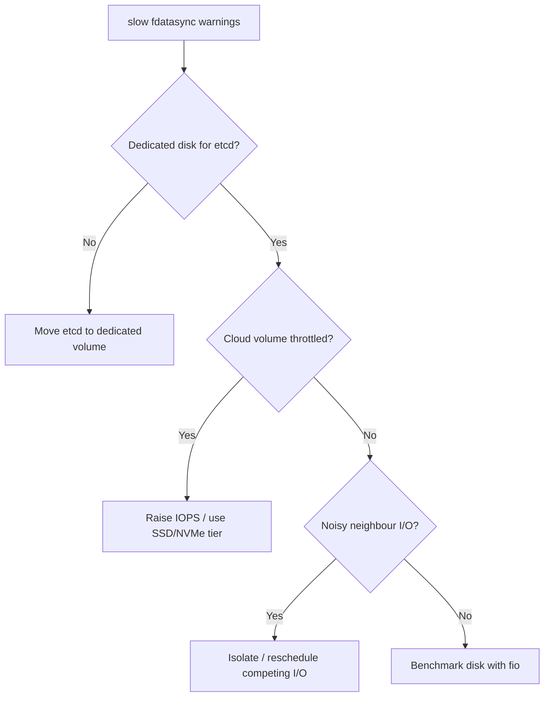

# etcd Slow fdatasync

> **Severity:** High · **Typical recovery time:** 15–60 min · **Affected versions:** 1.19+

## Error Message

```text
{"level":"warn","msg":"slow fdatasync","took":"1.203s","expected-duration":"1s"}
finished scheduled compaction ... slow fdatasync
etcd_disk_wal_fsync_duration_seconds p99 > 0.01
```

## Description

Every etcd write must be appended to the write-ahead log (WAL) and durably
flushed to disk with `fdatasync` before the entry can be committed. The
`slow fdatasync` warning means that flush is taking longer than expected,
directly throttling the entire write path. Because Raft commit latency is
gated on the slowest fsync among the quorum, slow disk on even one member can
drag the whole cluster.

This is the single most common root cause behind etcd timeouts, "apply took too
long", and leader flapping. etcd is extremely sensitive to disk write latency;
the documented target is a WAL fsync p99 under ~10 ms. Cloud network-attached
disks, throttled IOPS, and noisy-neighbour storage frequently violate this.

## Affected Kubernetes Versions

All etcd v3 clusters (Kubernetes 1.19+). The `slow fdatasync` log line and the
`etcd_disk_wal_fsync_duration_seconds` metric are present in etcd 3.4/3.5. The
warning threshold (1 s) is conservative; SLO breaches start well below it.

## Likely Root Causes

- etcd backed by slow / network-attached / throttled disks (top cause)
- IOPS or throughput limits hit (burst credits exhausted on cloud volumes)
- Noisy neighbours sharing the same physical disk or storage backend
- Sharing the disk with other write-heavy workloads (logs, container images)
- Filesystem / RAID misconfiguration adding write latency

## Diagnostic Flow



## Verification Steps

Measure WAL fsync latency against the ~10 ms target and confirm the disk — not
CPU or network — is the bottleneck. Check whether etcd shares storage with
other write-heavy processes.

## kubectl Commands

```bash
kubectl logs -n kube-system -l component=etcd --tail=300 | grep -i "fdatasync\|fsync\|took too long"
kubectl get pods -n kube-system -l component=etcd -o wide

# Read-only health/status on the node
ETCDCTL_API=3 etcdctl --endpoints=https://127.0.0.1:2379 \
  --cacert=/etc/kubernetes/pki/etcd/ca.crt \
  --cert=/etc/kubernetes/pki/etcd/server.crt \
  --key=/etc/kubernetes/pki/etcd/server.key \
  endpoint status --cluster -w table
ETCDCTL_API=3 etcdctl ... endpoint health --cluster
journalctl -u kubelet -n 200 | grep -i etcd
crictl stats | grep etcd
```

## Expected Output

```text
{"level":"warn","msg":"slow fdatasync","took":"1.203s","expected-duration":"1s"}
{"level":"warn","msg":"apply request took too long","took":"742ms","expected-duration":"100ms"}
# Prometheus: histogram_quantile(0.99, etcd_disk_wal_fsync_duration_seconds_bucket) = 0.085  (target < 0.01)
```

## Common Fixes

1. Move etcd's data dir to dedicated low-latency SSD/NVMe storage
2. Increase provisioned IOPS / switch to a higher storage tier on cloud volumes
3. Stop other write-heavy workloads sharing the disk; isolate etcd I/O
4. As a non-fix mitigation, give etcd higher disk I/O priority (ionice/cgroups)

## Recovery Procedures

**etcd is the source of truth — snapshot before any maintenance or migration.**

1. **Snapshot save** first (non-disruptive).
2. To migrate a member to faster storage: stop one member, move its data dir to
   the new disk, restart it (blast radius: that member only; do one at a time so
   quorum is always preserved).
3. If the db is also bloated (worsening fsync), **compact then defrag one member
   at a time** (blast radius: each member briefly blocked during defrag).
4. Replace an irredeemably slow node via planned member remove/add, one member
   at a time, never dropping below majority.

## Validation

`slow fdatasync` warnings stop, `etcd_disk_wal_fsync_duration_seconds` p99 is
back under ~10 ms, and downstream timeouts / leader changes cease.

## Prevention

- Always run etcd on dedicated SSD/NVMe with guaranteed IOPS
- Alert on `etcd_disk_wal_fsync_duration_seconds` and `etcd_disk_backend_commit_duration_seconds`
- Keep the db small via auto-compaction + scheduled defrag
- Benchmark disks with `fio` before promoting a node to control plane

## Related Errors

- [etcd Apply Took Too Long](./etcd-apply-took-too-long.md)
- [etcd Request Timed Out](./etcd-request-timed-out.md)
- [etcd Leader Changed](./etcd-leader-changed.md)
- [etcd Needs Defragmentation](./etcd-needs-defragmentation.md)

## References

- [etcd tuning — disk requirements](https://etcd.io/docs/latest/tuning/)
- [etcd FAQ — hardware](https://etcd.io/docs/latest/faq/)
- [Kubernetes — Operating etcd clusters](https://kubernetes.io/docs/tasks/administer-cluster/configure-upgrade-etcd/)

## Further Reading

- [DevOps AI ToolKit — Kubernetes guides](https://devopsaitoolkit.com/blog/)
