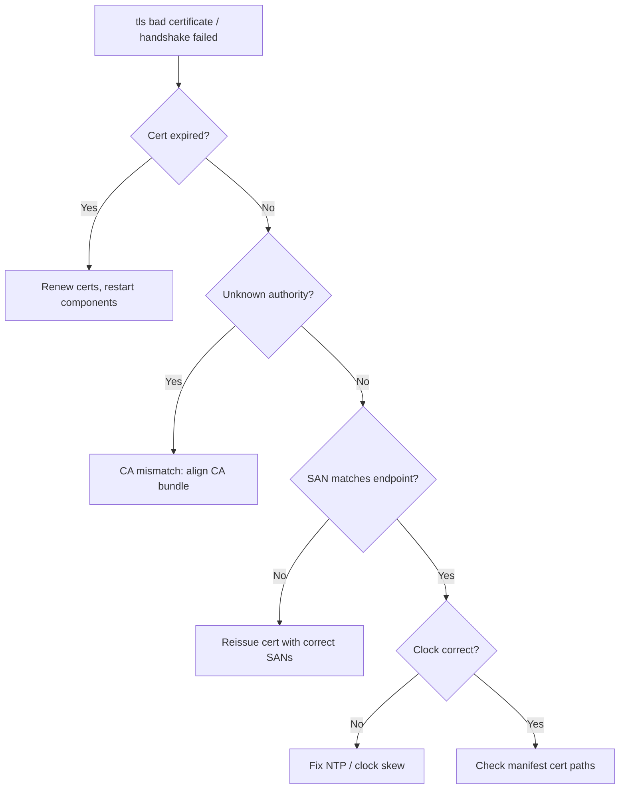

# etcd TLS / Auth Failure

> **Severity:** High · **Typical recovery time:** 15–60 min · **Affected versions:** 1.19+

## Error Message

```text
remote error: tls: bad certificate
rejected connection: x509: certificate has expired or is not yet valid
rpc error: code = Unavailable desc = connection error: ... context canceled
transport: authentication handshake failed: x509: certificate signed by unknown authority
```

## Description

etcd uses mutual TLS for both client (apiserver↔etcd, port 2379) and peer
(etcd↔etcd, port 2380) connections. When a certificate is expired, signed by an
unexpected CA, missing a required SAN, or simply mismatched, the TLS handshake
fails and the connection is dropped — surfacing as `tls: bad certificate`,
`x509: certificate signed by unknown authority`, or `context canceled` during
auth. Depending on which certs are bad, you lose apiserver→etcd connectivity,
peer replication, or both.

This is one of the most common causes of a sudden control-plane outage with no
preceding change, because certificates silently expire. Kubeadm-issued etcd
certs default to a one-year validity, so clusters that haven't upgraded or
renewed in ~12 months are prime candidates. A wrong clock can also make a valid
cert appear "not yet valid" — see the clock-difference page.

## Affected Kubernetes Versions

All etcd v3 / Kubernetes 1.19+ clusters using TLS (effectively all production
clusters). Kubeadm manages etcd PKI under `/etc/kubernetes/pki/etcd/` with
1-year certs; `kubeadm certs check-expiration` and `kubeadm certs renew` apply
to 1.19+. The x509 error wording is consistent across etcd 3.4/3.5.

## Likely Root Causes

- Expired etcd server/peer/client certificate (most common)
- Certificate signed by a CA the peer/client doesn't trust (CA rotated/mismatched)
- Missing or wrong SAN (IP/DNS) after a node IP change or rename
- Wrong cert/key/CA paths in the etcd or apiserver static pod manifest
- Clock skew making a valid cert appear expired / not-yet-valid

## Diagnostic Flow



## Verification Steps

Identify which connection fails (client 2379 vs peer 2380) and the exact x509
reason (expired, unknown CA, SAN mismatch). Check certificate expiry dates and
confirm node clocks are correct so you don't misdiagnose skew as expiry.

## kubectl Commands

```bash
kubectl logs -n kube-system -l component=etcd --tail=200 | grep -i "tls\|x509\|certificate\|handshake"
kubectl logs -n kube-system -l component=kube-apiserver --tail=200 | grep -i "x509\|tls\|etcd"

# Read-only PKI + health inspection on the node
kubeadm certs check-expiration
openssl x509 -in /etc/kubernetes/pki/etcd/server.crt -noout -enddate -subject -ext subjectAltName
ETCDCTL_API=3 etcdctl --endpoints=https://127.0.0.1:2379 \
  --cacert=/etc/kubernetes/pki/etcd/ca.crt \
  --cert=/etc/kubernetes/pki/etcd/server.crt \
  --key=/etc/kubernetes/pki/etcd/server.key \
  endpoint health --cluster
crictl ps -a | grep etcd
journalctl -u kubelet -n 200 | grep -i etcd
```

## Expected Output

```text
CERTIFICATE                EXPIRES                  RESIDUAL TIME   EXTERNALLY MANAGED
etcd-server                Jun 20, 2026 00:00 UTC   <invalid>       no
etcd-peer                  Jun 20, 2026 00:00 UTC   <invalid>       no
# etcd log:
remote error: tls: bad certificate
rejected connection from "10.0.0.12:2380" (error "x509: certificate has expired or is not yet valid: current time ... is after ...")
```

## Common Fixes

1. Renew expired etcd certs (`kubeadm certs renew etcd-server etcd-peer etcd-healthcheck-client apiserver-etcd-client`) and restart the static pods
2. Align the CA bundle so client/peer certs are trusted (fix CA mismatch)
3. Reissue certificates with correct SANs after an IP/hostname change
4. Correct cert/key/CA paths in the etcd and apiserver manifests; fix node clocks

## Recovery Procedures

**etcd is the source of truth — snapshot before touching PKI on members.**

1. **Snapshot save** first (non-disruptive).
2. **Renew certificates** on each control-plane node, then restart the etcd and
   apiserver static pods (kubelet recreates them when the manifest is touched).
   Blast radius: brief per-node apiserver/etcd restart; do nodes one at a time
   so quorum and API availability are preserved throughout.
3. For a CA rotation, distribute the new CA bundle to all members and clients
   before swapping leaf certs (blast radius: peer comms break if CA trust is
   inconsistent across members — sequence carefully, one member at a time).
4. If clock skew caused the failure, fix time first (see
   [etcd Clock Difference Too High](./etcd-clock-difference-too-high.md)); certs
   may then validate without reissuing.

## Validation

`kubeadm certs check-expiration` shows healthy residual time, `endpoint health`
is healthy over TLS, no x509/handshake errors recur, and the apiserver serves
the API normally.

## Prevention

- Alert on certificate expiry well ahead of time (e.g. 30 days residual)
- Automate renewal (kubeadm upgrade/renew, or cert-manager for etcd PKI)
- Keep node clocks synced via NTP/chrony
- Document and version SANs; reissue proactively on IP/hostname changes

## Related Errors

- [etcd Cluster Unavailable](./etcd-cluster-unavailable.md)
- [etcd Member Unhealthy](./etcd-member-unhealthy.md)
- [etcd Clock Difference Too High](./etcd-clock-difference-too-high.md)
- [etcd No Leader](./etcd-no-leader.md)

## References

- [etcd — Transport security (TLS)](https://etcd.io/docs/latest/op-guide/security/)
- [etcd FAQ](https://etcd.io/docs/latest/faq/)
- [Kubernetes — Certificate management with kubeadm](https://kubernetes.io/docs/tasks/administer-cluster/kubeadm/kubeadm-certs/)

## Further Reading

- [DevOps AI ToolKit — Kubernetes guides](https://devopsaitoolkit.com/blog/)
