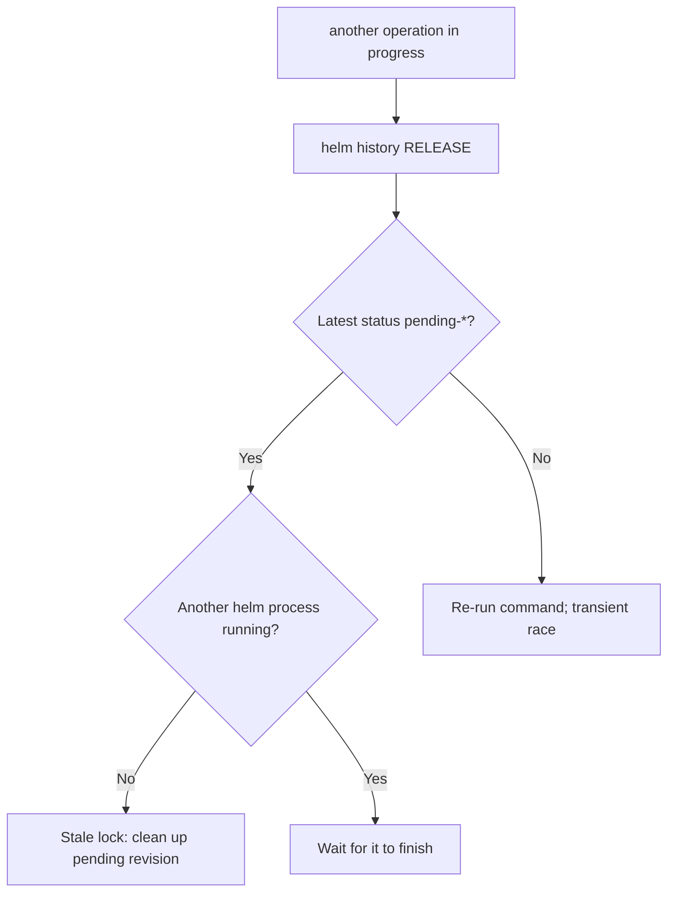

# Another Operation In Progress

> **Severity:** High · **Typical recovery time:** 5–20 min · **Affected versions:** 1.20+

## Error Message

```text
Error: UPGRADE FAILED: another operation (install/upgrade/rollback) is in progress
```

## Description

Helm 3 uses an optimistic lock to prevent two operations from mutating the same
release at once. When a command starts, Helm writes a release Secret whose
status is `pending-install`, `pending-upgrade`, or `pending-rollback`. Any new
command for that release checks the latest revision; if it is still in a
`pending-*` state, Helm refuses with this error.

In practice the lock is almost always *stale*: a previous `helm upgrade` was
killed (Ctrl-C, CI timeout, OOM of the Helm process, or a `--wait` deadline)
before it could flip the status to `deployed` or `failed`. The release is not
actually being worked on — the lock simply was never released. This blocks all
further deploys until the pending revision is cleaned up.

## Affected Kubernetes Versions

Independent of the cluster version (1.20+). This is purely Helm 3 client
behaviour driven by the release storage backend (Secrets by default). Helm 2
showed a similar message via Tiller but used ConfigMaps; the cleanup steps
differ and are out of scope here.

## Likely Root Causes

- A prior `helm` command was interrupted and left a `pending-*` revision
- A `--wait` operation hit its timeout and the process exited mid-flight
- Two pipelines (or a human and CI) deployed the same release concurrently
- The Helm process was OOM-killed or the runner pod was evicted

## Diagnostic Flow



## Verification Steps

Confirm the latest revision is genuinely stuck in a `pending-*` state and that
no legitimate Helm process is still running in CI or on another workstation.

## kubectl Commands

```bash
helm history my-release -n my-namespace
helm status my-release -n my-namespace
helm list --all --pending -n my-namespace
kubectl get secret -n my-namespace -l owner=helm,name=my-release \
  --sort-by=.metadata.creationTimestamp
kubectl describe secret sh.helm.release.v1.my-release.v8 -n my-namespace
```

## Expected Output

```text
REVISION  UPDATED                   STATUS           CHART        APP VERSION  DESCRIPTION
7         Mon Jun 22 10:01:11 2026  deployed         web-1.4.2    1.4.2        Upgrade complete
8         Mon Jun 22 10:14:55 2026  pending-upgrade  web-1.4.3    1.4.3        Preparing upgrade
```

## Common Fixes

1. Confirm no other Helm process is active, then roll the release back to the
   last good revision to clear the lock.
2. If the pending revision is the very first (`pending-install`) and nothing
   deployed, uninstall and reinstall cleanly.
3. As a last resort, delete the stale `pending-*` release Secret so the
   previous `deployed` revision becomes current again.

## Recovery Procedures

1. **`helm rollback my-release 7 -n my-namespace`** — *Blast radius:* re-applies
   revision 7's manifests; pods may restart as objects reconcile. This is the
   safest fix because it returns the release to a known-good, `deployed` state.
2. If revision 8 was `pending-install` and no resources exist:
   **`helm uninstall my-release -n my-namespace`** then reinstall. *Blast
   radius:* deletes any partially created resources for this release.
3. Manual unlock — **`kubectl delete secret sh.helm.release.v1.my-release.v8
   -n my-namespace`**. *Blast radius:* removes only the pending revision record;
   the prior `deployed` revision becomes current. Never delete the `deployed`
   revision Secret.

## Validation

Run `helm status my-release -n my-namespace` and confirm `STATUS: deployed`.
Re-run your intended `helm upgrade`; it should now proceed without the lock
error.

## Prevention

- Serialise deploys: use a CI concurrency group or lock so only one pipeline
  touches a release at a time.
- Give `--wait` realistic timeouts and ensure runners do not kill Helm early.
- Add `--atomic` so failed upgrades auto-rollback instead of leaving `pending`.

## Related Errors

- [Release Stuck Pending](helm-release-stuck-pending.md)
- [Helm UPGRADE FAILED](helm-upgrade-failed.md)
- [Helm Context Deadline Exceeded](helm-context-deadline-exceeded.md)

## References

- [Helm: Charts and release lifecycle](https://helm.sh/docs/intro/using_helm/)
- [Kubernetes Secrets](https://kubernetes.io/docs/concepts/configuration/secret/)
