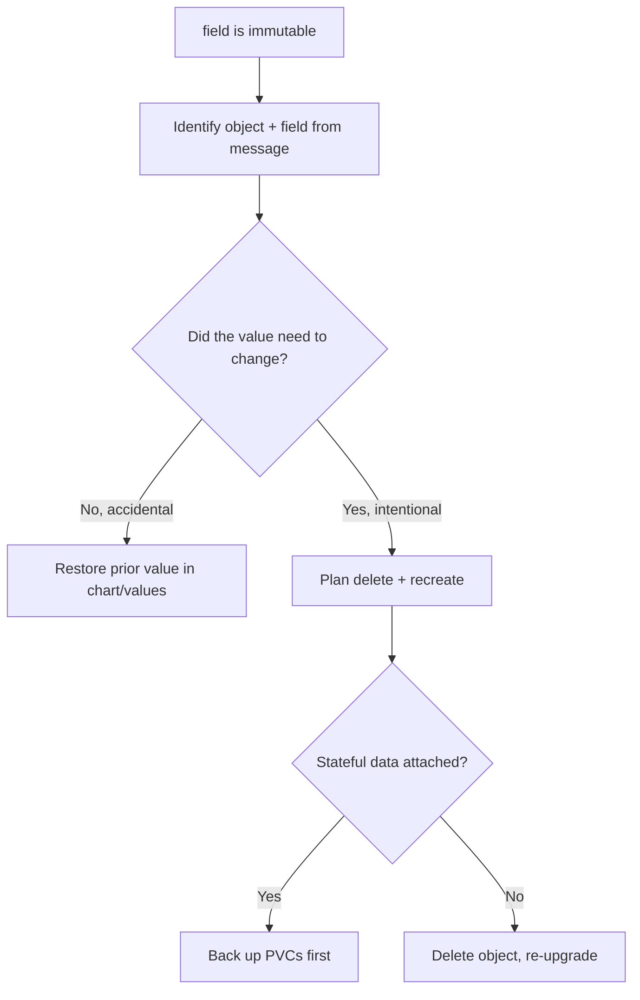

# Cannot Patch Immutable Field

> **Severity:** High · **Typical recovery time:** 10–30 min · **Affected versions:** 1.20+

## Error Message

```text
Error: UPGRADE FAILED: cannot patch "web" with kind Deployment:
Deployment.apps "web" is invalid: spec.selector: Invalid value:
... field is immutable
```

## Description

Some Kubernetes object fields cannot be changed after creation. When a Helm
upgrade renders a manifest whose immutable field differs from the live object,
the API server rejects the patch and Helm reports `field is immutable`. Helm
cannot resolve this by patching — the only path forward is to delete and
recreate the object (or revert the value).

Common immutable fields include `spec.selector` on Deployments/StatefulSets,
`spec.template` on Jobs, the `volumeClaimTemplates` of a StatefulSet, a
Service's `spec.clusterIP`, and most fields on a PVC except a size increase.
These changes usually slip in when chart label/selector templating changes
(for example a chart upgrade that alters `matchLabels`).

## Affected Kubernetes Versions

Applies to all supported releases (1.20+). The set of immutable fields is
defined by each resource's API validation and is stable, though newer charts
that change default label sets are a frequent trigger after an upstream bump.

## Likely Root Causes

- A chart upgrade changed `spec.selector.matchLabels` on a Deployment/StatefulSet
- Modifying a Job's pod template (Jobs are effectively immutable once created)
- Changing a StatefulSet's `volumeClaimTemplates` or `serviceName`
- Setting/altering a Service `clusterIP` or a PVC's `storageClassName`

## Diagnostic Flow



## Verification Steps

Read which object and field the message names, then compare the rendered value
against the live object to confirm whether the change was intentional.

## kubectl Commands

```bash
helm get manifest my-release -n my-namespace | grep -A20 'kind: Deployment'
kubectl get deployment web -n my-namespace -o jsonpath='{.spec.selector}'
kubectl describe deployment web -n my-namespace
helm history my-release -n my-namespace
helm diff upgrade my-release ./chart -n my-namespace
```

## Expected Output

```text
# live selector
{"matchLabels":{"app":"web"}}

# rendered (new) selector after chart bump
{"matchLabels":{"app.kubernetes.io/name":"web"}}
```

## Common Fixes

1. If the change was accidental (chart relabel), pin the old selector/labels in
   `values.yaml` so the rendered object matches the live one.
2. If the change is intentional, delete and recreate the affected object.
3. For Services, avoid setting `clusterIP`; let it default so it stays stable.

## Recovery Procedures

1. **Revert the value** in the chart/values and
   **`helm upgrade my-release ./chart -n my-namespace --atomic`** — *Blast
   radius:* none beyond a normal reconcile; preferred when the change was
   unintended.
2. **Delete and recreate** (intentional change):
   **`kubectl delete deployment web -n my-namespace`** then re-run the upgrade.
   *Blast radius:* the workload is down until recreated — drain traffic first.
3. For a StatefulSet selector change, **`kubectl delete statefulset web -n
   my-namespace --cascade=orphan`** then re-upgrade. *Blast radius:* orphaning
   keeps pods/PVCs running while the controller is recreated; verify data
   safety before deleting the StatefulSet object.

## Validation

`helm upgrade` completes with `deployed`, `kubectl get deployment web` shows the
expected selector, and `kubectl rollout status` reports the workload ready.

## Prevention

- Treat selectors/labels as immutable contracts; never change them casually.
- Review chart upgrade notes for label/selector changes before bumping.
- Gate upgrades with `helm diff upgrade` in CI to catch immutable diffs early.

## Related Errors

- [Helm UPGRADE FAILED](helm-upgrade-failed.md)
- [Resource Already Exists](helm-resource-already-exists.md)
- [Helm Rollback Failed](helm-rollback-failed.md)

## References

- [Helm: Upgrade command](https://helm.sh/docs/helm/helm_upgrade/)
- [Kubernetes Deployments: selector](https://kubernetes.io/docs/concepts/workloads/controllers/deployment/)
