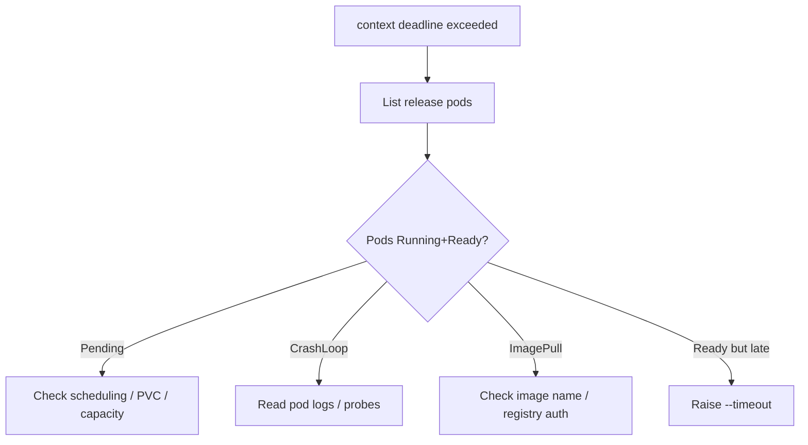

# Helm Context Deadline Exceeded

> **Severity:** High · **Typical recovery time:** 10–40 min · **Affected versions:** 1.20+

## Error Message

```text
Error: UPGRADE FAILED: context deadline exceeded

Error: timed out waiting for the condition
```

## Description

When you pass `--wait` (or `--atomic`, which implies it), Helm does not return as
soon as the API server accepts the manifests — it blocks until the release's
resources report ready (Deployments/StatefulSets at desired replicas, Pods
Ready, Services with endpoints, Jobs complete) or until `--timeout` (default 5m)
elapses. If readiness is not reached in time, Helm reports `context deadline
exceeded` / `timed out waiting for the condition`.

This is rarely a Helm bug. It means the underlying workload genuinely did not
become healthy fast enough: image pulls are slow, a pod is crash-looping, a PVC
is unbound, readiness probes are failing, or there is simply not enough capacity
to schedule. The release is recorded as `failed`; with `--atomic` it is also
rolled back. Always diagnose the workload, not Helm.

## Affected Kubernetes Versions

Cluster-independent (1.20+). The default `--timeout` of 5m and the readiness
conditions Helm waits on are stable across Helm 3. Underlying workload readiness
semantics follow the cluster's controllers.

## Likely Root Causes

- A pod is crash-looping or failing readiness probes
- Slow image pull (large image, cold node, rate-limited registry)
- Insufficient cluster capacity — pods stuck `Pending` (unschedulable)
- A PVC cannot bind (no matching StorageClass/PV)
- `--timeout` set too low for a legitimately slow rollout

## Diagnostic Flow



## Verification Steps

Identify which resource Helm was waiting on, then inspect the corresponding pods
and events to find why they never reached Ready within the timeout.

## kubectl Commands

```bash
helm status my-release -n my-namespace
helm history my-release -n my-namespace
kubectl get pods -n my-namespace -l app.kubernetes.io/instance=my-release
kubectl describe pod <pending-or-crashing-pod> -n my-namespace
kubectl logs <pod> -n my-namespace --previous
kubectl get events -n my-namespace --sort-by=.lastTimestamp
```

## Expected Output

```text
NAME            READY  STATUS             RESTARTS  AGE
web-7c9d-abcde  0/1    CrashLoopBackOff   4         3m
web-7c9d-fghij  0/1    Pending            0         3m

Events:
  Warning  FailedScheduling  0/6 nodes are available: insufficient memory
```

## Common Fixes

1. Fix the unhealthy workload — correct the image, config, probe, or resource
   requests so pods reach Ready.
2. Resolve scheduling/PVC blockers (add capacity, fix StorageClass).
3. If the rollout is simply slow but healthy, increase `--timeout` (e.g.
   `--timeout 15m`).

## Recovery Procedures

1. After fixing the workload, re-run **`helm upgrade my-release ./chart -n
   my-namespace --atomic --timeout 15m`** — *Blast radius:* re-applies and waits
   again; `--atomic` rolls back on a repeat failure.
2. If the failed upgrade degraded service, **`helm rollback my-release <last
   good revision> -n my-namespace --wait --timeout 15m`** — *Blast radius:*
   reverts to the prior revision; affected pods restart.
3. If the release is now stuck `pending`, clear it per
   [Release Stuck Pending](helm-release-stuck-pending.md) before retrying.

## Validation

`kubectl get pods` shows all release pods `Running`/Ready, `kubectl rollout
status` succeeds, and `helm status` reports `deployed`.

## Prevention

- Set readiness probes that accurately reflect application health.
- Pre-pull or use smaller images; configure registry pull credentials.
- Right-size requests so pods schedule; ensure StorageClasses exist.
- Choose `--timeout` to match realistic rollout time in CI.

## Related Errors

- [Helm Hook Failed](helm-hook-failed.md)
- [Release Stuck Pending](helm-release-stuck-pending.md)
- [Helm UPGRADE FAILED](helm-upgrade-failed.md)

## References

- [Helm: Upgrade command (--wait/--timeout)](https://helm.sh/docs/helm/helm_upgrade/)
- [Kubernetes: Pod lifecycle & probes](https://kubernetes.io/docs/concepts/workloads/pods/pod-lifecycle/)
