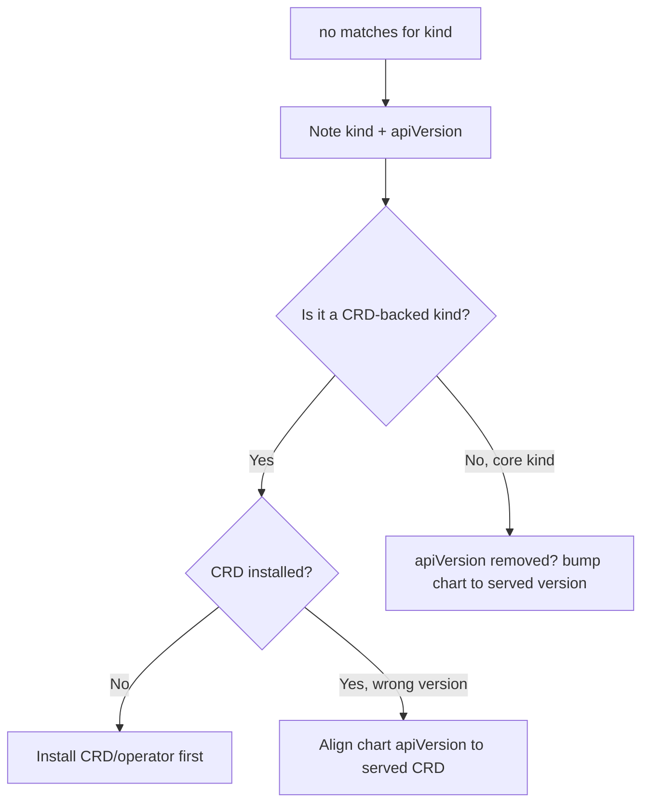

# No Matches For Kind (CRD missing)

> **Severity:** High · **Typical recovery time:** 5–25 min · **Affected versions:** 1.20+

## Error Message

```text
Error: INSTALLATION FAILED: unable to recognize "": no matches for kind
"Certificate" in version "cert-manager.io/v1"
```

## Description

When Helm tries to apply a manifest whose `apiVersion`/`kind` the API server
does not know, the cluster returns `no matches for kind`. The kind is unknown
because its CustomResourceDefinition (CRD) is not installed, or because the
manifest references an API version that has been removed or not yet served.

This is most common when a chart ships custom resources (Certificates,
Prometheus `ServiceMonitor`s, etc.) but the CRDs are owned by a separate
operator chart that has not been installed yet — or installed in the wrong
order. It also appears after Kubernetes upgrades remove a deprecated API version
the chart still targets. Helm's `crds/` directory installs CRDs before other
templates on `install`, but it does **not** update or install them on `upgrade`,
which is a frequent gap.

## Affected Kubernetes Versions

Cluster-dependent. Removed API versions are the classic trigger: e.g.
`networking.k8s.io/v1beta1` Ingress gone in 1.22, `policy/v1beta1`
PodDisruptionBudget gone in 1.25, `batch/v1beta1` CronJob gone in 1.25. Match
the chart's `apiVersion`s to the target cluster.

## Likely Root Causes

- The CRD for a custom kind is not installed in the cluster
- The operator/CRD chart was installed after the chart that uses its CRs
- The manifest uses an API version removed in the cluster's Kubernetes release
- Helm `upgrade` did not install new CRDs (the `crds/` dir runs only on install)

## Diagnostic Flow



## Verification Steps

Check whether the named CRD/API version is actually served by the cluster, then
confirm the chart targets a version the API server recognises.

## kubectl Commands

```bash
helm template my-release ./chart -n my-namespace | grep -E 'kind:|apiVersion:'
kubectl api-resources | grep -i certificate
kubectl api-versions | grep cert-manager
kubectl get crd | grep cert-manager
kubectl explain certificate.spec
```

## Expected Output

```text
# chart wants:
apiVersion: cert-manager.io/v1
kind: Certificate

# cluster has no such CRD:
$ kubectl get crd | grep cert-manager
(no output)
```

## Common Fixes

1. Install the CRDs (or the operator that owns them) before installing the chart
   that creates those custom resources.
2. After a Kubernetes upgrade, bump the chart to an API version the cluster
   serves (`kubectl api-versions`).
3. On `helm upgrade`, apply new/updated CRDs out of band — Helm does not manage
   CRD upgrades from the `crds/` directory.

## Recovery Procedures

1. **Install dependencies first**, then the chart:
   **`helm install cert-manager jetstack/cert-manager -n cert-manager
   --create-namespace --set installCRDs=true`** followed by your
   **`helm install my-release ./chart -n my-namespace`**. *Blast radius:* adds
   cluster-scoped CRDs/operator; CRDs are shared cluster resources.
2. After fixing API versions in the chart, **`helm upgrade my-release ./chart -n
   my-namespace --atomic`**. *Blast radius:* normal apply.
3. If the failed install left a `failed` release, **`helm uninstall my-release
   -n my-namespace`** before reinstalling. *Blast radius:* removes partial
   resources from the failed install (CRDs from `crds/` are not removed).

## Validation

`kubectl get crd` lists the required CRD, `kubectl api-resources` shows the kind,
and `helm install`/`upgrade` completes with `deployed`.

## Prevention

- Manage CRDs as an explicit, ordered dependency (separate release or
  `installCRDs`), never assume Helm upgrades them.
- Pin and test chart `apiVersion`s against each target cluster version before
  upgrading Kubernetes.
- Run `helm template | kubeconform -strict` against the target version in CI.

## Related Errors

- [Rendered Manifest Invalid](helm-rendered-manifest-invalid.md)
- [Helm UPGRADE FAILED](helm-upgrade-failed.md)
- [Resource Already Exists](helm-resource-already-exists.md)

## References

- [Helm: Custom Resource Definitions](https://helm.sh/docs/chart_best_practices/custom_resource_definitions/)
- [Kubernetes: Deprecated API migration guide](https://kubernetes.io/docs/reference/using-api/deprecation-guide/)
