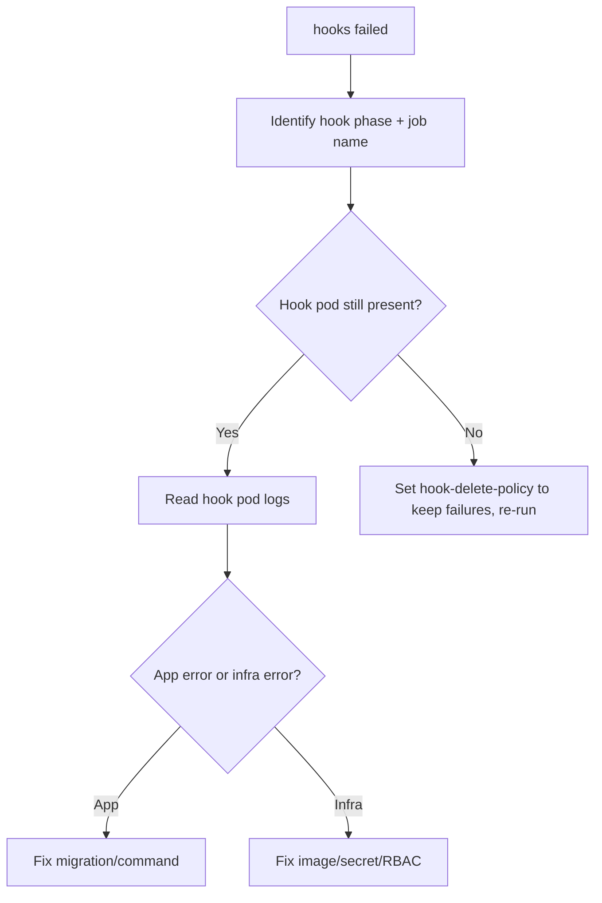

# Helm Hook Failed

> **Severity:** High · **Typical recovery time:** 10–40 min · **Affected versions:** 1.20+

## Error Message

```text
Error: UPGRADE FAILED: pre-upgrade hooks failed: 1 error occurred:
* job db-migrate failed: BackoffLimitExceeded
```

## Description

Helm hooks run resources (most often `Job`s) at defined lifecycle points —
`pre-install`, `post-install`, `pre-upgrade`, `post-upgrade`, `pre-delete`, etc.
If a hook resource fails (a Job exhausts its `backoffLimit`, or a hook times
out), Helm aborts the whole operation and reports which hook phase failed.

The release itself does not progress: a failed `pre-upgrade` hook means the new
manifests are never applied. The actual cause lives in the hook pod's logs —
a failed database migration, a missing secret, a bad image, or a connectivity
problem. A complicating factor is `hook-delete-policy`: if the policy deletes
the Job on failure, the pod may be gone before you can read its logs, so set
the policy to keep failed hooks while debugging.

## Affected Kubernetes Versions

Cluster-independent (1.20+). Hook semantics and annotations
(`helm.sh/hook`, `helm.sh/hook-delete-policy`, `helm.sh/hook-weight`) are stable
across Helm 3. Job `backoffLimit`/`ttlSecondsAfterFinished` behaviour follows
the cluster's `batch/v1` API.

## Likely Root Causes

- The hook Job's command failed (e.g. a migration error) and hit `backoffLimit`
- The hook image is wrong or cannot be pulled
- The hook needs a secret/config/RBAC that does not exist yet
- The hook timed out under `--wait`/`--timeout`
- `hook-delete-policy: hook-succeeded` removed the failed pod before triage

## Diagnostic Flow



## Verification Steps

Confirm the failed phase from the error, find the hook Job, and read its pod
logs. If the pod was auto-deleted, adjust `helm.sh/hook-delete-policy` to retain
failed hooks before retrying.

## kubectl Commands

```bash
helm history my-release -n my-namespace
helm status my-release -n my-namespace
kubectl get jobs -n my-namespace -l app.kubernetes.io/instance=my-release
kubectl describe job db-migrate -n my-namespace
kubectl logs job/db-migrate -n my-namespace
kubectl get events -n my-namespace --sort-by=.lastTimestamp
```

## Expected Output

```text
NAME        COMPLETIONS  DURATION  AGE
db-migrate  0/1          2m        2m

# job describe
Warning  BackoffLimitExceeded  Job has reached the specified backoff limit
# pod logs
ERROR: relation "users" already exists (migration 0007 failed)
```

## Common Fixes

1. Read the hook pod logs and fix the underlying command (migration script,
   missing env/secret, or bad image reference).
2. Make hooks idempotent so re-runs after a partial failure succeed.
3. Set `helm.sh/hook-delete-policy: before-hook-creation` so a fresh hook Job is
   created each run instead of colliding with a leftover one.

## Recovery Procedures

1. After fixing the cause, re-run **`helm upgrade my-release ./chart -n
   my-namespace --atomic --timeout 15m`** — *Blast radius:* re-executes the
   hooks and applies the chart; `--atomic` rolls back on failure.
2. If the failed upgrade left the release `failed`,
   **`helm rollback my-release <last good revision> -n my-namespace`** to
   restore service. *Blast radius:* re-applies the prior revision; pods may
   restart.
3. Remove a stuck leftover hook Job manually: **`kubectl delete job db-migrate
   -n my-namespace`**. *Blast radius:* deletes only that hook Job; safe once you
   have captured its logs.

## Validation

The hook Job reports `COMPLETIONS 1/1`, `helm status` shows `deployed`, and the
intended schema/state change (e.g. migration) is present.

## Prevention

- Write idempotent, re-runnable hooks; check-then-apply rather than assume.
- Use `helm.sh/hook-weight` to order dependent hooks deterministically.
- Keep failed hooks for debugging (`hook-delete-policy: before-hook-creation`).
- Give hooks generous, explicit `--timeout` and sensible Job `backoffLimit`.

## Related Errors

- [Helm UPGRADE FAILED](helm-upgrade-failed.md)
- [Helm Context Deadline Exceeded](helm-context-deadline-exceeded.md)
- [Helm Rollback Failed](helm-rollback-failed.md)

## References

- [Helm: Chart hooks](https://helm.sh/docs/topics/charts_hooks/)
- [Kubernetes Jobs](https://kubernetes.io/docs/concepts/workloads/controllers/job/)
