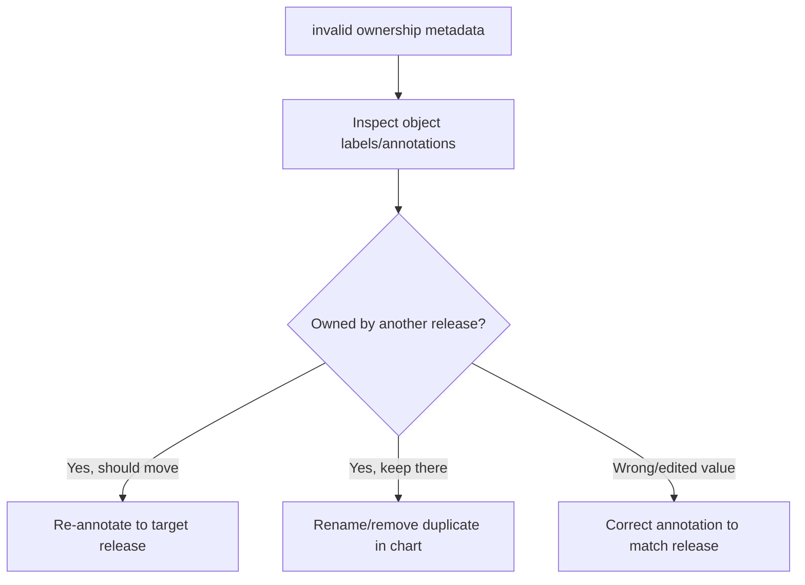

# Invalid Ownership Metadata

> **Severity:** High · **Typical recovery time:** 10–30 min · **Affected versions:** 1.20+

## Error Message

```text
Error: rendered manifests contain a resource that already exists. Unable to
continue with install: Service "web" in namespace "prod" exists and cannot be
imported into the current release: invalid ownership metadata; annotation
validation error: key "meta.helm.sh/release-name" must equal "web": current
value is "legacy-web"
```

## Description

Helm 3 marks every object it manages with a `managed-by: Helm` label and two
annotations recording which release owns it (`meta.helm.sh/release-name` and
`meta.helm.sh/release-namespace`). When a chart tries to create or adopt an
object whose ownership metadata points to a *different* release (or is missing
entirely), Helm refuses with `invalid ownership metadata`.

This protects against two releases fighting over the same object. It typically
appears when an object was created by another release (a rename, a split chart,
or a migration left the old annotations), or when someone hand-edited the Helm
annotations. The resolution is to decide who should own the object and make the
ownership metadata match exactly — or remove the conflicting object.

## Affected Kubernetes Versions

Cluster-independent (1.20+). The ownership label/annotation keys are stable
Helm 3 conventions and behave identically across recent Helm 3 versions.

## Likely Root Causes

- The object is still annotated for a previous release name/namespace
- A chart/release was renamed but its existing objects were not re-annotated
- An object was split out to a new chart while the old annotations remained
- The Helm ownership annotations were manually edited to a wrong value

## Diagnostic Flow



## Verification Steps

Read the object's `meta.helm.sh/release-name` / `release-namespace` annotations
and `managed-by` label, then compare them to the release you are deploying.

## kubectl Commands

```bash
helm list --all -A
helm status my-release -n my-namespace
kubectl get service web -n my-namespace -o jsonpath='{.metadata.annotations}'
kubectl get service web -n my-namespace \
  -o jsonpath='{.metadata.labels.app\.kubernetes\.io/managed-by}{"\n"}'
kubectl get events -n my-namespace --sort-by=.lastTimestamp
```

## Expected Output

```text
# object owned by a different release
{"meta.helm.sh/release-name":"legacy-web",
 "meta.helm.sh/release-namespace":"prod"}
managed-by: Helm
# target release is "web" -> mismatch -> install refused
```

## Common Fixes

1. Decide the rightful owner. To transfer ownership to the new release, set the
   `meta.helm.sh/release-name`/`release-namespace` annotations and `managed-by`
   label to match it.
2. If the object should stay with the old release, rename or remove the
   duplicate definition from the new chart.
3. If the object is disposable, delete it and let the target release recreate it.

## Recovery Procedures

1. **Re-annotate to transfer ownership** (mutating; only if the new release
   should own it): **`kubectl annotate service web -n my-namespace
   meta.helm.sh/release-name=my-release --overwrite`** plus the
   `release-namespace` annotation and **`kubectl label service web -n
   my-namespace app.kubernetes.io/managed-by=Helm --overwrite`**, then re-run
   the install/upgrade. *Blast radius:* the object is now tied to the new
   release and will be modified/deleted with it; the old release loses it.
2. **Delete and recreate** if disposable: **`kubectl delete service web -n
   my-namespace`** then deploy. *Blast radius:* consumers lose the Service (and
   its `clusterIP`) until recreated.
3. **Forward-fix the old release** instead — **`helm uninstall legacy-web -n
   prod`** if it is truly retired. *Blast radius:* removes all objects still
   owned by `legacy-web`.

## Validation

The install/upgrade completes with `deployed`, and the object's annotations now
name the intended release with `managed-by: Helm`.

## Prevention

- Avoid renaming releases in place; if you must, migrate ownership annotations
  deliberately.
- Never share a single object across two releases — scope names per release.
- Treat Helm ownership labels/annotations as managed metadata; do not hand-edit.

## Related Errors

- [Resource Already Exists](helm-resource-already-exists.md)
- [Helm UPGRADE FAILED](helm-upgrade-failed.md)
- [Uninstall Leaves Resources](helm-uninstall-leaves-resources.md)

## References

- [Helm 3: Resource adoption and ownership](https://helm.sh/docs/intro/using_helm/)
- [Kubernetes: Recommended labels](https://kubernetes.io/docs/concepts/overview/working-with-objects/common-labels/)
