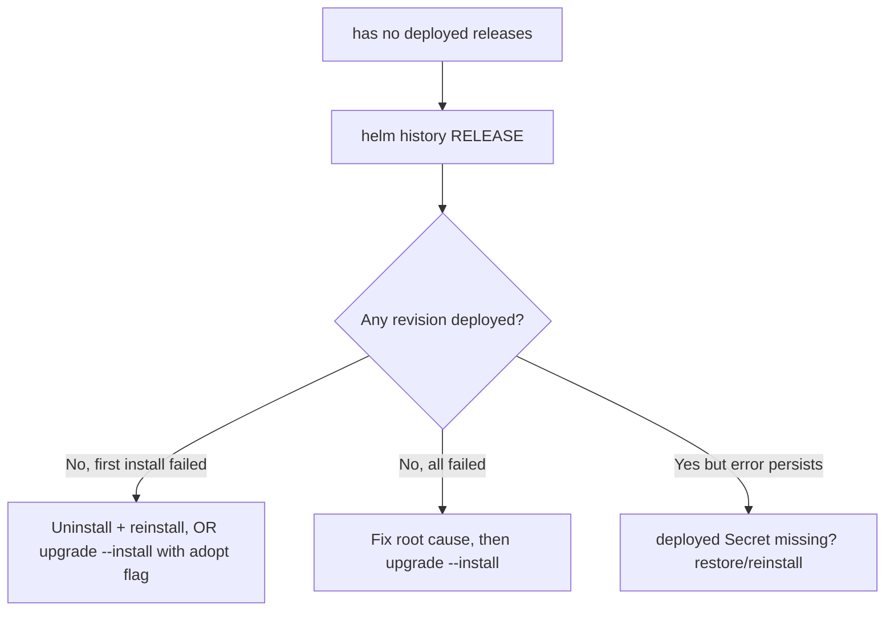

# Has No Deployed Releases

> **Severity:** High · **Typical recovery time:** 10–30 min · **Affected versions:** 1.20+

## Error Message

```text
Error: UPGRADE FAILED: "web" has no deployed releases
```

## Description

`helm upgrade` expects to find a revision in `deployed` status to upgrade *from*.
If the most recent revisions are all `failed` (or the very first install never
succeeded, leaving only `pending-install`/`failed`), Helm has no good baseline
and refuses with `has no deployed releases`.

This classically happens after a first-time `helm install` fails: the release
exists in history but never reached `deployed`. Subsequent `helm upgrade
--install` runs then hit this error because there is nothing to upgrade and
Helm's upgrade path will not "promote" a failed-only history without help. The
fix is to either recover the failed first install or use the documented flag to
let Helm adopt the failed release.

## Affected Kubernetes Versions

Cluster-version independent (1.20+); this is Helm 3 release-store logic. The
`--history-max` default and the `helm upgrade --install` semantics are stable
across recent Helm 3 minor versions.

## Likely Root Causes

- The initial `helm install` failed, so no revision ever reached `deployed`
- Every recent revision is in `failed` status (repeated bad upgrades)
- The `deployed` revision's Secret was manually deleted, orphaning history
- A `pending-install` was force-cleaned, leaving only `failed` revisions

## Diagnostic Flow



## Verification Steps

Run `helm history` and confirm there is no row with `STATUS: deployed`. If every
revision is `failed` or `pending-install`, this error is expected.

## kubectl Commands

```bash
helm history my-release -n my-namespace
helm list --all -n my-namespace
helm status my-release -n my-namespace
kubectl get secret -n my-namespace -l owner=helm,name=my-release
kubectl get events -n my-namespace --sort-by=.lastTimestamp
```

## Expected Output

```text
REVISION  UPDATED                   STATUS           CHART      APP VERSION  DESCRIPTION
1         Mon Jun 22 09:30:00 2026  failed           web-1.4.0  1.4.0        Release "web" failed: timed out waiting
2         Mon Jun 22 09:45:00 2026  failed           web-1.4.1  1.4.1        Upgrade "web" failed
```

## Common Fixes

1. Fix the underlying reason the install failed (bad image, missing secret,
   failing readiness probe), then retry.
2. For a failed first install with no real resources, uninstall and reinstall
   from scratch.
3. To let Helm adopt a failed release as the baseline, upgrade with the
   recovery flag rather than deleting history.

## Recovery Procedures

1. **Clean reinstall** (failed first install, no live resources):
   **`helm uninstall my-release -n my-namespace`** then
   **`helm install my-release ./chart -n my-namespace --atomic`**. *Blast
   radius:* deletes any partial resources from the failed install before
   recreating.
2. **Adopt the failed release**: after fixing the cause,
   **`helm upgrade my-release ./chart -n my-namespace --install --atomic`**.
   On modern Helm this promotes the release; *blast radius:* applies the chart
   to existing/absent resources as a normal upgrade.
3. If only the `deployed` Secret was deleted, **`helm rollback my-release <good
   revision> -n my-namespace`** to re-establish a deployed baseline. *Blast
   radius:* re-applies that revision's manifests.

## Validation

`helm history` now shows a `deployed` revision and `helm status` reports
`deployed`. The next `helm upgrade` proceeds normally.

## Prevention

- Use `--atomic` on installs so a failed first install rolls back cleanly.
- Add readiness probes and realistic `--timeout` so installs do not falsely
  fail.
- Alert on releases left in `failed`/`pending` state via `helm list --all`.

## Related Errors

- [Helm UPGRADE FAILED](helm-upgrade-failed.md)
- [Release Stuck Pending](helm-release-stuck-pending.md)
- [Another Operation In Progress](helm-another-operation-in-progress.md)

## References

- [Helm: Upgrade command](https://helm.sh/docs/helm/helm_upgrade/)
- [Kubernetes Secrets](https://kubernetes.io/docs/concepts/configuration/secret/)
