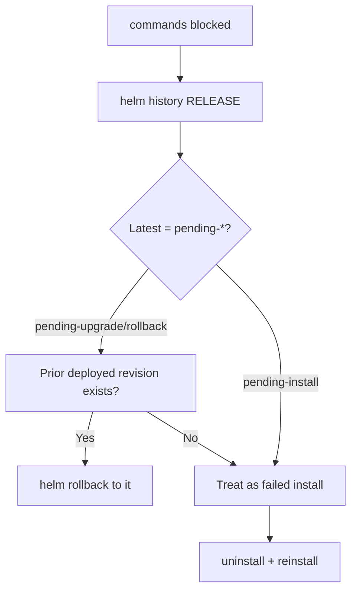

# Release Stuck Pending

> **Severity:** High · **Typical recovery time:** 5–25 min · **Affected versions:** 1.20+

## Error Message

```text
STATUS: pending-upgrade
# subsequent commands fail with:
Error: UPGRADE FAILED: another operation (install/upgrade/rollback) is in progress
```

## Description

Every Helm 3 operation transitions a release through a `pending-*` status while
it works, then sets `deployed` (success) or `failed` (error). A release "stuck
pending" is one whose latest revision is still `pending-install`,
`pending-upgrade`, or `pending-rollback` because the Helm process that owned it
never finished — it was killed, timed out, OOM'd, or its CI runner was evicted.

The release is not actually progressing; the status simply never advanced.
Because Helm treats a `pending-*` revision as an in-flight operation, every
later command for that release fails with `another operation in progress`. You
must clear or revert the pending revision before you can deploy again.

## Affected Kubernetes Versions

Cluster-independent (1.20+). This is Helm 3 release-storage state; the release
Secret naming (`sh.helm.release.v1.<name>.v<n>`) and status values are stable.

## Likely Root Causes

- A `helm install`/`upgrade` process was interrupted (Ctrl-C, CI cancel)
- A `--wait` operation hit `--timeout` and exited before finalising
- The Helm process or its runner pod was OOM-killed / evicted
- A network partition cut the client off mid-operation

## Diagnostic Flow



## Verification Steps

Confirm via `helm history` that the latest revision sits in a `pending-*` state
and that no live Helm process is still running for the release.

## kubectl Commands

```bash
helm list --all --pending -A
helm history my-release -n my-namespace
helm status my-release -n my-namespace
kubectl get secret -n my-namespace -l owner=helm,name=my-release \
  --sort-by=.metadata.creationTimestamp
kubectl get events -n my-namespace --sort-by=.lastTimestamp
```

## Expected Output

```text
NAME        NAMESPACE  REVISION  STATUS           CHART      APP VERSION
my-release  prod       12        pending-upgrade  web-1.4.3  1.4.3
```

## Common Fixes

1. If a prior `deployed` revision exists, roll back to it — this clears the
   pending lock and restores a known-good state.
2. If the stuck revision is the first install with no usable resources,
   uninstall and reinstall.
3. As a last resort, delete the stale `pending-*` release Secret so the previous
   `deployed` revision becomes current.

## Recovery Procedures

1. **`helm rollback my-release <last deployed revision> -n my-namespace`** —
   *Blast radius:* re-applies that revision's manifests; affected pods may
   restart. Preferred fix for `pending-upgrade`/`pending-rollback`.
2. **`helm uninstall my-release -n my-namespace`** then reinstall — for a stuck
   `pending-install`. *Blast radius:* removes any partial resources created by
   the failed install.
3. **`kubectl delete secret sh.helm.release.v1.my-release.v12 -n
   my-namespace`** — manual unlock when rollback is not viable. *Blast radius:*
   deletes only the pending revision record; the prior `deployed` revision
   becomes current. Never delete the `deployed` revision Secret.

## Validation

`helm list --all --pending` returns nothing for the release, `helm status`
shows `deployed`, and a fresh `helm upgrade` proceeds without the lock error.

## Prevention

- Deploy with `--atomic` so failures flip to `failed` and auto-rollback rather
  than lingering as `pending`.
- Set realistic `--timeout` and prevent CI from killing Helm mid-run.
- Serialise deploys with a CI concurrency lock per release.

## Related Errors

- [Another Operation In Progress](helm-another-operation-in-progress.md)
- [Helm Context Deadline Exceeded](helm-context-deadline-exceeded.md)
- [Has No Deployed Releases](helm-no-deployed-releases.md)

## References

- [Helm: Using Helm](https://helm.sh/docs/intro/using_helm/)
- [Kubernetes Secrets](https://kubernetes.io/docs/concepts/configuration/secret/)
