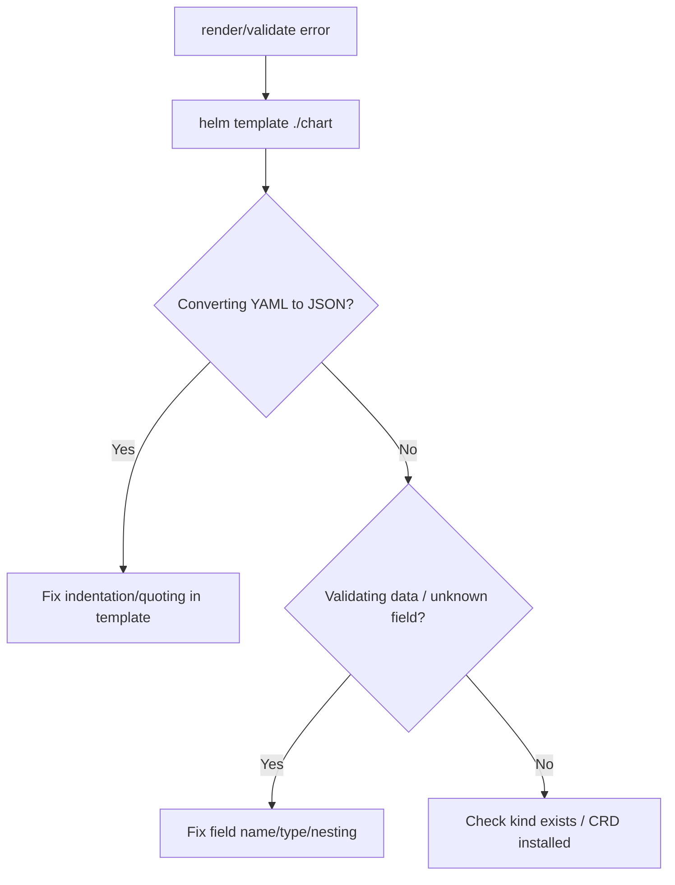

# Rendered Manifest Invalid

> **Severity:** High · **Typical recovery time:** 5–20 min · **Affected versions:** 1.20+

## Error Message

```text
Error: INSTALLATION FAILED: YAML parse error on web/templates/deployment.yaml:
error converting YAML to JSON: yaml: line 23: did not find expected key

Error: error validating data: ValidationError(Deployment.spec.template.spec):
unknown field "containers"
```

## Description

After rendering templates, Helm parses the output as YAML and (for known kinds)
the API server validates the structure before applying. Two distinct failures
surface here: a **parse error** (`error converting YAML to JSON`) means the
rendered text is not valid YAML — usually broken indentation, a missing quote,
or a value Helm could not coerce. A **validation error** (`error validating
data`) means the YAML is well-formed but does not match the Kubernetes schema —
a misspelled field, wrong type, or a key in the wrong place.

Because the failure is in the *rendered* output, the line numbers refer to the
generated manifest, not your template source. `helm template` is the fastest way
to see exactly what Helm produced.

## Affected Kubernetes Versions

Parse errors are cluster-independent. Validation errors depend on the target
cluster's schema and on server-side field validation, which became strict by
default in Kubernetes 1.25+ (unknown/duplicate fields are rejected rather than
silently dropped).

## Likely Root Causes

- Broken indentation or missing `|`/`nindent` when injecting multi-line values
- Unquoted strings that YAML interprets as numbers/booleans (e.g. `on`, `1.10`)
- A misspelled or misplaced Kubernetes field (typo, wrong nesting)
- A template value rendered empty, producing `key:` with no value
- A `range`/`if` block that emits malformed structure

## Diagnostic Flow



## Verification Steps

Render locally with `helm template` and pipe through a YAML linter, then dry-run
against the cluster to trigger server-side validation without applying changes.

## kubectl Commands

```bash
helm template my-release ./chart -n my-namespace --debug
helm template my-release ./chart -n my-namespace --validate
helm get manifest my-release -n my-namespace
kubectl get deployment web -n my-namespace -o yaml
kubectl explain deployment.spec.template.spec.containers
```

## Expected Output

```text
# helm template output around the broken line
    spec:
      containers:        # <-- typo: should be "containers"
        - name: web
          image: web:1.4.3
```

## Common Fixes

1. Open the rendered manifest, jump to the reported line, and fix the YAML
   (indentation, quoting, or field name).
2. For multi-line/string values use `{{ .Values.x | nindent 8 }}` or `quote`
   to keep YAML well-formed.
3. Verify field names against `kubectl explain` and the API reference.

## Recovery Procedures

This error blocks the apply, so no live resources change — recovery is editing
the chart and re-running.

1. Fix the template, then **`helm upgrade my-release ./chart -n my-namespace
   --install --atomic`** — *Blast radius:* normal apply; `--atomic` rolls back
   on any further failure.
2. If a partially failed *install* left a `failed` release record,
   **`helm uninstall my-release -n my-namespace`** before reinstalling. *Blast
   radius:* removes any partial resources from the failed install.

## Validation

`helm template --validate` produces clean YAML and reports no validation
errors, and the upgrade completes with `deployed`.

## Prevention

- Run `helm lint` and `helm template | kubeconform` (or `kubectl --dry-run`) in
  CI for every chart change.
- Always render multi-line values with `nindent`/`indent` and quote ambiguous
  scalars.
- Add a `values.schema.json` to catch bad inputs before they reach templating.

## Related Errors

- [Values Schema Validation Failed](helm-values-schema-validation.md)
- [Helm UPGRADE FAILED](helm-upgrade-failed.md)
- [No Matches For Kind (CRD missing)](helm-crd-no-matches-for-kind.md)

## References

- [Helm: Chart template guide](https://helm.sh/docs/chart_template_guide/)
- [Kubernetes: Field validation](https://kubernetes.io/docs/reference/using-api/api-concepts/#field-validation)
