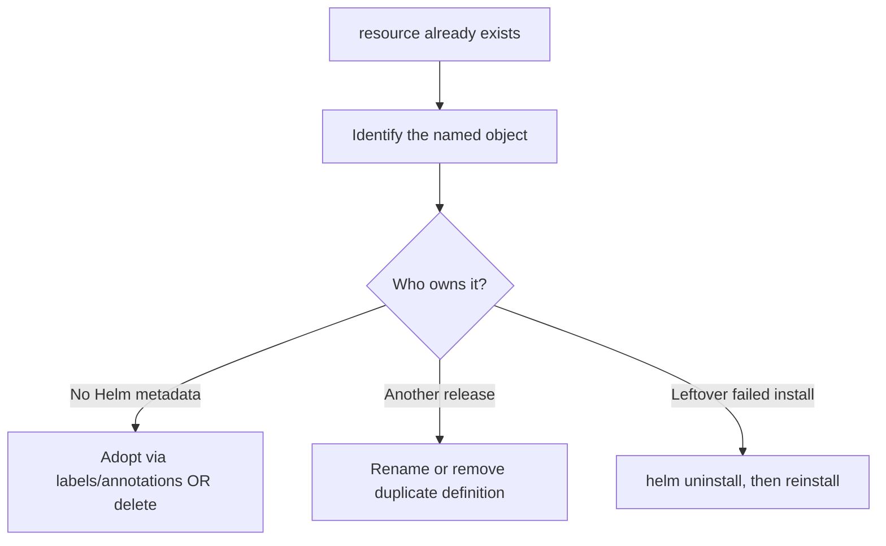

# Resource Already Exists

> **Severity:** High · **Typical recovery time:** 5–25 min · **Affected versions:** 1.20+

## Error Message

```text
Error: INSTALLATION FAILED: rendered manifests contain a resource that already
exists. Unable to continue with install: ConfigMap "web-config" in namespace
"prod" exists and cannot be imported into the current release: invalid
ownership metadata
```

## Description

During `helm install`, Helm refuses to take over objects it did not create. If a
rendered manifest names a resource that already exists in the cluster but lacks
the Helm ownership metadata for *this* release, the install aborts. This guards
against one release silently clobbering objects owned by another release, by a
manual `kubectl apply`, or by a previous half-cleaned install.

The most common scenarios: re-running `helm install` after a failed first
install that did create some objects; installing a chart whose object names
collide with manually created resources; or two charts that both define the same
cluster-scoped object. Helm 3 can *adopt* pre-existing objects only if they
carry the correct ownership annotations/labels.

## Affected Kubernetes Versions

Cluster-independent (1.20+). The ownership labels
(`app.kubernetes.io/managed-by: Helm`) and annotations
(`meta.helm.sh/release-name`, `meta.helm.sh/release-namespace`) are stable
across Helm 3.

## Likely Root Causes

- A prior `helm install` failed after creating some objects, then was retried
- The object was created manually (`kubectl apply`/`create`) before installing
- Another Helm release already owns an identically named resource
- Two subcharts/charts define the same cluster-scoped object (e.g. a CRD)

## Diagnostic Flow



## Verification Steps

Inspect the conflicting object's labels and annotations to learn whether it is
unmanaged, owned by another release, or a leftover from a failed install.

## kubectl Commands

```bash
helm list --all -A
helm status my-release -n my-namespace
kubectl get configmap web-config -n my-namespace -o yaml
kubectl get configmap web-config -n my-namespace \
  -o jsonpath='{.metadata.labels}{"\n"}{.metadata.annotations}'
kubectl get events -n my-namespace --sort-by=.lastTimestamp
```

## Expected Output

```text
# conflicting object has no Helm ownership metadata
labels:    {"app":"web"}
annotations: {"kubectl.kubernetes.io/last-applied-configuration":"..."}
# (missing app.kubernetes.io/managed-by: Helm and meta.helm.sh/release-name)
```

## Common Fixes

1. If the object is leftover from a failed install of this same release,
   uninstall the release and reinstall cleanly.
2. If the object should be managed by this release, adopt it by adding the Helm
   ownership labels/annotations so Helm imports it.
3. If it belongs elsewhere, rename the chart's resource or delete the duplicate
   definition.

## Recovery Procedures

1. **Clean reinstall** (leftover from failed install):
   **`helm uninstall my-release -n my-namespace`** then
   **`helm install my-release ./chart -n my-namespace --atomic`**. *Blast
   radius:* deletes the partial resources before recreating them.
2. **Adopt the existing object** — label/annotate it so Helm can import it
   (mutating; run only if the object truly belongs to this release):
   `app.kubernetes.io/managed-by=Helm`,
   `meta.helm.sh/release-name=my-release`,
   `meta.helm.sh/release-namespace=my-namespace`, then reinstall. *Blast
   radius:* the object becomes owned by this release and will be modified/deleted
   with it.
3. **Delete the conflicting object** if it is disposable: **`kubectl delete
   configmap web-config -n my-namespace`** then reinstall. *Blast radius:*
   anything currently consuming that object loses it until recreated.

## Validation

`helm install`/`upgrade` completes with `deployed`, and the previously
conflicting object now carries `app.kubernetes.io/managed-by: Helm` with this
release's annotations.

## Prevention

- Never mix manual `kubectl apply` with Helm-managed objects in the same scope.
- Use unique, release-prefixed names (`{{ .Release.Name }}-config`).
- Use `--atomic` so failed installs roll back instead of leaving orphans.

## Related Errors

- [Invalid Ownership Metadata](helm-invalid-ownership-metadata.md)
- [Has No Deployed Releases](helm-no-deployed-releases.md)
- [Cannot Patch Immutable Field](helm-cannot-patch-immutable.md)

## References

- [Helm 3: Resource adoption](https://helm.sh/docs/intro/using_helm/)
- [Kubernetes: Recommended labels](https://kubernetes.io/docs/concepts/overview/working-with-objects/common-labels/)
