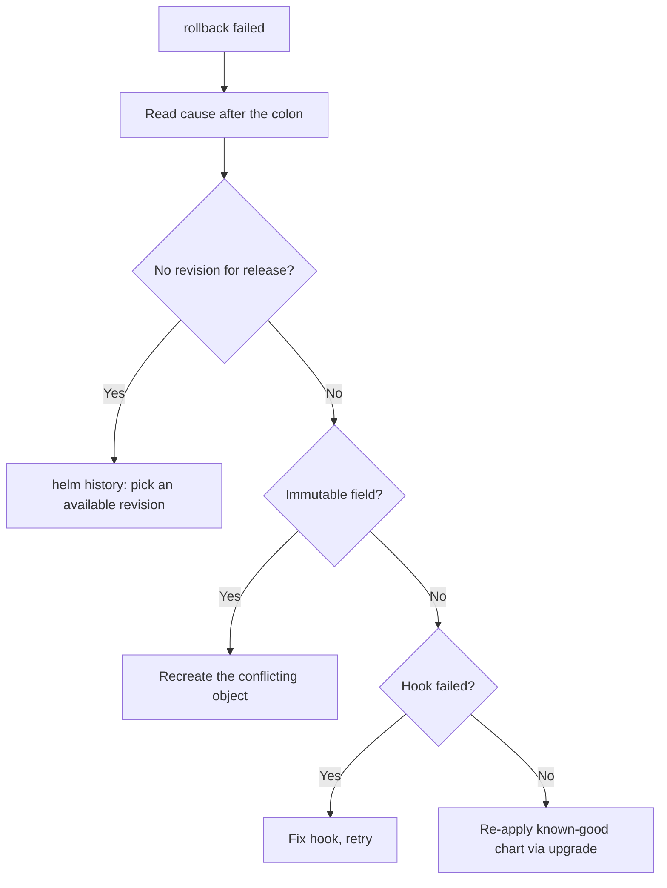

# Helm Rollback Failed

> **Severity:** High · **Typical recovery time:** 15–45 min · **Affected versions:** 1.20+

## Error Message

```text
Error: rollback failed: cannot patch "web" with kind Deployment:
Deployment.apps "web" is invalid: spec.selector: field is immutable

Error: rollback failed: no revision for release "web"
```

## Description

`helm rollback` re-applies the manifests stored for an earlier revision. It can
fail for the same reasons an upgrade fails — an immutable field differs between
the target revision and the live object, a referenced resource no longer exists,
a hook fails — or because the requested revision is not available (history
trimmed by `--history-max`, or its release Secret was deleted).

Rollback failures are stressful because they usually happen during an active
incident, when you are *trying* to recover. The key is to read the specific
cause: if it is an immutable-field conflict, rollback cannot patch it and the
object must be recreated; if the revision is simply gone, you must roll to a
different available revision or re-apply a known-good chart directly.

## Affected Kubernetes Versions

The rollback mechanism is cluster-independent (1.20+). The *embedded* cause
follows cluster behaviour — immutable-field rules and server-side validation can
differ across Kubernetes versions, especially after an API version was removed.

## Likely Root Causes

- The target revision changes an immutable field versus the current live object
- The requested revision no longer exists (history trimmed or Secret deleted)
- A pre/post-rollback hook fails
- A resource present in the target revision was deleted out of band
- The cluster's API/CRDs changed since the target revision was deployed

## Diagnostic Flow



## Verification Steps

Read the cause after `rollback failed:`. Use `helm history` to confirm which
revisions still exist and which one you can safely roll back to.

## kubectl Commands

```bash
helm history my-release -n my-namespace
helm status my-release -n my-namespace
helm get manifest my-release --revision 7 -n my-namespace
kubectl get secret -n my-namespace -l owner=helm,name=my-release \
  --sort-by=.metadata.creationTimestamp
kubectl describe deployment web -n my-namespace
```

## Expected Output

```text
REVISION  STATUS    CHART      DESCRIPTION
6         superseded web-1.4.1  Upgrade complete
7         deployed   web-1.4.2  Upgrade complete
8         failed     web-1.4.3  Upgrade "web" failed
# rollback to 5 fails: revision 5 trimmed by --history-max
```

## Common Fixes

1. Roll back to a revision that still exists in `helm history` rather than a
   trimmed one.
2. For an immutable-field conflict, recreate the offending object, then retry
   the rollback or re-apply the good chart via `helm upgrade`.
3. If hooks block rollback, fix the hook (or use `--no-hooks` only when the hook
   is non-essential to data integrity).

## Recovery Procedures

1. **`helm rollback my-release 7 -n my-namespace --wait --timeout 15m`** to an
   available, known-good revision. *Blast radius:* re-applies revision 7;
   affected pods restart.
2. **Recreate a conflicting immutable object**: **`kubectl delete deployment web
   -n my-namespace`** then retry the rollback. *Blast radius:* that workload is
   down until recreated — drain traffic first.
3. **Bypass broken hooks** when safe: **`helm rollback my-release 7 -n
   my-namespace --no-hooks`**. *Blast radius:* skips pre/post-rollback hooks —
   never use if a hook performs required data migration.
4. If history is unusable, re-apply a known-good chart directly: **`helm upgrade
   my-release ./known-good-chart -n my-namespace --atomic`**. *Blast radius:*
   forward-fix apply replacing the broken state.

## Validation

`helm history` shows the rolled-back revision as `deployed`, `helm status`
reports `deployed`, and affected workloads pass `kubectl rollout status`.

## Prevention

- Keep enough history (`--history-max`) to roll back across recent revisions.
- Deploy with `--atomic` so failed upgrades auto-revert before they pile up.
- Avoid changing immutable fields; review with `helm diff` before deploying.
- Keep rollback hooks idempotent and fast.

## Related Errors

- [Helm UPGRADE FAILED](helm-upgrade-failed.md)
- [Cannot Patch Immutable Field](helm-cannot-patch-immutable.md)
- [Release Stuck Pending](helm-release-stuck-pending.md)

## References

- [Helm: Rollback command](https://helm.sh/docs/helm/helm_rollback/)
- [Kubernetes: Objects and immutability](https://kubernetes.io/docs/concepts/overview/working-with-objects/kubernetes-objects/)
