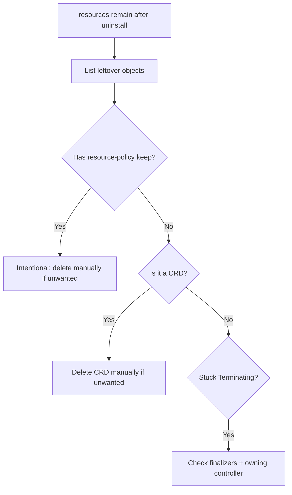

# Uninstall Leaves Resources

> **Severity:** Medium · **Typical recovery time:** 5–25 min · **Affected versions:** 1.20+

## Error Message

```text
release "web" uninstalled
# yet objects remain:
$ kubectl get pvc -n prod
NAME            STATUS    VOLUME    CAPACITY   AGE
web-data-web-0  Bound     pvc-...   20Gi       40d

$ kubectl delete namespace prod
namespace "prod" stuck in Terminating
```

## Description

`helm uninstall` deletes the objects a release owns and removes its release
history. But some resources legitimately survive — by design or by accident. The
`helm.sh/resource-policy: keep` annotation tells Helm to *never* delete an
object (common for PVCs and CRDs). CRDs installed from a chart's `crds/`
directory are also never removed by uninstall. And objects with **finalizers**
(or whose owning operator is gone) can hang in `Terminating`, leaving the
namespace stuck.

The result is leftover PVCs, Secrets, CRDs, or namespaces after you believed the
release was gone. This matters for cost (orphaned volumes), for clean reinstalls
(name collisions — see Resource Already Exists), and for namespace deletion that
never completes.

## Affected Kubernetes Versions

Cluster-independent for the Helm behaviour (1.20+). Finalizer/namespace
`Terminating` behaviour follows Kubernetes garbage collection, stable across
1.20+. CRD retention and `resource-policy: keep` are stable Helm 3 conventions.

## Likely Root Causes

- Objects annotated `helm.sh/resource-policy: keep` (often PVCs) by design
- CRDs from the chart's `crds/` directory — uninstall never deletes them
- A finalizer is set and its controller/operator is no longer running
- A namespace stuck `Terminating` because a contained resource won't finalize
- StatefulSet PVCs, which are not garbage-collected with the StatefulSet

## Diagnostic Flow



## Verification Steps

List the leftover objects and inspect their annotations and `finalizers` to tell
intentional retention from a stuck deletion.

## kubectl Commands

```bash
helm list --all -n prod
helm status web -n prod
kubectl get all,pvc,secret,cm -n prod -l app.kubernetes.io/instance=web
kubectl get pvc web-data-web-0 -n prod \
  -o jsonpath='{.metadata.annotations}{"\n"}{.metadata.finalizers}'
kubectl get crd -l app.kubernetes.io/managed-by=Helm
kubectl get namespace prod -o jsonpath='{.status}'
```

## Expected Output

```text
# leftover PVC kept on purpose
annotations: {"helm.sh/resource-policy":"keep"}
finalizers:  ["kubernetes.io/pvc-protection"]

# namespace stuck
{"phase":"Terminating","conditions":[{"type":"NamespaceFinalizersRemaining"}]}
```

## Common Fixes

1. For `resource-policy: keep` objects (e.g. PVCs), decide whether you actually
   want the data; delete them manually only if not.
2. For leftover CRDs, delete them manually — but only if no other release uses
   those custom resources.
3. For stuck `Terminating` objects, restore the missing controller so it can run
   finalizers, or remove the finalizer once you confirm cleanup is safe.

## Recovery Procedures

1. **Delete kept PVCs** when the data is no longer needed: **`kubectl delete pvc
   web-data-web-0 -n prod`**. *Blast radius:* permanent data loss — the
   underlying volume is released/deleted per its reclaim policy. Back up first.
2. **Delete leftover CRDs**: **`kubectl delete crd widgets.example.com`**.
   *Blast radius:* cluster-wide — deletes the CRD *and every custom resource of
   that kind across all namespaces*. Confirm nothing else depends on it.
3. **Clear a stuck finalizer** only after verifying real cleanup is done:
   **`kubectl patch pvc web-data-web-0 -n prod -p
   '{"metadata":{"finalizers":null}}' --type=merge`**. *Blast radius:* forces
   deletion, potentially orphaning backing storage; use as a last resort.
4. **Delete the namespace** once empty: **`kubectl delete namespace prod`**.
   *Blast radius:* removes everything remaining in the namespace.

## Validation

`kubectl get all,pvc,secret -n prod -l app.kubernetes.io/instance=web` returns
nothing unintended, leftover CRDs/namespaces are gone, and a fresh reinstall no
longer hits "resource already exists".

## Prevention

- Apply `helm.sh/resource-policy: keep` only where retention is truly intended.
- Manage CRDs as a separate, explicitly versioned lifecycle.
- Know that StatefulSet PVCs persist by design; clean them up deliberately.
- Ensure owning operators are running before deleting their custom resources.

## Related Errors

- [Invalid Ownership Metadata](helm-invalid-ownership-metadata.md)
- [Resource Already Exists](helm-resource-already-exists.md)
- [No Matches For Kind (CRD missing)](helm-crd-no-matches-for-kind.md)

## References

- [Helm: Uninstall and resource policy](https://helm.sh/docs/howto/charts_tips_and_tricks/)
- [Kubernetes: Finalizers](https://kubernetes.io/docs/concepts/overview/working-with-objects/finalizers/)
