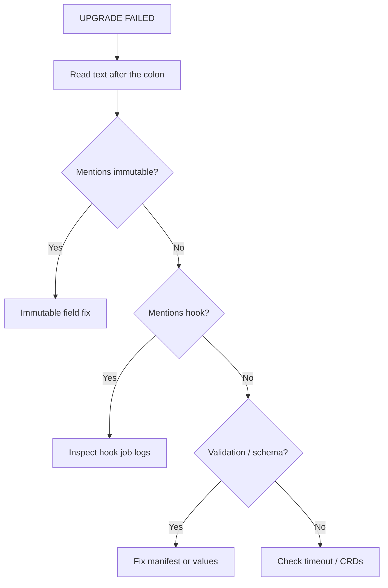

# Helm UPGRADE FAILED

> **Severity:** High · **Typical recovery time:** 10–45 min · **Affected versions:** 1.20+

## Error Message

```text
Error: UPGRADE FAILED: cannot patch "web" with kind Deployment: Deployment.apps
"web" is invalid: spec.selector: Invalid value: ... field is immutable
```

## Description

`UPGRADE FAILED` is the umbrella message Helm 3 returns when applying a new
revision's manifests fails. The text after the colon is the real cause — an
immutable field patch, a hook failure, a schema violation, a server-side
validation error, or an API timeout. Helm renders all templates, diffs them
against the live release, and applies the changes; failure at any step aborts
the upgrade.

What happens next depends on flags. Without `--atomic`, the new revision is
recorded as `failed` and partially applied changes may remain, leaving the
release in a mixed state. With `--atomic`, Helm automatically rolls back to the
prior revision. Either way, the *cause* in the message — not the `UPGRADE
FAILED` prefix — is what you must fix.

## Affected Kubernetes Versions

The wrapper message is stable across Helm 3 on all supported clusters (1.20+).
The underlying errors it surfaces are version-dependent (e.g. tightened
server-side validation or removed API groups in newer Kubernetes).

## Likely Root Causes

- Patching an immutable field (Deployment/Job selectors, PVC size down, etc.)
- A pre/post-upgrade hook job failed
- Rendered manifest fails server-side validation or `values.schema.json`
- A required CRD or API version is missing from the cluster
- `--wait`/`--timeout` expired before resources became ready

## Diagnostic Flow



## Verification Steps

Read the full error — the substring after `UPGRADE FAILED:` is the actual
fault. Cross-check `helm history` to see whether the failed revision was
recorded and whether `--atomic` already rolled it back.

## kubectl Commands

```bash
helm history my-release -n my-namespace
helm status my-release -n my-namespace
helm get manifest my-release -n my-namespace
helm get values my-release -n my-namespace
kubectl get events -n my-namespace --sort-by=.lastTimestamp
kubectl describe deployment web -n my-namespace
```

## Expected Output

```text
REVISION  STATUS    CHART      APP VERSION  DESCRIPTION
3         deployed  web-1.4.2  1.4.2        Upgrade complete
4         failed    web-1.4.3  1.4.3        Deployment.apps "web" is invalid: spec.selector: field is immutable
```

## Common Fixes

1. Identify the embedded cause and fix it at its source (template, values, or
   cluster) — see the linked focused pages for each variant.
2. If an immutable field changed, the resource must be recreated rather than
   patched (see Cannot Patch Immutable Field).
3. Re-run the upgrade with `--atomic --timeout 10m` so a future failure rolls
   back cleanly instead of leaving a half-applied state.

## Recovery Procedures

1. **`helm rollback my-release 3 -n my-namespace`** — *Blast radius:* reverts
   to revision 3's manifests; affected pods may restart. Use when the failed
   upgrade left the release in a degraded state.
2. After fixing the root cause: **`helm upgrade my-release ./chart -n
   my-namespace --atomic --timeout 10m`** — *Blast radius:* applies the new
   spec; on failure it auto-rolls back to the current good revision.
3. For an immutable-field change: **`kubectl delete deployment web -n
   my-namespace`** then re-run the upgrade. *Blast radius:* brief outage for
   that workload while it is recreated.

## Validation

`helm status my-release` shows `deployed`, `helm history` records the new
revision as `deployed`, and `kubectl rollout status` for affected workloads
reports success.

## Prevention

- Always deploy with `--atomic` and an explicit `--timeout` in CI.
- Run `helm template` / `helm upgrade --dry-run` in pull-request checks.
- Use `helm diff upgrade` to preview changes before applying.

## Related Errors

- [Cannot Patch Immutable Field](helm-cannot-patch-immutable.md)
- [Has No Deployed Releases](helm-no-deployed-releases.md)
- [Helm Hook Failed](helm-hook-failed.md)

## References

- [Helm: Upgrade command](https://helm.sh/docs/helm/helm_upgrade/)
- [Kubernetes API conventions](https://kubernetes.io/docs/reference/using-api/api-concepts/)
