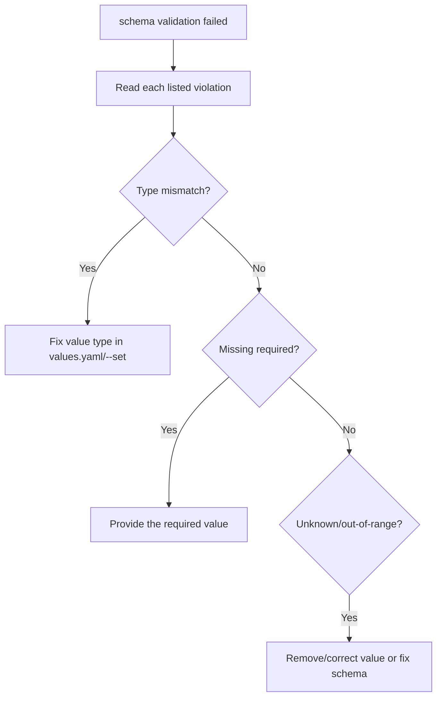

# Values Schema Validation Failed

> **Severity:** Medium · **Typical recovery time:** 5–15 min · **Affected versions:** 1.20+

## Error Message

```text
Error: INSTALLATION FAILED: values don't meet the specifications of the
schema(s) in the following chart(s):
web:
- replicaCount: Invalid type. Expected: integer, given: string
- (root): image is required
```

## Description

A chart may ship a `values.schema.json` (JSON Schema) that constrains its
`values.yaml`. Before rendering templates, Helm validates the merged values
(defaults plus your overrides) against that schema. If any value violates the
schema — wrong type, missing required key, out-of-range number, unknown property
when `additionalProperties: false` — Helm aborts and lists every violation.

This is a *pre-render* guardrail: it catches bad inputs early with clear
messages instead of producing broken manifests or a misconfigured runtime. The
fix is always to correct the supplied values (or, if you own the chart and the
constraint is wrong, the schema itself). No cluster resources are touched.

## Affected Kubernetes Versions

Cluster-independent (1.20+). JSON Schema validation is a Helm 3 client feature
driven entirely by the chart's `values.schema.json`; behaviour is consistent
across recent Helm 3 versions.

## Likely Root Causes

- A value has the wrong type (string vs integer/boolean) — often an unquoted
  `--set` value
- A `required` value is missing from overrides
- A number is outside an allowed `minimum`/`maximum`/`enum`
- An unknown key when the schema sets `additionalProperties: false`
- `--set` coerced a value unexpectedly (e.g. `--set replicaCount="3"`)

## Diagnostic Flow



## Verification Steps

Read each violation line — Helm names the exact value path and the rule it
broke. Inspect the chart's `values.schema.json` to see the expected type and
constraints, then check your merged values.

## kubectl Commands

```bash
helm show values ./chart
helm get values my-release -n my-namespace
helm template my-release ./chart -n my-namespace -f my-values.yaml --debug
helm lint ./chart -f my-values.yaml
kubectl get configmap -n my-namespace -l app.kubernetes.io/instance=my-release
```

## Expected Output

```text
# values.schema.json excerpt
"replicaCount": { "type": "integer", "minimum": 1 }

# your override (wrong type)
replicaCount: "3"   # quoted -> string, schema wants integer
```

## Common Fixes

1. Correct the value's type — remove quotes around numbers/booleans in
   `values.yaml` or use typed `--set` (`--set replicaCount=3`, not `="3"`).
2. Supply any `required` values the schema demands.
3. Remove unknown keys (or fix the schema if you own the chart and the key is
   legitimate).

## Recovery Procedures

This error blocks before any apply, so no live resources change.

1. Fix `my-values.yaml`, then **`helm upgrade my-release ./chart -n
   my-namespace -f my-values.yaml --install --atomic`** — *Blast radius:* normal
   apply once values pass validation.
2. If you maintain the chart and the constraint is wrong, correct
   `values.schema.json`, re-package, and upgrade. *Blast radius:* none beyond a
   normal chart change.

## Validation

`helm lint`/`helm template` succeed with the same values, and the
install/upgrade reaches `deployed`.

## Prevention

- Keep `values.schema.json` in sync with what templates actually consume.
- Validate values in CI with `helm lint -f` and `helm template -f` before merge.
- Prefer typed `--set` or a values file over quoted scalars to avoid coercion.

## Related Errors

- [Rendered Manifest Invalid](helm-rendered-manifest-invalid.md)
- [Helm UPGRADE FAILED](helm-upgrade-failed.md)
- [Helm Hook Failed](helm-hook-failed.md)

## References

- [Helm: Schema files for values](https://helm.sh/docs/topics/charts/#schema-files)
- [Kubernetes: ConfigMaps](https://kubernetes.io/docs/concepts/configuration/configmap/)
