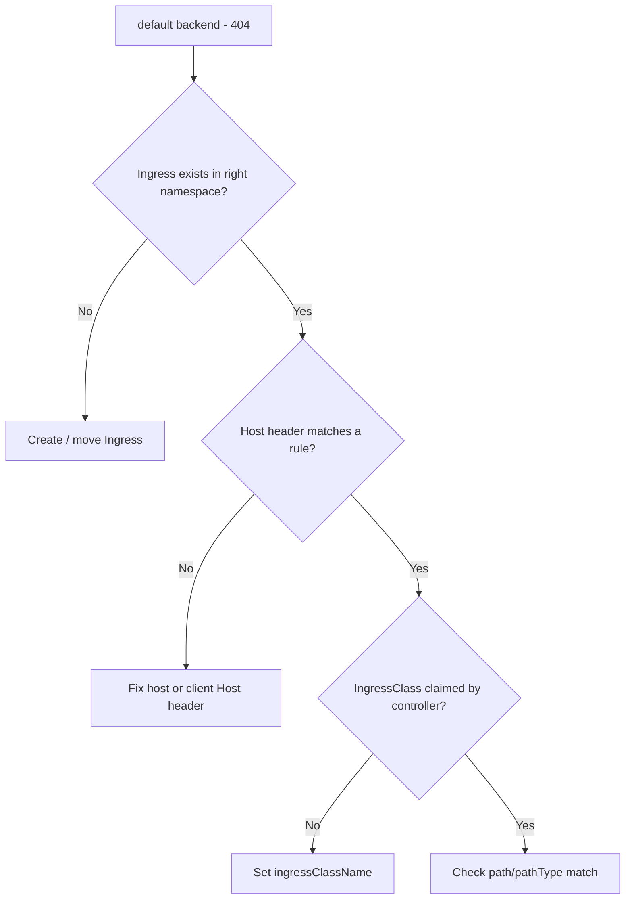

# Ingress 404 Default Backend

> **Severity:** Medium · **Typical recovery time:** 5–25 min · **Affected versions:** 1.19+

## Error Message

```text
default backend - 404
```

## Description

This response comes from the ingress controller's **default backend** — the
catch-all that serves traffic when *no* host/path rule matches the incoming
request. Seeing `default backend - 404` means the request reached the controller
but did not match any Ingress object's `host` or `path`. The controller is
healthy; the routing rules simply do not cover this request. Causes are almost
always a Host header mismatch, a missing/typo'd rule, the Ingress living in the
wrong namespace, or the Ingress not being claimed by this controller (wrong
class). ingress-nginx serves this string; other controllers serve their own 404.

## Affected Kubernetes Versions

All versions with `networking.k8s.io/v1` Ingress (1.19+). The default backend is
a controller feature, independent of the Kubernetes release.

## Likely Root Causes

- Request `Host` header does not match any Ingress `host` rule (e.g. apex vs
  `www`).
- Ingress is in a different namespace than the Service, or simply absent.
- Ingress is not picked up by this controller (no/incorrect IngressClass).
- Path rule does not match the request path (see path/pathType mismatch).

## Diagnostic Flow



## Verification Steps

Reproduce with an explicit Host header and confirm whether the controller has
any rule for that host. Verify the Ingress is in the same namespace as its
Service and has a valid class.

## kubectl Commands

```bash
kubectl get ingress -A
kubectl describe ingress <ingress> -n <namespace>
kubectl get ingress <ingress> -n <namespace> -o yaml
kubectl get ingressclass
kubectl logs -n ingress-nginx deploy/ingress-nginx-controller --tail=50
```

## Expected Output

```text
$ curl -H "Host: app.example.com" -I http://<ingress-ip>/
HTTP/1.1 404 Not Found
Content-Type: text/plain; charset=utf-8

$ kubectl get ingress -A
NAMESPACE   NAME   CLASS   HOSTS                ADDRESS        PORTS
shop        web    nginx   www.example.com      203.0.113.10   80, 443
```

## Common Fixes

1. Add or correct the `host` rule so it matches the request (include both apex
   and `www` if needed).
2. Ensure the Ingress is in the same namespace as the target Service.
3. Set the correct `ingressClassName` so the controller claims the Ingress.

## Recovery Procedures

1. Confirm the failing Host and compare to existing rules.
2. Patch or create the Ingress rule for the missing host/path — config-only,
   controller reloads gracefully, no downtime.
3. If the Ingress was in the wrong namespace, recreate it correctly — deleting
   the misplaced Ingress is **disruptive only if it was serving other valid
   hosts; blast radius is those hosts**.

## Validation

```bash
curl -H "Host: app.example.com" -I http://<ingress-ip>/
```
Returns the application response (e.g. 200/301) instead of `default backend -
404`.

## Prevention

- Standardize host naming (apex + www) and document it.
- Lint Ingress manifests in CI to confirm host/path coverage and class.
- Keep Ingress and Service in the same namespace by convention.

## Related Errors

- [Ingress Path Not Matching](ingress-path-not-matching.md)
- [Ingress Has No IngressClass](ingress-no-ingressclass.md)
- [Ingress TLS Fake Certificate](ingress-tls-fake-certificate.md)

## References

- [Ingress concepts](https://kubernetes.io/docs/concepts/services-networking/ingress/)
- [IngressClass](https://kubernetes.io/docs/concepts/services-networking/ingress/#ingress-class)

## Further Reading

- [Free Kubernetes config validators](https://devopsaitoolkit.com/validators/)
