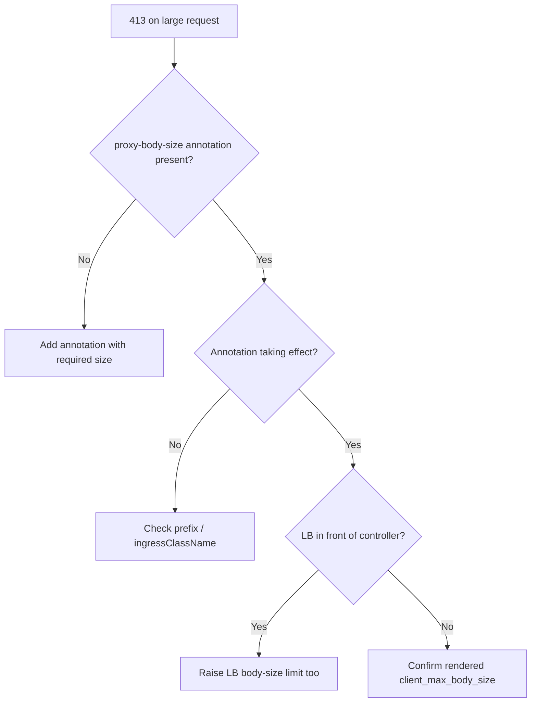

# Ingress 413 Request Entity Too Large

> **Severity:** Medium · **Typical recovery time:** 5–15 min · **Affected versions:** 1.19+

## Error Message

```text
413 Request Entity Too Large
nginx/1.x.x
The request body exceeds the configured maximum allowed size (client_max_body_size).
```

## Description

The client sent a request body larger than the proxy will accept, so nginx rejects
it before forwarding to the backend with a 413. This most often shows up as file
uploads or large JSON/GraphQL payloads failing while small requests succeed. The
default `proxy-body-size` in ingress-nginx is `1m`, which surprises teams who never
hit it in local testing.

During an incident the tell is that the backend logs show nothing — the request
never reached it. The 413 is generated entirely at the ingress layer.

## Affected Kubernetes Versions

Applies to ingress-nginx on 1.19+. The annotation key is
`nginx.ingress.kubernetes.io/proxy-body-size`; the equivalent global setting is
`proxy-body-size` in the controller ConfigMap. Behavior is unchanged across recent
controller releases, but a value of `0` (unlimited) is honored only at the ingress
level and should be used cautiously.

## Likely Root Causes

- Default 1 MB limit never raised for an upload-heavy route
- Annotation set but ignored (wrong prefix, or Ingress not claimed by the controller)
- Cloud load balancer in front imposing its own lower body-size limit
- A separate buffering limit (`proxy-buffering`, client body buffer) interfering

## Diagnostic Flow



## Verification Steps

Confirm the 413 comes from nginx (not the app), check the configured body size, and
verify the annotation actually rendered into the controller config.

## kubectl Commands

```bash
kubectl get ingress <name> -n <namespace> -o yaml
kubectl describe ingress <name> -n <namespace>
kubectl get configmap -n ingress-nginx ingress-nginx-controller -o yaml
kubectl get pods -n ingress-nginx -l app.kubernetes.io/component=controller
kubectl logs -n ingress-nginx <controller-pod> --tail=50
```

## Expected Output

```text
$ curl -sI -X POST --data-binary @big.bin http://app.example.com/upload
HTTP/1.1 413 Request Entity Too Large
Server: nginx

$ kubectl get ingress app -n web -o jsonpath='{.metadata.annotations}'
{"nginx.ingress.kubernetes.io/proxy-body-size":"50m"}   # confirm it is applied
```

## Common Fixes

1. Add `nginx.ingress.kubernetes.io/proxy-body-size: "50m"` (or the size you need) to the Ingress
2. Set `proxy-body-size` globally in the controller ConfigMap if many routes need it
3. Raise the upstream cloud load balancer's request-size limit to match

## Recovery Procedures

1. Patch the single Ingress with the required `proxy-body-size` (non-disruptive;
   affects only that route, applied on the next controller reload).
2. If you change the controller ConfigMap instead, the new default applies cluster-wide.
   **Disruptive — blast radius: every Ingress on this controller reloads** and
   inherits the new limit; review for security implications of larger bodies.

## Validation

Re-POST a body at the previous failing size and confirm a 2xx. Inspect the rendered
`client_max_body_size` in the controller pod to confirm the value took.

## Prevention

- Set body-size limits explicitly per route based on real payload sizes
- Lint that upload routes carry an explicit `proxy-body-size`
- Keep controller and front-LB limits in sync, documented together

## Related Errors

- [Ingress Annotation Ignored](ingress-annotation-ignored.md)
- [Ingress Upstream Connect Error](ingress-upstream-connect-error.md)
- [Ingress CORS Blocked](ingress-cors-blocked.md)

## References

- [Ingress concepts](https://kubernetes.io/docs/concepts/services-networking/ingress/)
- [Ingress controllers](https://kubernetes.io/docs/concepts/services-networking/ingress-controllers/)

## Further Reading

- [Free Kubernetes config validators](https://devopsaitoolkit.com/validators/)
