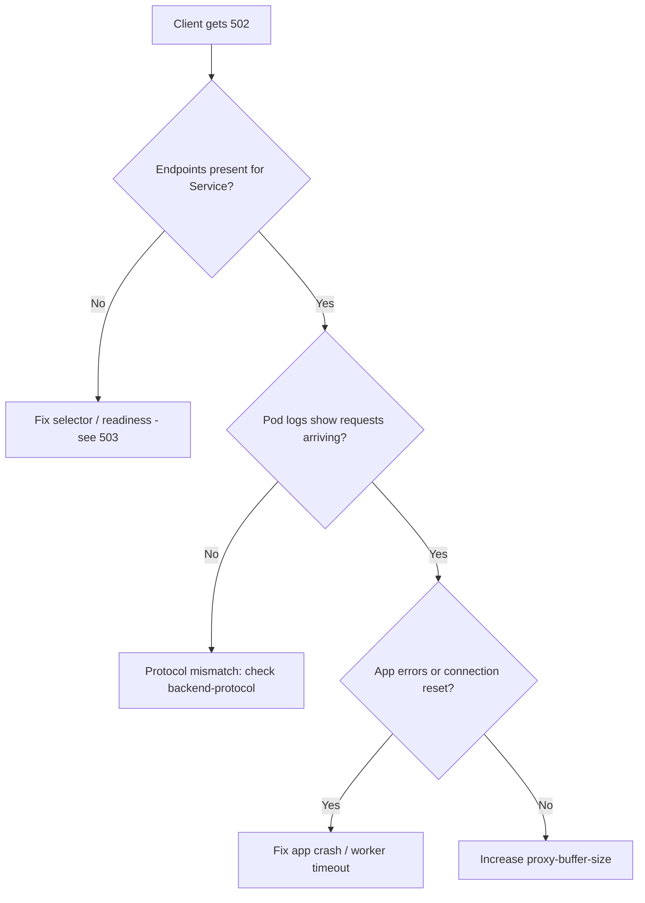

# Ingress 502 Bad Gateway

> **Severity:** High · **Typical recovery time:** 10–45 min · **Affected versions:** 1.19+

## Error Message

```text
502 Bad Gateway
nginx
```

## Description

A 502 is returned by the ingress controller (ingress-nginx by default, but the
same applies to HAProxy, Traefik, or a cloud ALB controller) when it accepted
the client request but received an *invalid or refused* response from the
upstream pod. Unlike a 503, the controller *did* select an endpoint and tried to
proxy to it — the backend either reset the connection, replied with a malformed
HTTP response, or closed early. During an incident this almost always points at
the application pod or the protocol contract between proxy and pod, not at DNS or
the controller itself.

## Affected Kubernetes Versions

Applies to all versions running ingress-nginx (1.19+). The
`networking.k8s.io/v1` Ingress API is stable since 1.19. Behaviour is identical
across versions; only annotation names differ between controllers.

## Likely Root Causes

- The upstream pod crashed or is failing readiness mid-request, returning a
  reset/garbage response.
- Backend speaks HTTPS but the controller proxies HTTP (or vice versa) —
  missing `backend-protocol: HTTPS` annotation.
- Backend response/header size exceeds `proxy-buffer-size`.
- Application returns a non-HTTP payload or closes the connection before sending
  headers (slow app, undersized worker pool).

## Diagnostic Flow



## Verification Steps

Confirm the 502 comes from the ingress controller (banner says `nginx`) and not
from an upstream proxy inside your app. Check that the Service has ready
endpoints and inspect controller logs for the upstream address and status.

## kubectl Commands

```bash
kubectl get ingress -n <namespace>
kubectl describe ingress <ingress> -n <namespace>
kubectl get endpoints <service> -n <namespace>
kubectl get pods -n <namespace> -o wide
kubectl logs -n ingress-nginx deploy/ingress-nginx-controller --tail=100
kubectl logs <backend-pod> -n <namespace>
```

## Expected Output

```text
2024/05/01 12:00:01 [error] 31#31: *123 upstream prematurely closed connection
while reading response header from upstream, client: 10.0.0.5,
server: app.example.com, request: "GET /api HTTP/1.1",
upstream: "http://10.244.2.7:8080/api", host: "app.example.com"
```

## Common Fixes

1. Restart or fix the crashing backend pod so it returns valid HTTP responses.
2. Set `nginx.ingress.kubernetes.io/backend-protocol: "HTTPS"` when the pod
   terminates TLS itself.
3. Raise `nginx.ingress.kubernetes.io/proxy-buffer-size: "16k"` for large
   response headers (auth tokens, cookies).

## Recovery Procedures

1. Verify endpoints exist (`kubectl get endpoints`).
2. If a single pod is bad, cordon traffic by deleting only that pod —
   **disruptive: blast radius is one replica**, the Deployment reschedules it.
3. If a config/annotation change is required, apply it to the Ingress; the
   controller reloads gracefully with no client-visible downtime.
4. Rolling restart of the backend Deployment is a last resort —
   **disruptive: briefly reduces capacity across the whole Service**.

## Validation

```bash
curl -I https://app.example.com/api
```
Expect `HTTP/1.1 200` and clean controller logs with no `upstream prematurely
closed` entries.

## Prevention

- Configure readiness probes so failing pods leave the endpoint list before they
  return garbage.
- Match `backend-protocol` to what the pod actually serves.
- Add PodDisruptionBudgets and sane `proxy-buffer-size` defaults in CI policy.

## Related Errors

- [Ingress 503 Service Unavailable](ingress-503-service-unavailable.md)
- [Ingress 504 Gateway Timeout](ingress-504-gateway-timeout.md)
- [Ingress Path Not Matching](ingress-path-not-matching.md)

## References

- [Ingress concepts](https://kubernetes.io/docs/concepts/services-networking/ingress/)
- [Debug Services](https://kubernetes.io/docs/tasks/debug/debug-application/debug-service/)

## Further Reading

- [DevOps AI ToolKit — Kubernetes guides](https://devopsaitoolkit.com/blog/)
