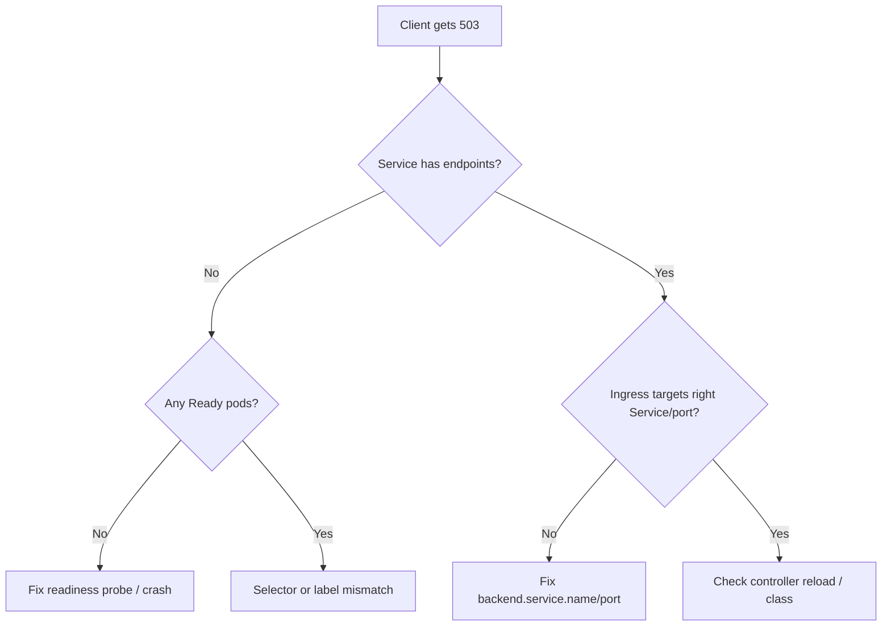

# Ingress 503 Service Unavailable

> **Severity:** High · **Typical recovery time:** 5–30 min · **Affected versions:** 1.19+

## Error Message

```text
503 Service Temporarily Unavailable
nginx
```

## Description

A 503 from the ingress controller means it matched the host/path rule but had
**no ready upstream endpoint** to send the request to. The controller knows
where traffic *should* go but the backing Service has an empty endpoint list —
pods are not ready, the selector matches nothing, or the Service/port name is
wrong. This is the single most common ingress error during deploys, because a
rollout can momentarily empty the endpoints. It applies equally to ingress-nginx,
Traefik, and HAProxy; cloud LB controllers return their own 503 variant.

## Affected Kubernetes Versions

All versions with `networking.k8s.io/v1` Ingress (1.19+). EndpointSlices became
the default backing store in 1.21; the symptom is unchanged.

## Likely Root Causes

- No pods are Ready (readiness probe failing, CrashLoopBackOff).
- Service `selector` does not match any pod labels.
- Ingress references a wrong Service name or `port` number/name.
- All replicas scaled to zero (HPA min or manual scale-down).

## Diagnostic Flow



## Verification Steps

Confirm endpoints are empty and that the Ingress backend names a real Service
and port. Distinguish from a 502 (endpoints exist but reply badly).

## kubectl Commands

```bash
kubectl get endpoints <service> -n <namespace>
kubectl get endpointslices -n <namespace> -l kubernetes.io/service-name=<service>
kubectl describe ingress <ingress> -n <namespace>
kubectl get svc <service> -n <namespace> -o yaml
kubectl get pods -n <namespace> -l <selector> -o wide
kubectl logs -n ingress-nginx deploy/ingress-nginx-controller --tail=50
```

## Expected Output

```text
$ kubectl get endpoints web -n shop
NAME   ENDPOINTS   AGE
web    <none>      4h

$ kubectl get pods -n shop -l app=web
NAME                   READY   STATUS             RESTARTS   AGE
web-7d9c8f6b5-abcde    0/1     CrashLoopBackOff   6          10m
```

## Common Fixes

1. Fix the readiness probe or the crashing container so pods become Ready and
   populate endpoints.
2. Align the Service `selector` with the pod labels.
3. Correct the Ingress `backend.service.name` and `port` to match the Service.

## Recovery Procedures

1. Identify whether endpoints are empty due to readiness or selector.
2. If a probe is too strict, patch it back to a working spec — config-only, no
   downtime.
3. If pods crashed, address root cause then let the Deployment recover; avoid a
   full restart unless needed — **a rolling restart briefly removes capacity for
   the whole Service**.
4. Scale up if replicas hit zero (`kubectl scale` to >0) —
   **disruptive only in that it changes resource usage**.

## Validation

```bash
kubectl get endpoints <service> -n <namespace>
curl -I https://app.example.com/
```
Endpoints list IP:port entries and curl returns 200.

## Prevention

- Use maxUnavailable/maxSurge and PodDisruptionBudgets so rollouts never empty
  endpoints.
- Keep readiness probes accurate but not flapping.
- Add CI validation that Ingress backends reference existing Services/ports.

## Related Errors

- [Ingress 502 Bad Gateway](ingress-502-bad-gateway.md)
- [Ingress Path Not Matching](ingress-path-not-matching.md)
- [Ingress Has No IngressClass](ingress-no-ingressclass.md)

## References

- [Ingress concepts](https://kubernetes.io/docs/concepts/services-networking/ingress/)
- [EndpointSlices](https://kubernetes.io/docs/concepts/services-networking/endpoint-slices/)

## Further Reading

- [Free Kubernetes config validators](https://devopsaitoolkit.com/validators/)
