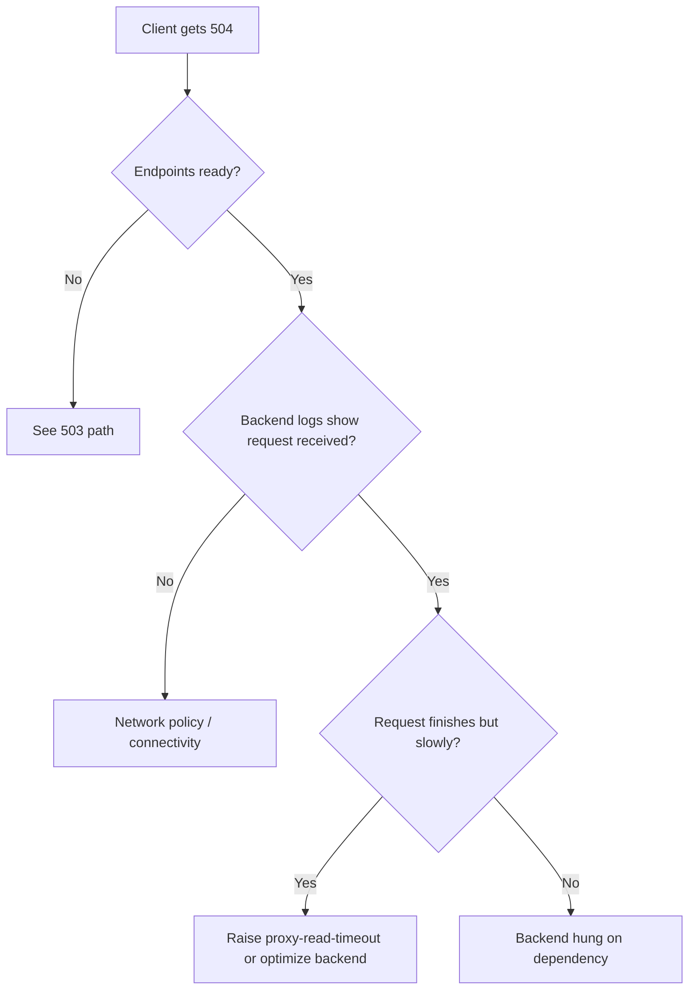

# Ingress 504 Gateway Timeout

> **Severity:** High · **Typical recovery time:** 10–40 min · **Affected versions:** 1.19+

## Error Message

```text
504 Gateway Time-out
nginx
```

## Description

A 504 means the ingress controller connected to a ready upstream pod but the pod
**did not return a response within the proxy timeout**. The controller waited
the configured `proxy-read-timeout` (default 60s in ingress-nginx) and gave up.
This is a backend-latency problem: a slow query, an external dependency hanging,
a long-running request that exceeds the proxy budget, or saturated worker
threads. Traefik (`responseHeaderTimeout`), HAProxy (`timeout server`), and
cloud LBs have equivalent knobs — the symptom and reasoning are the same.

## Affected Kubernetes Versions

All versions with `networking.k8s.io/v1` Ingress (1.19+). Timeout defaults are
set by the controller, not Kubernetes; verify the value in your ingress-nginx
ConfigMap or per-Ingress annotations.

## Likely Root Causes

- Backend genuinely takes longer than `proxy-read-timeout` (reports, exports,
  large uploads).
- Downstream dependency (DB, third-party API) is slow or unreachable.
- Pod is CPU-throttled or thread-pool exhausted under load.
- Timeout annotation too low for a legitimately long endpoint.

## Diagnostic Flow



## Verification Steps

Confirm the request reaches the pod (appears in app logs) but takes longer than
the proxy timeout. Time the backend directly to separate app latency from
controller config.

## kubectl Commands

```bash
kubectl describe ingress <ingress> -n <namespace>
kubectl logs -n ingress-nginx deploy/ingress-nginx-controller --tail=100
kubectl logs <backend-pod> -n <namespace> --tail=100
kubectl top pod -n <namespace>
kubectl get configmap ingress-nginx-controller -n ingress-nginx -o yaml
```

## Expected Output

```text
2024/05/01 12:05:10 [error] 33#33: *900 upstream timed out (110: Connection
timed out) while reading response header from upstream, client: 10.0.0.5,
server: app.example.com, request: "GET /reports/export HTTP/1.1",
upstream: "http://10.244.3.4:8080/reports/export", host: "app.example.com"
```

## Common Fixes

1. Raise the timeout for the affected path only:
   `nginx.ingress.kubernetes.io/proxy-read-timeout: "120"` (and
   `proxy-send-timeout`).
2. Optimize the slow backend path (indexing, caching, async jobs).
3. Add capacity / fix CPU throttling so the pod responds in time.

## Recovery Procedures

1. Confirm whether the latency is the app or a dependency.
2. For an immediate mitigation, bump the per-Ingress timeout annotation —
   config-only, the controller reloads gracefully with no downtime.
3. If a dependency is down, fail traffic over or scale the dependency rather
   than the app.
4. Scale the backend Deployment up to relieve saturation —
   **disruptive only as added load/cost; no outage**.

## Validation

```bash
time curl -I https://app.example.com/reports/export
```

Response returns under the timeout with `HTTP/1.1 200` and no `upstream timed
out` lines in controller logs.

## Prevention

- Move genuinely long operations to async/background jobs with polling.
- Set timeouts deliberately per route instead of one global value.
- Monitor p95/p99 latency and CPU throttling to catch creep before it 504s.

## Related Errors

- [Ingress 502 Bad Gateway](ingress-502-bad-gateway.md)
- [Ingress 503 Service Unavailable](ingress-503-service-unavailable.md)
- [Ingress Path Not Matching](ingress-path-not-matching.md)

## References

- [Ingress concepts](https://kubernetes.io/docs/concepts/services-networking/ingress/)
- [Debug running pods](https://kubernetes.io/docs/tasks/debug/debug-application/debug-running-pod/)

## Further Reading

- [DevOps AI ToolKit — Kubernetes guides](https://devopsaitoolkit.com/blog/)
