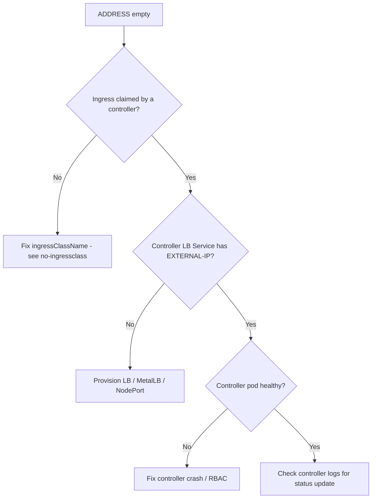

# Ingress ADDRESS Empty

> **Severity:** High · **Typical recovery time:** 10–45 min · **Affected versions:** 1.19+

## Error Message

```text
NAME   CLASS   HOSTS             ADDRESS   PORTS   AGE
web    nginx   www.example.com             80      8m
# ADDRESS column never populates
```

## Description

The `ADDRESS` field of an Ingress is written back by the controller once it has
accepted the Ingress and knows the external IP/hostname clients should use
(usually the controller's `LoadBalancer` Service ingress IP). When it stays
empty, either no controller has claimed the Ingress, or the controller's
front-end Service has no external address to publish. Until ADDRESS is set, DNS
has nothing to point at and the host is effectively unreachable from outside.
This is a control-plane/plumbing problem, distinct from 502/503 which happen
*after* traffic is flowing.

## Affected Kubernetes Versions

All versions with `networking.k8s.io/v1` Ingress (1.19+). On bare metal without
a cloud LB, ADDRESS depends on MetalLB or a NodePort/hostNetwork setup.

## Likely Root Causes

- No controller claims the Ingress (missing/wrong IngressClass).
- The ingress-nginx `LoadBalancer` Service is stuck in `EXTERNAL-IP <pending>`
  (no cloud LB provisioner or MetalLB on bare metal).
- Controller pod is not running/healthy and never reconciles status.
- RBAC prevents the controller from updating Ingress status.

## Diagnostic Flow



## Verification Steps

Confirm the Ingress has a valid class, then check whether the controller's
front-end Service has an external IP. On bare metal, verify a load-balancer
implementation exists at all.

## kubectl Commands

```bash
kubectl get ingress <ingress> -n <namespace>
kubectl get ingressclass
kubectl get svc -n ingress-nginx
kubectl describe svc ingress-nginx-controller -n ingress-nginx
kubectl get pods -n ingress-nginx
kubectl logs -n ingress-nginx deploy/ingress-nginx-controller --tail=80
```

## Expected Output

```text
$ kubectl get svc -n ingress-nginx
NAME                       TYPE           CLUSTER-IP     EXTERNAL-IP   PORT(S)
ingress-nginx-controller   LoadBalancer   10.96.10.20    <pending>     80,443
# EXTERNAL-IP <pending> => no LB provisioned => Ingress ADDRESS stays empty
```

## Common Fixes

1. Set the correct `ingressClassName` so a controller claims the Ingress.
2. Provision an external IP for the controller Service — cloud LB controller, or
   MetalLB / a NodePort fronted by an external LB on bare metal.
3. Restore the controller pod and its RBAC so it can write Ingress status.

## Recovery Procedures

1. Check class first; if unclaimed, fix `ingressClassName` (config-only, no
   downtime).
2. If the LB Service is `<pending>`, install/repair the LB provisioner. Changing
   the controller Service type (e.g. to NodePort) is **disruptive: blast radius
   is every Ingress fronted by this controller** — schedule it.
3. If the controller is down, restart it — **disruptive: a controller rollout
   briefly interrupts all ingress traffic; cluster-wide blast radius**.

## Validation

```bash
kubectl get ingress <ingress> -n <namespace>
```

`ADDRESS` shows the external IP/hostname; `dig`/`curl` against it reaches the
backend.

## Prevention

- Verify a load-balancer implementation exists before deploying Ingresses
  (cloud LB or MetalLB).
- Monitor the controller Service for `<pending>` EXTERNAL-IP.
- Always set `ingressClassName` and alert on Ingresses with empty ADDRESS.

## Related Errors

- [Ingress Has No IngressClass](ingress-no-ingressclass.md)
- [Ingress 404 Default Backend](ingress-404-default-backend.md)
- [Ingress 503 Service Unavailable](ingress-503-service-unavailable.md)

## References

- [Ingress controllers](https://kubernetes.io/docs/concepts/services-networking/ingress-controllers/)
- [Service type LoadBalancer](https://kubernetes.io/docs/concepts/services-networking/service/#loadbalancer)

## Further Reading

- [Free Kubernetes config validators](https://devopsaitoolkit.com/validators/)
