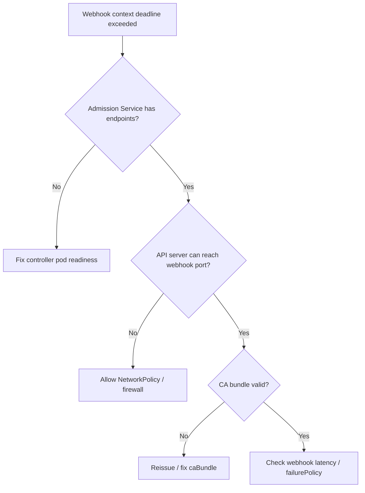

# Ingress Admission Webhook Timeout

> **Severity:** High · **Typical recovery time:** 10–30 min · **Affected versions:** 1.19+

## Error Message

```text
Error from server (InternalError): error when creating "ingress.yaml":
Internal error occurred: failed calling webhook "validate.nginx.ingress.kubernetes.io":
failed to call webhook: Post "https://ingress-nginx-controller-admission.ingress-nginx.svc:443/networking/v1/ingresses?timeout=10s":
context deadline exceeded
```

## Description

ingress-nginx installs a `ValidatingWebhookConfiguration` that the API server calls
to validate every Ingress create/update. If the webhook endpoint is unreachable or
slow, the API server's call times out and the Ingress operation is rejected. The
result is that you cannot create or modify Ingress objects at all — a deploy-blocking
failure even though existing routes keep serving.

The webhook is backed by the controller's admission Service. Timeouts mean the API
server can't reach that Service: the controller pod is down, the Service has no
endpoints, a NetworkPolicy or firewall blocks API-server→webhook traffic, or the
webhook's `failurePolicy: Fail` is amplifying a transient slowness.

## Affected Kubernetes Versions

Applies to ingress-nginx on 1.19+ using `admissionregistration.k8s.io/v1`. On
managed clusters (EKS/GKE/AKS) with restricted control planes, the API server may be
unable to reach in-cluster webhook ports unless explicitly allowed — a frequent cause
of this exact timeout after install or network changes.

## Likely Root Causes

- Controller pod down or not Ready, so the admission Service has no endpoints
- NetworkPolicy/firewall blocking API server → admission webhook (port 8443/443)
- Expired or mismatched webhook CA bundle / serving certificate
- `failurePolicy: Fail` turning a slow webhook into a hard deploy block

## Diagnostic Flow



## Verification Steps

Confirm the admission Service has endpoints, the webhook configuration points at the
right Service and CA, and the API server can actually reach the port.

## kubectl Commands

```bash
kubectl get validatingwebhookconfigurations ingress-nginx-admission -o yaml
kubectl get pods -n ingress-nginx -l app.kubernetes.io/component=controller
kubectl get svc -n ingress-nginx ingress-nginx-controller-admission
kubectl get endpoints -n ingress-nginx ingress-nginx-controller-admission
kubectl describe pod -n ingress-nginx <controller-pod>
kubectl logs -n ingress-nginx <controller-pod> --tail=100
```

## Expected Output

```text
$ kubectl get endpoints -n ingress-nginx ingress-nginx-controller-admission
NAME                                       ENDPOINTS   AGE
ingress-nginx-controller-admission         <none>      30m     # <- no backend

$ kubectl get validatingwebhookconfigurations ingress-nginx-admission \
    -o jsonpath='{.webhooks[0].failurePolicy}'
Fail
```

## Common Fixes

1. Restore controller readiness so the admission Service gets endpoints
2. Add a NetworkPolicy/firewall rule permitting the API server to reach the webhook port
3. Reissue the webhook serving cert and correct the `caBundle`

## Recovery Procedures

1. Fix the controller pod (most cases — once Ready, the webhook answers). Non-disruptive.
2. To unblock urgent deploys when the controller can't be fixed immediately, delete
   the `ValidatingWebhookConfiguration` so Ingress validation is bypassed.
   **Disruptive — blast radius: cluster-wide;** invalid Ingresses can now be admitted
   with no validation. Re-create the webhook as soon as the controller is healthy.
3. Restart the controller deployment if the pod is wedged. **Disruptive — blast radius:
   Ingress traffic on this controller briefly reloads.**

## Validation

Create a trivial test Ingress and confirm it is admitted without timeout, and that
the admission Service shows ready endpoints again.

## Prevention

- Run the controller with multiple replicas and a PodDisruptionBudget so the webhook stays available
- Allowlist API-server→webhook traffic explicitly in NetworkPolicies/firewalls
- Monitor webhook latency and certificate expiry; consider scoped `namespaceSelector`

## Related Errors

- [Ingress Controller CrashLoopBackOff](ingress-controller-crashloopbackoff.md)
- [Ingress Annotation Ignored](ingress-annotation-ignored.md)
- [Multiple Ingress Controllers Conflict](ingress-multiple-controllers-conflict.md)

## References

- [Dynamic Admission Control](https://kubernetes.io/docs/reference/access-authn-authz/extensible-admission-controllers/)
- [Ingress controllers](https://kubernetes.io/docs/concepts/services-networking/ingress-controllers/)

## Further Reading

- [Free Kubernetes config validators](https://devopsaitoolkit.com/validators/)
