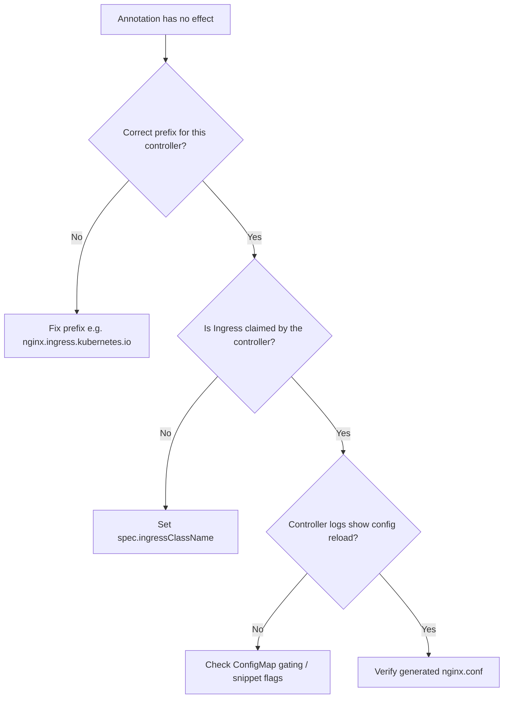

# Ingress Annotation Ignored

> **Severity:** Medium · **Typical recovery time:** 5–20 min · **Affected versions:** 1.19+

## Error Message

```text
Ingress applied successfully, but the behavior it requests never takes effect.
Example: nginx.ingress.kubernetes.io/proxy-body-size: "50m" is set, yet uploads
still fail with 413, and the controller logs show no matching configuration.
There is no hard error — the annotation is silently ignored.
```

## Description

This is one of the most common silent Ingress failures. The resource is accepted
by the API server, `kubectl apply` returns success, but the controller never acts
on the annotation. Because nothing errors, operators waste time chasing the wrong
layer. From an SRE perspective the symptom is "my config is there but the proxy
behaves as if it isn't."

Annotations are vendor-specific. Each controller only reads annotations matching
its own prefix (for ingress-nginx that is `nginx.ingress.kubernetes.io/`). If the
prefix is wrong, the annotation belongs to a different controller, or the Ingress
is not claimed by the controller you expect, the setting is discarded.

## Affected Kubernetes Versions

Applies to 1.19+ where `IngressClass` became stable. From 1.18 onward the legacy
`kubernetes.io/ingress.class` annotation was deprecated in favor of
`spec.ingressClassName`. In 1.22+ the old `networking.k8s.io/v1beta1` API is
removed, so manifests using deprecated annotation forms may be parsed differently.

## Likely Root Causes

- Wrong annotation prefix (e.g. `nginx.org/` for ingress-nginx, or vice versa)
- Ingress not claimed by the intended controller (missing/incorrect `ingressClassName`)
- Typo in the annotation key, or value type the controller rejects silently
- Annotation requires a global ConfigMap setting or `allow-snippet-annotations: true`

## Diagnostic Flow



## Verification Steps

Confirm which controller owns the Ingress, that the prefix matches that controller,
and that the controller actually reloaded its config after your change.

## kubectl Commands

```bash
kubectl get ingress <name> -n <namespace> -o yaml
kubectl get ingressclass
kubectl describe ingress <name> -n <namespace>
kubectl get pods -n ingress-nginx -l app.kubernetes.io/component=controller
kubectl logs -n ingress-nginx <controller-pod> --tail=100
kubectl get configmap -n ingress-nginx ingress-nginx-controller -o yaml
```

## Expected Output

```text
$ kubectl get ingressclass
NAME    CONTROLLER                      PARAMETERS   AGE
nginx   k8s.io/ingress-nginx            <none>       42d

$ kubectl get ingress app -n web -o jsonpath='{.spec.ingressClassName}'
(empty)        # <- not claimed; annotations on this Ingress are ignored
```

## Common Fixes

1. Set `spec.ingressClassName: nginx` so the controller claims the Ingress
2. Correct the annotation prefix to match your controller's documented prefix
3. Enable the gating flag (e.g. `allow-snippet-annotations: "true"`) in the controller ConfigMap when the annotation requires it

## Recovery Procedures

1. Patch the Ingress with the correct `ingressClassName` and prefix (non-disruptive;
   affects only this Ingress route).
2. If a controller ConfigMap change is required, edit it and let the controller
   reload. **Disruptive — blast radius: all Ingresses served by this controller**
   briefly reload their configuration; existing connections are usually preserved
   but momentary 503s are possible under heavy load.
3. Re-apply the Ingress and confirm the controller logs a successful reload.

## Validation

Re-run the request that exercised the annotation (upload, redirect, header) and
confirm the new behavior. Inspect the rendered config inside the controller pod to
verify the directive is present.

## Prevention

- Pin `ingressClassName` on every Ingress and reject manifests without it in CI
- Lint annotation prefixes against the deployed controller
- Document the single source of truth for which controller serves which class

## Related Errors

- [Ingress Rewrite Redirect Loop](ingress-rewrite-target-redirect-loop.md)
- [Ingress 413 Request Entity Too Large](ingress-413-request-too-large.md)
- [Multiple Ingress Controllers Conflict](ingress-multiple-controllers-conflict.md)

## References

- [Ingress concepts](https://kubernetes.io/docs/concepts/services-networking/ingress/)
- [IngressClass](https://kubernetes.io/docs/concepts/services-networking/ingress/#ingress-class)

## Further Reading

- [DevOps AI ToolKit — Kubernetes guides](https://devopsaitoolkit.com/blog/)
