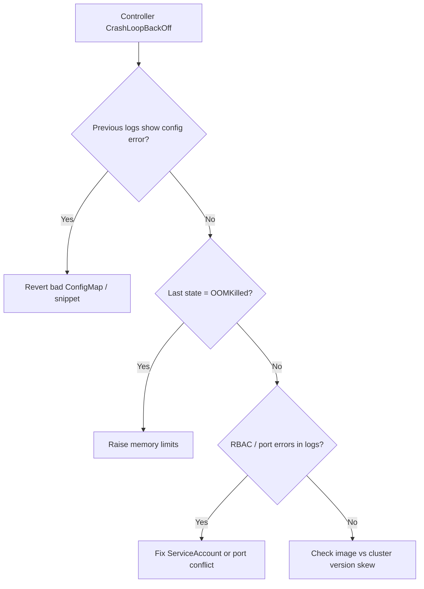

# Ingress Controller CrashLoopBackOff

> **Severity:** Critical · **Typical recovery time:** 15–45 min · **Affected versions:** 1.19+

## Error Message

```text
NAME                                        READY   STATUS             RESTARTS   AGE
ingress-nginx-controller-7d9c8f5b6b-q2x9w   0/1     CrashLoopBackOff   6          8m
```

## Description

The ingress-nginx controller pod starts, exits, and Kubernetes keeps restarting it
with exponential backoff. While it is down, no new Ingress configuration is applied
and, depending on topology, live traffic through that controller can be interrupted.
This is a Critical incident because it can take every Ingress-fronted service offline.

The crash is usually visible in the previous container's logs: a fatal config error,
a port already in use, an invalid generated `nginx.conf`, missing RBAC permissions,
or the controller being OOMKilled. Reading `--previous` logs and the pod's last state
is the fastest path to root cause.

## Affected Kubernetes Versions

Applies to ingress-nginx on 1.19+. Version skew is a common trigger: newer
ingress-nginx releases require newer Kubernetes APIs and the matching admission
webhook. After a cluster upgrade, an old controller image may crash on removed APIs;
after a controller upgrade, an old `Validatingwebhookconfiguration` may break startup.

## Likely Root Causes

- Invalid configuration (bad ConfigMap value or a snippet that renders broken nginx.conf)
- Missing/incorrect RBAC (ServiceAccount lacks permissions to list resources)
- Port conflict / `hostPort` already in use, or another controller bound to the port
- OOMKilled due to too-low memory limits, or image/version incompatibility

## Diagnostic Flow



## Verification Steps

Read the previous container logs and the pod's `lastState` to see why it exited.
Distinguish a config crash (immediate exit with parse error) from OOMKilled
(`reason: OOMKilled`) from RBAC (forbidden list/watch errors).

## kubectl Commands

```bash
kubectl get pods -n ingress-nginx
kubectl describe pod -n ingress-nginx <controller-pod>
kubectl logs -n ingress-nginx <controller-pod> --previous
kubectl get events -n ingress-nginx --sort-by=.lastTimestamp
kubectl get configmap -n ingress-nginx ingress-nginx-controller -o yaml
kubectl get clusterrole,clusterrolebinding | grep ingress-nginx
```

## Expected Output

```text
$ kubectl describe pod -n ingress-nginx ingress-nginx-controller-...
    Last State:     Terminated
      Reason:       Error
      Exit Code:    1
$ kubectl logs -n ingress-nginx ingress-nginx-controller-... --previous | tail -2
[emerg] "proxy_buffer_size" directive invalid value
nginx: configuration file /tmp/nginx/nginx.conf test failed
```

## Common Fixes

1. Revert the ConfigMap key or annotation snippet that produced an invalid nginx.conf
2. Restore correct RBAC (ServiceAccount, ClusterRole, ClusterRoleBinding)
3. Increase memory limits if OOMKilled, or align the controller image with the cluster version

## Recovery Procedures

1. Identify the failing change from `--previous` logs (non-disruptive).
2. Roll back the controller config/Helm release to the last known-good revision.
   **Disruptive — blast radius: all Ingress traffic on this controller;** it briefly
   reloads/restarts, so connections may reset.
3. If a bad image is the cause, redeploy the prior controller version.
   **Disruptive — blast radius: cluster-wide Ingress** during the rollout.

## Validation

Confirm the controller pod is `1/1 Running` with no new restarts, the admission
webhook responds, and a test request through an Ingress returns 200.

## Prevention

- Validate ConfigMap/snippet changes in staging before production
- Pin compatible controller and Kubernetes versions; review the support matrix on upgrade
- Set realistic memory requests/limits and a PodDisruptionBudget for the controller

## Related Errors

- [Ingress Admission Webhook Timeout](ingress-admission-webhook-timeout.md)
- [Ingress Upstream Connect Error](ingress-upstream-connect-error.md)
- [Multiple Ingress Controllers Conflict](ingress-multiple-controllers-conflict.md)

## References

- [Ingress controllers](https://kubernetes.io/docs/concepts/services-networking/ingress-controllers/)
- [Debug running pods](https://kubernetes.io/docs/tasks/debug/debug-application/debug-running-pod/)

## Further Reading

- [DevOps AI ToolKit — Kubernetes guides](https://devopsaitoolkit.com/blog/)
