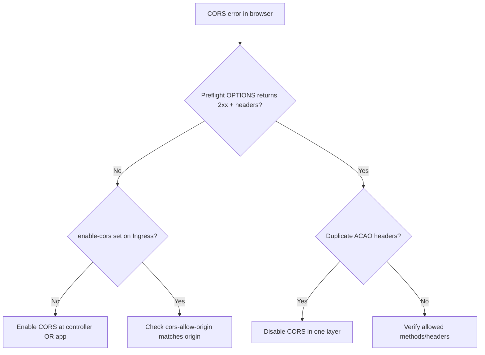

# Ingress CORS Blocked

> **Severity:** Medium · **Typical recovery time:** 10–30 min · **Affected versions:** 1.19+

## Error Message

```text
Access to fetch at 'https://api.example.com/v1/items' from origin
'https://app.example.com' has been blocked by CORS policy: Response to preflight
request doesn't pass access control check: No 'Access-Control-Allow-Origin'
header is present on the requested resource.
```

## Description

A browser made a cross-origin request and the response lacked the required CORS
headers, so the browser blocked it. For "non-simple" requests the browser first
sends an `OPTIONS` preflight; if that preflight is not answered with the right
`Access-Control-Allow-*` headers (and a 2xx), the real request never fires. The
backend may be perfectly healthy — this is purely a headers problem.

The frequent confusion is that CORS can be enabled either at the Ingress controller
or in the application, and enabling it in both can produce duplicate/conflicting
headers, which browsers also reject. SREs should pin down a single owner of CORS.

## Affected Kubernetes Versions

Applies to ingress-nginx on 1.19+. The relevant annotations are
`nginx.ingress.kubernetes.io/enable-cors`, `cors-allow-origin`,
`cors-allow-methods`, `cors-allow-headers`, and `cors-allow-credentials`. In recent
controller versions `cors-allow-origin` accepts a comma-separated list and is
validated more strictly; a wildcard `*` cannot be combined with
`allow-credentials: true`.

## Likely Root Causes

- CORS not enabled at the controller, and the app doesn't set the headers either
- `cors-allow-origin` doesn't match the calling origin (scheme/port/subdomain mismatch)
- Both controller and app set CORS headers, producing duplicates
- Preflight `OPTIONS` routed to the backend which returns non-2xx

## Diagnostic Flow



## Verification Steps

Reproduce the preflight with a manual `OPTIONS` request including `Origin` and
`Access-Control-Request-Method`, then inspect the returned headers and status.

## kubectl Commands

```bash
kubectl get ingress <name> -n <namespace> -o yaml
kubectl describe ingress <name> -n <namespace>
kubectl get configmap -n ingress-nginx ingress-nginx-controller -o yaml
kubectl logs -n ingress-nginx <controller-pod> --tail=50
```

## Expected Output

```text
$ curl -sI -X OPTIONS https://api.example.com/v1/items \
    -H 'Origin: https://app.example.com' \
    -H 'Access-Control-Request-Method: GET'
HTTP/2 204
access-control-allow-origin: https://app.example.com
access-control-allow-methods: GET, POST, OPTIONS
# Missing access-control-allow-origin here means the browser will block the call
```

## Common Fixes

1. Enable CORS at the controller: `enable-cors: "true"` plus `cors-allow-origin` set to the exact calling origin
2. If the app already sets CORS headers, disable it at the controller to avoid duplicates
3. For credentialed requests, set a specific origin (not `*`) and `cors-allow-credentials: "true"`

## Recovery Procedures

1. Patch the Ingress annotations for the affected route (non-disruptive; applies on
   the next controller reload, affects only that route).
2. If you remove app-side CORS instead, redeploy the backend.
   **Disruptive — blast radius: the backend Deployment rolls;** coordinate so a
   window without CORS headers doesn't break live clients.
3. Re-run the preflight to confirm a single, correct header set.

## Validation

Repeat the `OPTIONS` preflight and the real request from the actual origin; confirm
exactly one `Access-Control-Allow-Origin` matching the caller and a successful 2xx.

## Prevention

- Choose one CORS owner (controller or app) and enforce it in review
- Template allowed origins from environment config, never hardcode `*` with credentials
- Add a synthetic preflight check to CI/monitoring for public APIs

## Related Errors

- [Ingress Annotation Ignored](ingress-annotation-ignored.md)
- [Ingress Rewrite Redirect Loop](ingress-rewrite-target-redirect-loop.md)
- [Ingress 413 Request Entity Too Large](ingress-413-request-too-large.md)

## References

- [Ingress concepts](https://kubernetes.io/docs/concepts/services-networking/ingress/)
- [Ingress controllers](https://kubernetes.io/docs/concepts/services-networking/ingress-controllers/)

## Further Reading

- [DevOps AI ToolKit — Kubernetes guides](https://devopsaitoolkit.com/blog/)
