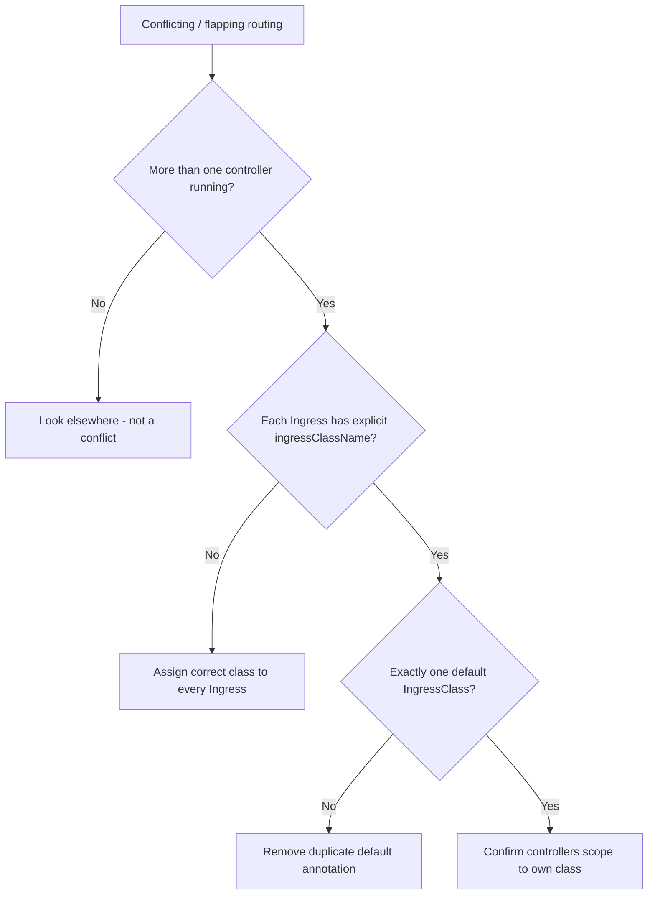

# Multiple Ingress Controllers Conflict

> **Severity:** High · **Typical recovery time:** 15–40 min · **Affected versions:** 1.19+

## Error Message

```text
Two ingress controllers (e.g. ingress-nginx and another nginx/traefik install)
both claim and program the same Ingress. Symptoms: requests intermittently hit
different backends, conflicting TLS certs are served, annotations from one
controller are ignored by the other, and each controller's logs show it syncing
the same host/path.
```

## Description

When more than one Ingress controller in a cluster watches the same Ingress objects,
both program their data plane for the same hostnames. Because both may share an
external IP/LoadBalancer or DNS record, clients are routed non-deterministically.
This produces flapping behavior that is hard to debug: a fix applied through one
controller's annotations appears to "sometimes work."

The root issue is ownership. Each controller should only serve Ingresses assigned to
its `IngressClass`. Without explicit class assignment, a controller configured to
watch all classes (or set as the default) will claim Ingresses meant for another.

## Affected Kubernetes Versions

Applies to 1.19+ where `IngressClass` is the supported ownership mechanism. The
legacy `kubernetes.io/ingress.class` annotation still works but coexisting old and
new mechanisms is a classic source of double-claiming. A `default IngressClass`
(annotation `ingressclass.kubernetes.io/is-default-class: "true"`) is honored from
1.18+, and having two defaults is itself a misconfiguration.

## Likely Root Causes

- Two controllers installed, both watching all classes / both marked default
- Ingresses missing `ingressClassName`, so the default (or every) controller claims them
- Mixed use of the legacy class annotation and `spec.ingressClassName`
- A controller started with `--watch-ingress-without-class` claiming unassigned Ingresses

## Diagnostic Flow



## Verification Steps

Enumerate the controllers and IngressClasses, then check which controller each
Ingress is bound to and whether more than one default class exists.

## kubectl Commands

```bash
kubectl get pods -A -l app.kubernetes.io/component=controller
kubectl get ingressclass -o wide
kubectl get ingressclass -o jsonpath='{range .items[*]}{.metadata.name}{"\t"}{.metadata.annotations.ingressclass\.kubernetes\.io/is-default-class}{"\n"}{end}'
kubectl get ingress -A -o custom-columns=NS:.metadata.namespace,NAME:.metadata.name,CLASS:.spec.ingressClassName
kubectl logs -n ingress-nginx <controller-pod> --tail=50
```

## Expected Output

```text
$ kubectl get ingressclass -o wide
NAME      CONTROLLER                    PARAMETERS   AGE
nginx     k8s.io/ingress-nginx          <none>       30d
traefik   traefik.io/ingress-controller <none>       12d

$ kubectl get ingress -A -o custom-columns=NAME:.metadata.name,CLASS:.spec.ingressClassName
NAME   CLASS
app    <none>      # <- unassigned: eligible to be claimed by both
```

## Common Fixes

1. Set an explicit `spec.ingressClassName` on every Ingress to its intended controller
2. Ensure exactly one IngressClass carries the `is-default-class` annotation
3. Scope each controller to its own class and disable watching unassigned Ingresses

## Recovery Procedures

1. Assign the correct `ingressClassName` to each affected Ingress (non-disruptive per
   Ingress; the losing controller stops programming it on the next sync).
2. Remove the duplicate default-class annotation. **Disruptive — blast radius: any
   Ingress relying on the implicit default may briefly lose routing** until it has an
   explicit class; assign classes first.
3. If you decommission a redundant controller, scale it down only after all its
   Ingresses are migrated. **Disruptive — blast radius: every route still on that
   controller goes down.**

## Validation

Repeat the previously flapping request many times and confirm it consistently hits
the intended backend with the expected TLS cert. Confirm only the chosen controller
logs syncing that host.

## Prevention

- Mandate `ingressClassName` on every Ingress via policy/CI (e.g. OPA/Kyverno)
- Keep at most one default IngressClass and document it
- Avoid running overlapping controllers on the same external IP without strict class scoping

## Related Errors

- [Ingress Annotation Ignored](ingress-annotation-ignored.md)
- [Ingress Controller CrashLoopBackOff](ingress-controller-crashloopbackoff.md)
- [Ingress Admission Webhook Timeout](ingress-admission-webhook-timeout.md)

## References

- [IngressClass](https://kubernetes.io/docs/concepts/services-networking/ingress/#ingress-class)
- [Multiple Ingress controllers](https://kubernetes.io/docs/concepts/services-networking/ingress-controllers/#using-multiple-ingress-controllers)

## Further Reading

- [DevOps AI ToolKit — Kubernetes guides](https://devopsaitoolkit.com/blog/)
