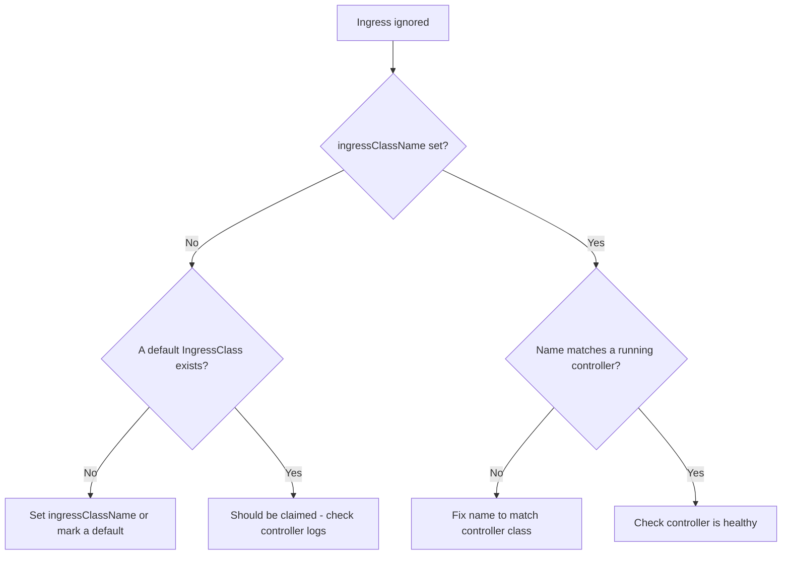

# Ingress Has No IngressClass

> **Severity:** High · **Typical recovery time:** 5–20 min · **Affected versions:** 1.18+

## Error Message

```text
Ingress not picked up (no IngressClass / wrong class)
# Symptom: ADDRESS stays empty, no events from controller, traffic 404s
```

## Description

An Ingress only takes effect when a controller **claims** it. Claiming is
decided by the `spec.ingressClassName` field (or the legacy
`kubernetes.io/ingress.class` annotation). If neither is set and no IngressClass
is marked default, or the value names a class no running controller serves, the
Ingress is silently ignored: no ADDRESS, no events, requests fall through to the
default backend. This is extremely common after migrating from the deprecated
annotation to `ingressClassName`, or in clusters running multiple controllers
(e.g. ingress-nginx plus a cloud ALB controller) where the wrong one would
otherwise grab the object.

## Affected Kubernetes Versions

The `IngressClass` resource and `spec.ingressClassName` were added in 1.18 and
are stable from 1.19. The legacy `kubernetes.io/ingress.class` annotation still
works in ingress-nginx but is deprecated — prefer `ingressClassName`.

## Likely Root Causes

- `spec.ingressClassName` is empty and no IngressClass has the
  `ingressclass.kubernetes.io/is-default-class: "true"` annotation.
- The class name does not match the controller's configured class
  (`--ingress-class` / `--controller-class`).
- Still using the old annotation while the controller expects the field.
- Multiple controllers installed; the intended one is not the default.

## Diagnostic Flow



## Verification Steps

List IngressClasses and confirm which (if any) is default. Compare the Ingress's
`ingressClassName` to the controller's configured class and check controller
logs for whether it ever saw the Ingress.

## kubectl Commands

```bash
kubectl get ingressclass
kubectl describe ingressclass <class>
kubectl get ingress <ingress> -n <namespace> -o yaml
kubectl describe ingress <ingress> -n <namespace>
kubectl get deploy -n ingress-nginx -o yaml | grep -i ingress-class
kubectl logs -n ingress-nginx deploy/ingress-nginx-controller --tail=50
```

## Expected Output

```text
$ kubectl get ingressclass
NAME    CONTROLLER             PARAMETERS   AGE
nginx   k8s.io/ingress-nginx   <none>       30d

$ kubectl get ingress web -n shop
NAME   CLASS    HOSTS             ADDRESS   PORTS   AGE
web    <none>   www.example.com             80      6m
# CLASS=<none> and empty ADDRESS => not claimed
```

## Common Fixes

1. Set `spec.ingressClassName: nginx` (matching your controller) on the Ingress.
2. Mark one IngressClass default:
   `ingressclass.kubernetes.io/is-default-class: "true"`.
3. If on the legacy annotation, replace it with `ingressClassName`.

## Recovery Procedures

1. Determine the controller's class name from its Deployment args.
2. Patch the Ingress to set the matching `ingressClassName` — config-only, the
   controller picks it up within seconds, no downtime.
3. Setting a cluster default IngressClass affects **all** future class-less
   Ingresses — **blast radius: cluster-wide for new/unset Ingresses**; review
   before applying in a shared cluster.

## Validation

```bash
kubectl get ingress <ingress> -n <namespace>
```

`CLASS` shows your controller and `ADDRESS` populates, confirming the controller
claimed the Ingress.

## Prevention

- Always set `ingressClassName` explicitly in manifests; do not rely on default.
- In multi-controller clusters, give each a distinct class and document it.
- Add CI checks that every Ingress names a valid, existing IngressClass.

## Related Errors

- [Ingress ADDRESS Empty](ingress-address-empty.md)
- [Ingress 404 Default Backend](ingress-404-default-backend.md)
- [Ingress 503 Service Unavailable](ingress-503-service-unavailable.md)

## References

- [IngressClass](https://kubernetes.io/docs/concepts/services-networking/ingress/#ingress-class)
- [Default IngressClass](https://kubernetes.io/docs/concepts/services-networking/ingress/#default-ingress-class)

## Further Reading

- [Free Kubernetes config validators](https://devopsaitoolkit.com/validators/)
