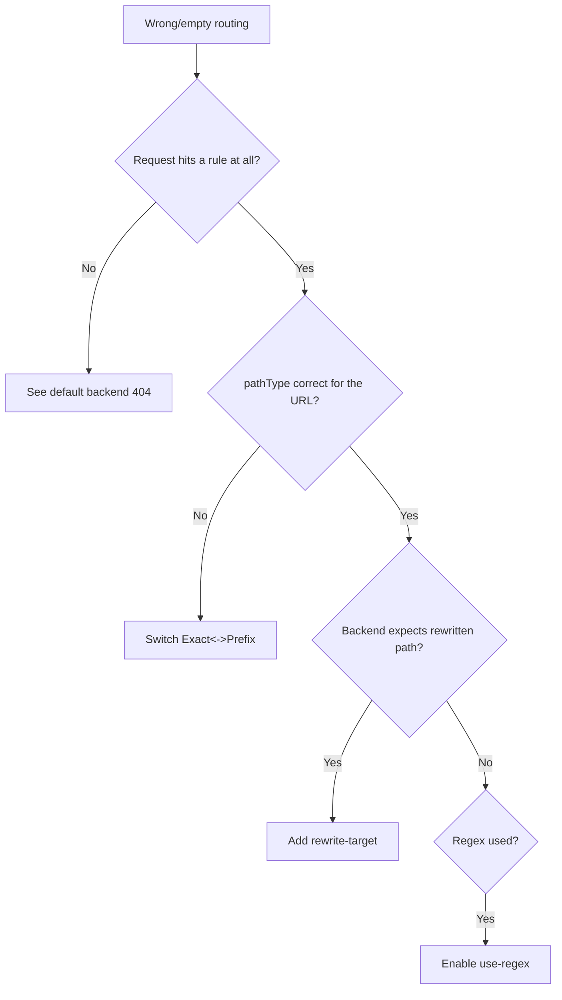

# Ingress Path Not Matching

> **Severity:** Medium · **Typical recovery time:** 5–25 min · **Affected versions:** 1.19+

## Error Message

```text
requests not routed (path/pathType mismatch)
# e.g. GET /api/users returns the wrong app or "default backend - 404"
```

## Description

Requests reach the controller but land on the wrong backend or the default
backend because the Ingress `path` and `pathType` do not match the request URL
the way you expect. The `networking.k8s.io/v1` API defines three pathTypes —
`Exact`, `Prefix`, and `ImplementationSpecific` — and they behave differently.
A common trap: `Prefix: /api` matches `/api` and `/api/v1` but the application
expects to receive `/v1`, so you also need a rewrite. Another: `Exact: /app`
will *not* match `/app/`. With ingress-nginx, `ImplementationSpecific` enables
regex (with `use-regex`), which behaves unlike portable Prefix matching.

## Affected Kubernetes Versions

`pathType` is required in `networking.k8s.io/v1` (stable 1.19+). In the older
`extensions/v1beta1` API there was no `pathType` and matching was always
implementation-specific — a frequent source of behaviour changes during
migration to v1.

## Likely Root Causes

- `pathType: Exact` used where `Prefix` is needed (trailing-slash mismatch).
- `Prefix` match without the rewrite the backend expects
  (`rewrite-target` missing or wrong).
- Regex path used without `nginx.ingress.kubernetes.io/use-regex: "true"`.
- Multiple overlapping paths; a more specific/earlier rule wins unexpectedly.

## Diagnostic Flow



## Verification Steps

Curl the exact failing URL and compare it against each Ingress rule's `path` and
`pathType`. Check controller logs for which upstream (if any) was selected.

## kubectl Commands

```bash
kubectl get ingress <ingress> -n <namespace> -o yaml
kubectl describe ingress <ingress> -n <namespace>
kubectl get ingress <ingress> -n <namespace> \
  -o jsonpath='{range .spec.rules[*].http.paths[*]}{.path}{" "}{.pathType}{"\n"}{end}'
kubectl logs -n ingress-nginx deploy/ingress-nginx-controller --tail=80
```

## Expected Output

```text
$ kubectl get ingress web -n shop -o jsonpath=...
/api   Exact
# Request GET /api/users -> no match (Exact), falls to default backend - 404
```

## Common Fixes

1. Use `pathType: Prefix` for path trees (`/api` to cover `/api/...`); reserve
   `Exact` for a single precise URL.
2. Add `nginx.ingress.kubernetes.io/rewrite-target` when the backend expects a
   stripped/rewritten path.
3. Enable `nginx.ingress.kubernetes.io/use-regex: "true"` when using regex
   captures; order rules from most to least specific.

## Recovery Procedures

1. Reproduce with curl and map the URL to the intended rule.
2. Patch the Ingress `path`/`pathType` or rewrite annotation — config-only, the
   controller reloads gracefully, no downtime.
3. When changing rewrite rules on a shared host, test on a non-prod path first:
   a wrong rewrite can misroute live traffic — **blast radius: all paths under
   that host**.

## Validation

```bash
curl -i https://app.example.com/api/users
```

Returns the expected backend response and the controller log shows the correct
upstream.

## Prevention

- Default to `Prefix` and document the trailing-slash contract per backend.
- Keep rewrite logic explicit and covered by integration tests.
- Lint Ingress paths in CI to flag overlaps and missing `pathType`.

## Related Errors

- [Ingress 404 Default Backend](ingress-404-default-backend.md)
- [Ingress 503 Service Unavailable](ingress-503-service-unavailable.md)
- [Ingress 502 Bad Gateway](ingress-502-bad-gateway.md)

## References

- [Ingress path types](https://kubernetes.io/docs/concepts/services-networking/ingress/#path-types)
- [Ingress rules](https://kubernetes.io/docs/concepts/services-networking/ingress/#ingress-rules)

## Further Reading

- [Free Kubernetes config validators](https://devopsaitoolkit.com/validators/)
