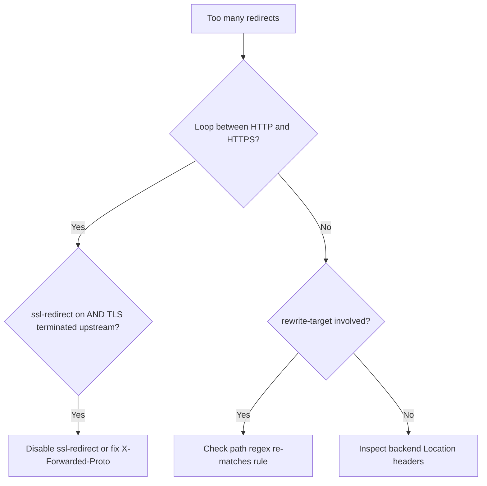

# Ingress Rewrite Redirect Loop

> **Severity:** High · **Typical recovery time:** 10–30 min · **Affected versions:** 1.19+

## Error Message

```text
ERR_TOO_MANY_REDIRECTS
The page isn't redirecting properly. A web page is redirecting in a way that
will never complete. Browser shows the request bouncing between HTTP and HTTPS,
or a path repeatedly rewritten back onto itself.
```

## Description

A redirect loop means the browser receives a 301/308 response, follows it, and is
immediately redirected again to a location that triggers the same response. The
page never loads. In ingress-nginx this is almost always caused by an interaction
between `ssl-redirect` (which forces HTTP→HTTPS) and an upstream that also redirects,
or by a misconfigured `rewrite-target` that maps a path onto a location that
re-matches the same rule.

This matters during an incident because it can take down an entire public route
while health checks against the Service still pass — the backend is healthy, but
no client can complete a request.

## Affected Kubernetes Versions

Applies to ingress-nginx on Kubernetes 1.19+. The `rewrite-target` annotation
changed semantics in ingress-nginx 0.22.0 to require capture groups
(`$1`, `$2`) with regex paths. Manifests written for older controllers commonly
break after an upgrade, producing loops or 404s.

## Likely Root Causes

- `force-ssl-redirect`/`ssl-redirect` enabled while the backend also issues HTTPS redirects (or TLS terminates upstream)
- A load balancer terminates TLS and forwards HTTP, so the controller keeps redirecting to HTTPS
- `rewrite-target` rewrites a path back onto a rule that matches it again
- `X-Forwarded-Proto` not honored by the app, so it issues its own redirect

## Diagnostic Flow



## Verification Steps

Trace the redirect chain with curl, then confirm whether the redirect originates
from the controller or the backend by checking the `Server` and `Location` headers.

## kubectl Commands

```bash
kubectl get ingress <name> -n <namespace> -o yaml
kubectl describe ingress <name> -n <namespace>
kubectl get configmap -n ingress-nginx ingress-nginx-controller -o yaml
kubectl logs -n ingress-nginx <controller-pod> --tail=100
kubectl get svc <backend> -n <namespace> -o yaml
```

## Expected Output

```text
$ curl -sIL http://app.example.com/
HTTP/1.1 308 Permanent Redirect
Location: https://app.example.com/
HTTP/2 308
location: https://app.example.com/      # <- same target, loops forever
```

## Common Fixes

1. If TLS is terminated by an upstream LB, set `nginx.ingress.kubernetes.io/ssl-redirect: "false"` (or `force-ssl-redirect` appropriately) and ensure `X-Forwarded-Proto` is trusted
2. Rewrite paths using capture groups, e.g. path `/app(/|$)(.*)` with `rewrite-target: /$2`
3. Configure the backend to honor `X-Forwarded-Proto` instead of issuing its own scheme redirect

## Recovery Procedures

1. Patch the offending annotation on the single Ingress (non-disruptive; affects
   only that route).
2. If the fix is in the controller ConfigMap (`use-forwarded-headers`,
   `ssl-redirect`), update it. **Disruptive — blast radius: every Ingress on this
   controller reloads;** validate in staging first.
3. Re-test the redirect chain before declaring the loop resolved.

## Validation

`curl -IL` the URL and confirm a single redirect (or none) ending in a 200. Load
the page in a fresh browser session with cleared cache.

## Prevention

- Standardize TLS termination (edge vs controller) and document it
- Use capture-group rewrite patterns and review them in code review
- Add a synthetic check that fails on redirect chains longer than two hops

## Related Errors

- [Ingress Annotation Ignored](ingress-annotation-ignored.md)
- [Ingress Upstream Connect Error](ingress-upstream-connect-error.md)
- [Ingress CORS Blocked](ingress-cors-blocked.md)

## References

- [Ingress TLS](https://kubernetes.io/docs/concepts/services-networking/ingress/#tls)
- [Ingress concepts](https://kubernetes.io/docs/concepts/services-networking/ingress/)

## Further Reading

- [Free Kubernetes config validators](https://devopsaitoolkit.com/validators/)
