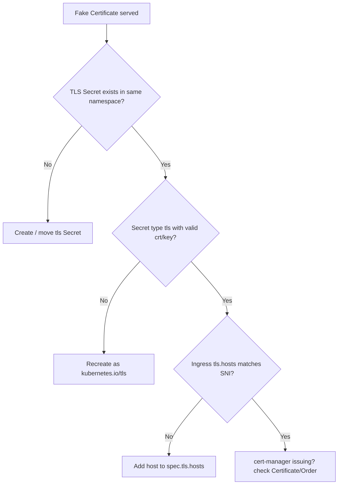

# Ingress TLS Fake Certificate

> **Severity:** High · **Typical recovery time:** 10–40 min · **Affected versions:** 1.19+

## Error Message

```text
Kubernetes Ingress Controller Fake Certificate
# Browser: NET::ERR_CERT_AUTHORITY_INVALID / certificate issued by "Fake Certificate"
```

## Description

ingress-nginx ships a self-signed placeholder certificate it serves whenever it
**cannot find a valid certificate** for the requested host. Seeing the *Fake
Certificate* means TLS is terminating, but the controller did not load your real
cert: the TLS secret is missing, in the wrong namespace, malformed, or the
Ingress `tls.hosts`/SNI does not match the request. It is a configuration
problem, not a CA/trust problem — the controller is healthy and is telling you
your certificate never reached it. The same root causes apply to other
controllers, which present their own default certs.

## Affected Kubernetes Versions

All versions with `networking.k8s.io/v1` Ingress (1.19+). The fake certificate
is an ingress-nginx behaviour, independent of the Kubernetes release.

## Likely Root Causes

- The TLS Secret named in `spec.tls[].secretName` does not exist in the
  Ingress's namespace.
- Secret is not type `kubernetes.io/tls` or has empty/invalid `tls.crt`/`tls.key`.
- `spec.tls[].hosts` (SNI) does not include the requested hostname.
- cert-manager has not yet issued the certificate (Order/Challenge pending).

## Diagnostic Flow



## Verification Steps

Inspect the served certificate with SNI and confirm the issuer is "Fake
Certificate". Verify the referenced Secret exists in the Ingress namespace, is
type `kubernetes.io/tls`, and that `tls.hosts` covers the hostname.

## kubectl Commands

```bash
kubectl get ingress <ingress> -n <namespace> -o yaml
kubectl get secret <tls-secret> -n <namespace>
kubectl describe secret <tls-secret> -n <namespace>
kubectl get certificate,order,challenge -n <namespace>
kubectl logs -n ingress-nginx deploy/ingress-nginx-controller --tail=80
```

## Expected Output

```text
$ openssl s_client -connect <ip>:443 -servername app.example.com </dev/null \
    2>/dev/null | openssl x509 -noout -issuer
issuer=O = Acme Co, CN = Kubernetes Ingress Controller Fake Certificate

$ kubectl get secret app-tls -n shop
Error from server (NotFound): secrets "app-tls" not found
```

## Common Fixes

1. Create the `kubernetes.io/tls` Secret in the **same namespace** as the
   Ingress and reference it in `spec.tls[].secretName`.
2. Add the hostname to `spec.tls[].hosts` so SNI matches.
3. If using cert-manager, fix the Issuer/ClusterIssuer and DNS/HTTP-01 challenge
   so the Certificate becomes Ready.

## Recovery Procedures

1. Confirm whether the Secret is missing, malformed, or just unmatched by host.
2. Create or correct the TLS Secret and reference it — config-only, controller
   reloads the cert within seconds, no downtime.
3. If you must replace an existing in-use Secret, update it in place; replacing
   it can briefly serve the fake cert during reload — **blast radius: TLS for
   that host for a few seconds**.

## Validation

```bash
openssl s_client -connect <ip>:443 -servername app.example.com </dev/null \
  2>/dev/null | openssl x509 -noout -issuer -dates
```

Issuer is your real CA (e.g. Let's Encrypt), not the Fake Certificate, with a
valid date range.

## Prevention

- Automate certs with cert-manager and monitor Certificate readiness/expiry.
- Keep TLS Secrets in the same namespace as their Ingress.
- Lint manifests so every `tls.secretName` resolves and `tls.hosts` covers the
  rules.

## Related Errors

- [Ingress 404 Default Backend](ingress-404-default-backend.md)
- [Ingress Has No IngressClass](ingress-no-ingressclass.md)
- [Ingress ADDRESS Empty](ingress-address-empty.md)

## References

- [Ingress TLS](https://kubernetes.io/docs/concepts/services-networking/ingress/#tls)
- [TLS Secrets](https://kubernetes.io/docs/concepts/configuration/secret/#tls-secrets)

## Further Reading

- [DevOps AI ToolKit — Kubernetes guides](https://devopsaitoolkit.com/blog/)
