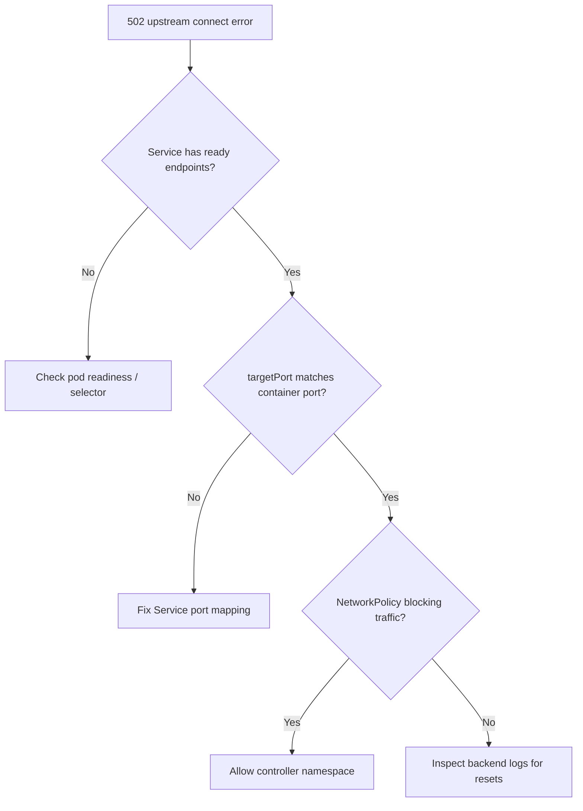

# Ingress Upstream Connect Error

> **Severity:** High · **Typical recovery time:** 10–40 min · **Affected versions:** 1.19+

## Error Message

```text
upstream connect error or disconnect/reset before headers. reset reason: connection failure
502 Bad Gateway
```

## Description

The controller accepted the client request but could not get a usable response from
the backend. Either it failed to open a TCP connection to a pod endpoint, or the
connection was reset before any HTTP headers were returned. The client sees a
502 (or 503/504). The Ingress and Service objects look fine; the failure is in the
path between the controller and the actual pods.

For an on-call engineer this is a classic "the proxy is up, the app is unreachable"
situation. The most common reality is that the Service has zero ready endpoints, the
backend port is wrong, or the app is rejecting connections (still starting,
crashing, or listening on the wrong interface).

## Affected Kubernetes Versions

Applies to ingress-nginx on 1.19+. The error string above is emitted both by
ingress-nginx upstreams and by Envoy-based controllers. Endpoint behavior changed
with `EndpointSlice` becoming the default in 1.21+, so on older clusters check
`Endpoints` and on newer ones check `EndpointSlices`.

## Likely Root Causes

- Service has no ready endpoints (pods not Ready, failing probes, or selector mismatch)
- Wrong `targetPort` / Service port, or app listening on `127.0.0.1` not `0.0.0.0`
- NetworkPolicy blocking controller→pod traffic
- Backend overloaded or resetting connections (timeouts, max connections)

## Diagnostic Flow



## Verification Steps

Confirm the Service actually has endpoints, the ports line up, and the controller
can reach the pods. Distinguish "no endpoints" (instant 503) from "reset before
headers" (connection opened then dropped).

## kubectl Commands

```bash
kubectl get ingress <name> -n <namespace>
kubectl get svc <backend> -n <namespace> -o yaml
kubectl get endpointslices -n <namespace> -l kubernetes.io/service-name=<backend>
kubectl get pods -n <namespace> -o wide
kubectl describe pod <backend-pod> -n <namespace>
kubectl logs -n ingress-nginx <controller-pod> --tail=100
```

## Expected Output

```text
$ kubectl get endpointslices -n web -l kubernetes.io/service-name=app
NAME        ADDRESSTYPE   PORTS   ENDPOINTS   AGE
app-abc12   IPv4          <unset> <unset>     12m      # <- no endpoints

$ kubectl logs -n ingress-nginx controller-xxxx | tail -1
[error] upstream connect error or disconnect/reset before headers
```

## Common Fixes

1. Make the backend Ready — fix failing readiness probes or crashing pods so endpoints populate
2. Correct the Service `targetPort`/`port` and ensure the app binds `0.0.0.0`
3. Add a NetworkPolicy rule permitting traffic from the ingress-nginx namespace

## Recovery Procedures

1. Identify whether endpoints exist; if not, fix the pods (this is where service is
   actually restored). Non-disruptive investigation.
2. If a backend rollout is wedged, roll back to the last good revision.
   **Disruptive — blast radius: the backend Deployment's pods are replaced;**
   in-flight requests to that app may drop.
3. If the controller has stale upstreams, reload it. **Disruptive — blast radius:
   all routes on the controller reload briefly.**

## Validation

Curl through the Ingress and confirm a 200 from the app. Confirm the Service shows
ready endpoints and the controller log no longer prints connect errors.

## Prevention

- Require correct readiness probes so traffic only routes to ready pods
- Validate Service selector/targetPort in CI against the Deployment
- Default-deny NetworkPolicies with an explicit allow from the ingress namespace

## Related Errors

- [Ingress Rewrite Redirect Loop](ingress-rewrite-target-redirect-loop.md)
- [Ingress Controller CrashLoopBackOff](ingress-controller-crashloopbackoff.md)
- [Ingress 413 Request Entity Too Large](ingress-413-request-too-large.md)

## References

- [Connecting applications with Services](https://kubernetes.io/docs/concepts/services-networking/connect-applications-service/)
- [EndpointSlices](https://kubernetes.io/docs/concepts/services-networking/endpoint-slices/)

## Further Reading

- [DevOps AI ToolKit — Kubernetes guides](https://devopsaitoolkit.com/blog/)
