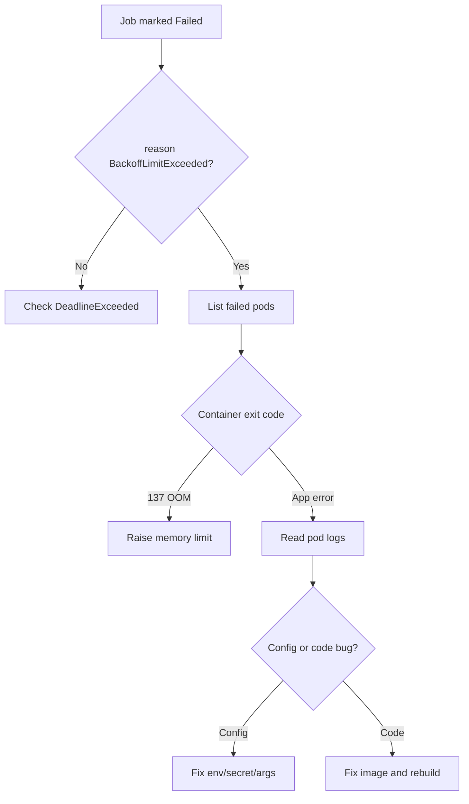

# Job BackoffLimitExceeded

> **Severity:** High · **Typical recovery time:** 10–45 min · **Affected versions:** 1.20+

## Error Message

```text
Warning  BackoffLimitExceeded  job-controller  Job has reached the specified backoff limit
```

## Description

A Job retries its Pods on failure up to `spec.backoffLimit` (default `6`). When
the failure count crosses that limit, the Job controller stops creating new
Pods, marks the Job `Failed` with condition `reason: BackoffLimitExceeded`, and
the work never completes. From an SRE perspective this is the controller telling
you the workload failed deterministically — retrying did not help, so something
in the image, command, configuration, or environment is broken.

The retry counter increments per Pod failure (or per container exit when
`podFailurePolicy` is not in use). Back-off is exponential (10s, 20s, 40s … to a
cap of 6 minutes), so a Job can take several minutes to exhaust its limit.

## Affected Kubernetes Versions

Applies to all versions with the batch/v1 Job API (1.20+). In 1.25+ the
`PodFailurePolicy` feature (GA in 1.31) lets you decide which exit codes count
against `backoffLimit`, and `backoffLimitPerIndex` (beta 1.29, GA 1.33) changes
counting for Indexed Jobs.

## Likely Root Causes

- Application bug or non-zero exit code on every run
- Missing or wrong config: bad env var, secret, ConfigMap, or CLI argument
- OOMKilled container counting as a failure each attempt
- Missing dependency at runtime (database, API endpoint not reachable)
- `backoffLimit` set too low for a legitimately flaky workload

## Diagnostic Flow



## Verification Steps

Confirm the Job condition is `Failed`/`BackoffLimitExceeded` and not a deadline
or suspension, then inspect the failed Pods it left behind.

## kubectl Commands

```bash
kubectl get job <job> -n <namespace> -o wide
kubectl describe job <job> -n <namespace>
kubectl get pods -n <namespace> -l job-name=<job>
kubectl logs <failed-pod> -n <namespace> --previous
kubectl get job <job> -n <namespace> -o jsonpath='{.status.conditions}'
```

## Expected Output

```text
Conditions:
  Type    Status  Reason
  Failed  True    BackoffLimitExceeded
Pods Statuses: 0 Active / 0 Succeeded / 7 Failed
```

## Common Fixes

1. Read `--previous` logs of a failed Pod and fix the root error (bad arg,
   missing secret, unreachable dependency)
2. If exit code is 137, raise `resources.limits.memory` to stop OOMKills
3. Correct the referenced ConfigMap/Secret/env so the container starts
4. Use `podFailurePolicy` to ignore retriable infrastructure exit codes
5. Raise `backoffLimit` only when failures are genuinely transient

## Recovery Procedures

1. Diagnose first using the read-only commands above — do not blindly re-run.
2. Apply the corrected Job manifest with a new name, or recreate the Job with
   the fix. **Deleting and recreating the Job is disruptive**: it removes Job
   history and any in-flight Pods; blast radius is limited to that one Job.
3. For scheduled work, fix the parent CronJob template so the next run succeeds.
4. Watch the new Job to `Complete` before declaring the incident resolved.

## Validation

`kubectl get job <job>` shows `COMPLETIONS 1/1` and condition `Complete=True`,
with the Pod in `Succeeded`. No new `BackoffLimitExceeded` events appear.

## Prevention

- Set realistic `resources.requests/limits` to prevent repeated OOMKills
- Make Job containers idempotent so retries are safe
- Add startup checks for required env/secrets that fail fast and clearly
- Use `podFailurePolicy` to separate config errors from transient faults
- Validate manifests in CI (see the free validators below)

## Related Errors

- [Job DeadlineExceeded](./job-deadlineexceeded.md)
- [Job Not Completing](./job-not-completing.md)
- [Job Pods Recreated Loop](./job-pods-recreated-loop.md)

## References

- [Kubernetes Jobs documentation](https://kubernetes.io/docs/concepts/workloads/controllers/job/)
- [Pod failure policy](https://kubernetes.io/docs/concepts/workloads/controllers/job/#pod-failure-policy)

## Further Reading

- [Free Kubernetes config validators](https://devopsaitoolkit.com/validators/)
