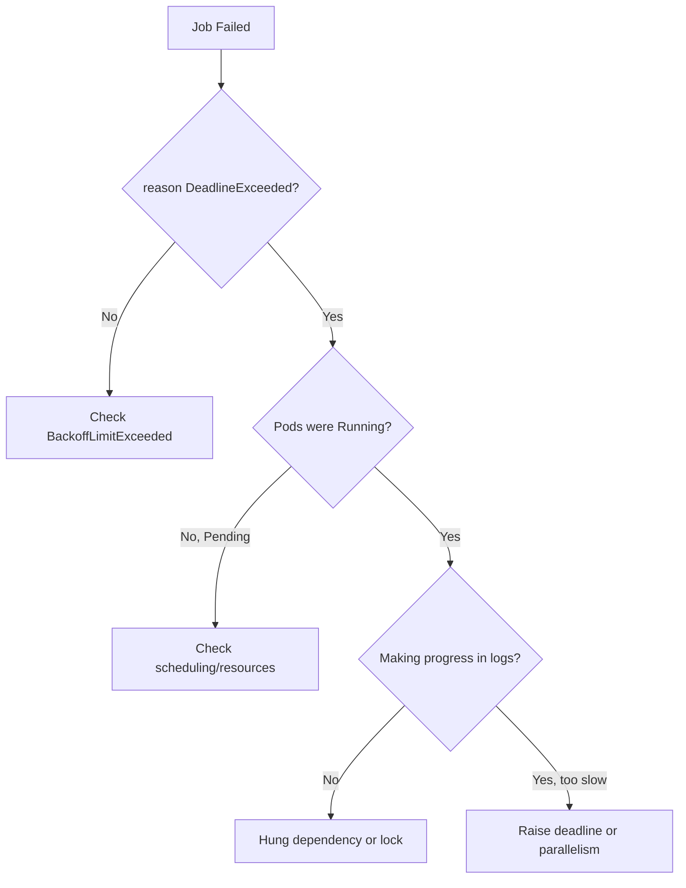

# Job DeadlineExceeded

> **Severity:** High · **Typical recovery time:** 10–40 min · **Affected versions:** 1.20+

## Error Message

```text
Warning  DeadlineExceeded  job-controller  Job was active longer than specified deadline
```

## Description

When a Job sets `spec.activeDeadlineSeconds`, the Job controller measures the
wall-clock time the Job has been active. Once that budget is exceeded, the
controller terminates all running Pods and marks the Job `Failed` with
`reason: DeadlineExceeded`. This is a hard timeout on the *Job*, independent of
`backoffLimit` — it fires even if Pods are still making progress.

During an incident this usually means the work genuinely takes longer than the
configured budget, or the Job is wedged (a Pod that never makes progress) and the
deadline is the safety net that cut it off. Note `activeDeadlineSeconds` on the
Pod template is different: it bounds a single Pod, not the whole Job.

## Affected Kubernetes Versions

Behaviour is stable across batch/v1 (1.20+). The deadline clock counts active
time; it is not reset by Pod restarts. No major semantic changes in recent
releases, though `PodFailurePolicy` interactions were clarified in 1.27+.

## Likely Root Causes

- `activeDeadlineSeconds` set too low for the real runtime
- Job stuck: Pod waiting on a lock, slow dependency, or hung network call
- Insufficient `parallelism` so total throughput cannot finish in time
- Resource starvation (CPU throttling) slowing the workload
- Pending Pods (unschedulable) burning the deadline without progressing

## Diagnostic Flow



## Verification Steps

Confirm the condition reason is `DeadlineExceeded`, then check whether Pods were
actually running and progressing or stuck Pending/blocked.

## kubectl Commands

```bash
kubectl describe job <job> -n <namespace>
kubectl get job <job> -n <namespace> -o jsonpath='{.spec.activeDeadlineSeconds}'
kubectl get job <job> -n <namespace> -o jsonpath='{.status}'
kubectl get pods -n <namespace> -l job-name=<job> -o wide
kubectl logs <pod> -n <namespace> --tail=50
```

## Expected Output

```text
Conditions:
  Type    Status  Reason
  Failed  True    DeadlineExceeded
Events:
  Warning  DeadlineExceeded  Job was active longer than specified deadline
```

## Common Fixes

1. Raise `activeDeadlineSeconds` to comfortably exceed observed runtime
2. Increase `parallelism` so the work finishes within the budget
3. Remove the deadline if the Job legitimately has no time bound
4. Fix the slow/hung dependency the Pod is blocked on
5. Resolve scheduling so Pods run instead of sitting Pending

## Recovery Procedures

1. Measure a successful run's duration from logs/metrics to size the deadline.
2. Recreate the Job with a corrected `activeDeadlineSeconds` (or higher
   `parallelism`). **Recreating the Job is disruptive** — it deletes the failed
   Job and its Pods; blast radius is that single Job's workload only.
3. If a shared dependency caused the hang, restore it before re-running so the
   retry does not also time out.
4. Watch the new Job complete inside the budget.

## Validation

`kubectl get job <job>` shows `Complete=True` with run time below
`activeDeadlineSeconds`. No `DeadlineExceeded` events on the new Job.

## Prevention

- Base `activeDeadlineSeconds` on the p99 of historical run times plus margin
- Add liveness/progress logging so hangs are visible quickly
- Size `parallelism`/`completions` to the time budget you need
- Alert on Jobs whose active time approaches the deadline
- Validate timeout fields in CI before deploy

## Related Errors

- [Job BackoffLimitExceeded](./job-backofflimitexceeded.md)
- [Job Not Completing](./job-not-completing.md)
- [Job Parallelism Stuck](./job-parallelism-stuck.md)

## References

- [Job termination and cleanup](https://kubernetes.io/docs/concepts/workloads/controllers/job/#job-termination-and-cleanup)
- [Jobs documentation](https://kubernetes.io/docs/concepts/workloads/controllers/job/)

## Further Reading

- [DevOps AI ToolKit — Kubernetes guides](https://devopsaitoolkit.com/blog/)
