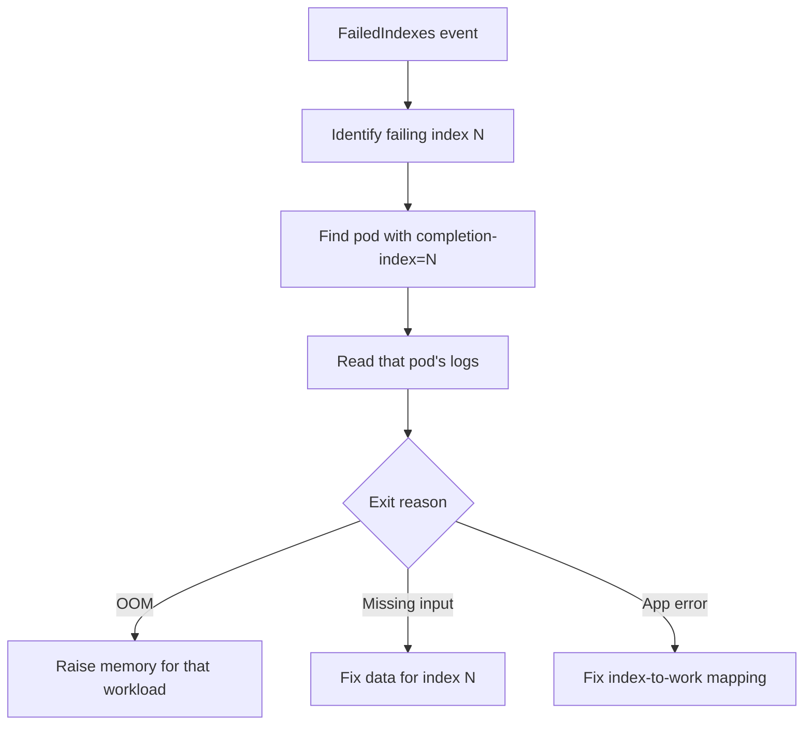

# Indexed Job Index Failed

> **Severity:** High · **Typical recovery time:** 15–60 min · **Affected versions:** 1.24+

## Error Message

```text
Warning  FailedIndexes  job-controller  Indexed Job: index 3 failed
```

## Description

An Indexed Job (`completionMode: Indexed`) splits work into a fixed set of
indexes `0..completions-1`, exposed to each Pod via the
`JOB_COMPLETION_INDEX` env var and the `batch.kubernetes.io/job-completion-index`
annotation. Each index must succeed exactly once. When a specific index keeps
failing, that shard of work never completes — and depending on configuration it
can stall the entire Job or fail it via `backoffLimitPerIndex`.

This pattern is used for partitioned batch processing (one index per data shard,
one per matrix row, etc.). A single bad index usually means the *input for that
index* is the problem, not the whole workload — the failure is localized and
reproducible by index number.

## Affected Kubernetes Versions

Indexed completion is GA in 1.24+. `backoffLimitPerIndex` and `maxFailedIndexes`
are beta in 1.29 and GA in 1.33, letting you cap retries per index and tolerate
a number of failed indexes without failing the whole Job. On older clusters,
only the global `backoffLimit` applies.

## Likely Root Causes

- Bad or missing input data for one specific index/shard
- Off-by-one logic mapping `JOB_COMPLETION_INDEX` to a work item
- Resource limits exceeded only on the heavier shard (OOM on one index)
- `completions` greater than the number of available work items
- A poison-pill record that crashes only the index processing it

## Diagnostic Flow



## Verification Steps

Identify exactly which index failed from `status.failedIndexes`, then inspect the
Pod that carried that completion index.

## kubectl Commands

```bash
kubectl describe job <job> -n <namespace>
kubectl get job <job> -n <namespace> -o jsonpath='{.status.failedIndexes}'
kubectl get pods -n <namespace> -l job-name=<job> \
  -L batch.kubernetes.io/job-completion-index
kubectl logs <pod-for-index-N> -n <namespace> --previous
kubectl get job <job> -n <namespace> -o jsonpath='{.status.completedIndexes}'
```

## Expected Output

```text
Status:
  Completed Indexes:  0-2,4-9
  Failed Indexes:     3
Events:
  Warning  FailedIndexes  Indexed Job: index 3 failed
```

## Common Fixes

1. Inspect logs for the failing index's Pod and fix that shard's input data
2. Correct the code that maps `JOB_COMPLETION_INDEX` to a work item
3. Raise memory/CPU if only the heavy index OOMs
4. Set `completions` to match the number of real work items
5. Use `backoffLimitPerIndex`/`maxFailedIndexes` to bound and tolerate failures

## Recovery Procedures

1. Reproduce locally with `JOB_COMPLETION_INDEX=<N>` to confirm the input issue.
2. Fix the data or code, then recreate the Job. **Recreating the Job reruns all
   indexes and is disruptive** — already-completed indexes repeat work; blast
   radius is the whole Job. Prefer designing indexes to be idempotent.
3. If only one index is acceptable to lose, set `maxFailedIndexes` so the Job
   can complete the rest.
4. Watch `completedIndexes` cover the full range `0-(N-1)`.

## Validation

`status.completedIndexes` lists the full range with no `failedIndexes`, and the
Job condition is `Complete=True`.

## Prevention

- Make per-index processing idempotent so reruns are safe
- Validate that `completions` equals the number of work items
- Add per-shard input validation that fails fast with the index number logged
- Use `backoffLimitPerIndex` to isolate flaky shards from healthy ones
- Set per-Pod resources sized for the largest shard

## Related Errors

- [Job Not Completing](./job-not-completing.md)
- [Job BackoffLimitExceeded](./job-backofflimitexceeded.md)
- [Job Parallelism Stuck](./job-parallelism-stuck.md)

## References

- [Indexed Job](https://kubernetes.io/docs/tasks/job/indexed-parallel-processing-static/)
- [Backoff limit per index](https://kubernetes.io/docs/concepts/workloads/controllers/job/#backoff-limit-per-index)

## Further Reading

- [DevOps AI ToolKit — Kubernetes guides](https://devopsaitoolkit.com/blog/)
