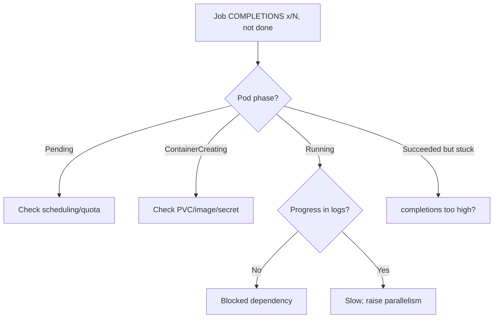

# Job Not Completing

> **Severity:** Medium · **Typical recovery time:** 10–60 min · **Affected versions:** 1.20+

## Error Message

```text
NAME   COMPLETIONS   DURATION   AGE
etl    3/5           42m        42m
# Job stays active: desired completions not reached
```

## Description

A Job is "complete" only when the number of successfully finished Pods reaches
`spec.completions`. If the Job sits at `2/5` indefinitely with no `Complete`
condition and no `Failed` condition, it is *stuck* — Pods are neither succeeding
nor failing fast enough to trip the back-off limit. The Job controller keeps the
Job active, waiting forever for completions that never arrive.

This is common with Pods stuck `Pending` (cannot schedule), `ContainerCreating`
(image or volume issues), or `Running` but blocked on work that never finishes.
Unlike `BackoffLimitExceeded` or `DeadlineExceeded`, there is no error event —
the absence of progress is the symptom.

## Affected Kubernetes Versions

All batch/v1 versions (1.20+). For `completionMode: Indexed` (GA 1.24) each
index must succeed exactly once; a single permanently failing index can stall
overall completion. `backoffLimitPerIndex` (GA 1.33) changes how stalled indexes
are handled.

## Likely Root Causes

- Pods stuck `Pending` due to insufficient CPU/memory or node selectors/taints
- Pods stuck `ContainerCreating` (PVC unbound, image pull, secret missing)
- Running Pods blocked on an external dependency that never responds
- `completions` set higher than the work that actually exists to do
- One Indexed Job index that cannot succeed, holding the whole Job open

## Diagnostic Flow



## Verification Steps

Check the `COMPLETIONS` count, confirm there is no `Failed`/`Complete`
condition, and identify what phase the Job's Pods are sitting in.

## kubectl Commands

```bash
kubectl get job <job> -n <namespace>
kubectl describe job <job> -n <namespace>
kubectl get pods -n <namespace> -l job-name=<job> -o wide
kubectl describe pod <pending-pod> -n <namespace>
kubectl logs <pod> -n <namespace> --tail=50
```

## Expected Output

```text
NAME   COMPLETIONS   DURATION   AGE
etl    2/5           58m        58m
# kubectl describe pod:
Events:
  Warning  FailedScheduling  0/4 nodes available: insufficient memory.
```

## Common Fixes

1. Fix scheduling: lower requests, add capacity, or relax selectors/tolerations
2. Resolve `ContainerCreating` cause (bind PVC, fix image/secret reference)
3. Restore the external dependency the Running Pods are waiting on
4. Set `completions` to match the real amount of work
5. For Indexed Jobs, fix the failing index's input/logic

## Recovery Procedures

1. Use `describe pod` and logs to find the exact blocker — read-only, no risk.
2. Address the cause (add capacity, fix volume/image, repair dependency).
3. If the manifest is wrong (`completions`/selectors), recreate the Job with a
   corrected spec. **Recreating the Job is disruptive**: it deletes current
   Pods; blast radius is that one Job.
4. Confirm Pods progress to `Succeeded` and the count climbs to `N/N`.

## Validation

`kubectl get job <job>` shows `COMPLETIONS N/N` and condition `Complete=True`.
All Pods are `Succeeded`; no Pods remain `Pending`/`ContainerCreating`.

## Prevention

- Right-size requests and verify cluster capacity before large Jobs
- Pre-bind PVCs and validate image/secret references in CI
- Add timeouts/retries inside the app for external dependencies
- Set `activeDeadlineSeconds` so stuck Jobs fail loudly instead of hanging
- Match `completions`/`parallelism` to the actual workload

## Related Errors

- [Job Parallelism Stuck](./job-parallelism-stuck.md)
- [Job BackoffLimitExceeded](./job-backofflimitexceeded.md)
- [Indexed Job Index Failed](./job-indexed-failed.md)

## References

- [Job completion modes](https://kubernetes.io/docs/concepts/workloads/controllers/job/#completion-mode)
- [Jobs documentation](https://kubernetes.io/docs/concepts/workloads/controllers/job/)

## Further Reading

- [Free Kubernetes config validators](https://devopsaitoolkit.com/validators/)
