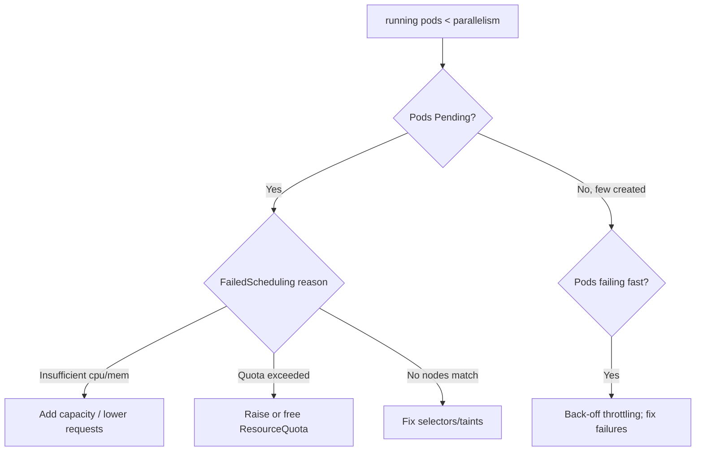

# Job Parallelism Stuck

> **Severity:** Medium · **Typical recovery time:** 10–45 min · **Affected versions:** 1.20+

## Error Message

```text
NAME   COMPLETIONS   DURATION   AGE
batch  0/20          15m        15m
# spec.parallelism=10 but only 2 pods Running; fewer pods running than parallelism
```

## Description

`spec.parallelism` tells the Job controller how many Pods to run concurrently.
When far fewer Pods are running than requested — and the rest are `Pending` or
not created at all — the Job's throughput collapses and `completions` crawl or
stall. This is not a Job-API failure; it is a *resource or admission* bottleneck
that prevents the controller's desired Pods from actually running.

The controller will create up to `parallelism` Pods, but the scheduler can only
bind them if nodes have capacity and policy allows it. So the gap between desired
and running parallelism almost always points at scheduling, quota, or
disruption budgets — not the Job spec itself.

## Affected Kubernetes Versions

Applies to all batch/v1 Jobs (1.20+). With `completionMode: Indexed`, the
controller also respects index ordering. ResourceQuota, LimitRange, Priority
class preemption, and Pod topology spread all affect how many Pods can run.

## Likely Root Causes

- Insufficient cluster CPU/memory to schedule all parallel Pods
- `ResourceQuota` capping Pods or resources in the namespace
- Node selectors, affinity, or taints limiting eligible nodes
- Low pod priority causing preemption/starvation under contention
- Pods failing fast and back-off throttling new Pod creation

## Diagnostic Flow



## Verification Steps

Compare desired `parallelism` against running Pods, then read the Pending Pods'
scheduling events and namespace quota.

## kubectl Commands

```bash
kubectl get job <job> -n <namespace> -o jsonpath='{.spec.parallelism}'
kubectl get pods -n <namespace> -l job-name=<job> -o wide
kubectl describe pod <pending-pod> -n <namespace>
kubectl get resourcequota -n <namespace>
kubectl describe resourcequota -n <namespace>
kubectl top nodes
```

## Expected Output

```text
spec.parallelism: 10
NAME            READY   STATUS    NODE
batch-abc       1/1     Running   node-1
batch-def       0/1     Pending   <none>
Events:
  Warning  FailedScheduling  0/5 nodes available: insufficient cpu.
```

## Common Fixes

1. Add node capacity or enable cluster autoscaling for the burst
2. Lower per-Pod `resources.requests` so more Pods fit
3. Raise the namespace `ResourceQuota` (pods/cpu/memory)
4. Relax node selectors/affinity or add tolerations for taints
5. Reduce `parallelism` to match real available capacity

## Recovery Procedures

1. Read the Pending Pods' `FailedScheduling` events to pinpoint the limit.
2. Address capacity/quota/selectors as appropriate. Scaling node pools or
   raising quota is generally safe; **lowering quota or evicting other workloads
   to free room is disruptive** — blast radius is every Pod sharing that
   namespace/node pool.
3. Let the controller fill up to `parallelism` once capacity exists.
4. Watch `completions` climb at the expected rate.

## Validation

Running Pod count equals `parallelism` (until the tail of the Job), no Pods
remain `Pending`, and `COMPLETIONS` advances steadily to `N/N`.

## Prevention

- Size `parallelism` to known cluster headroom, or use autoscaling
- Set ResourceQuota with batch bursts in mind
- Use a dedicated node pool / priority class for batch workloads
- Keep per-Pod requests accurate so the scheduler can pack efficiently
- Alert when running parallelism stays below desired for too long

## Related Errors

- [Job Not Completing](./job-not-completing.md)
- [Job DeadlineExceeded](./job-deadlineexceeded.md)
- [Indexed Job Index Failed](./job-indexed-failed.md)

## References

- [Parallel Jobs](https://kubernetes.io/docs/concepts/workloads/controllers/job/#parallel-jobs)
- [Resource quotas](https://kubernetes.io/docs/concepts/policy/resource-quotas/)

## Further Reading

- [Free Kubernetes config validators](https://devopsaitoolkit.com/validators/)
