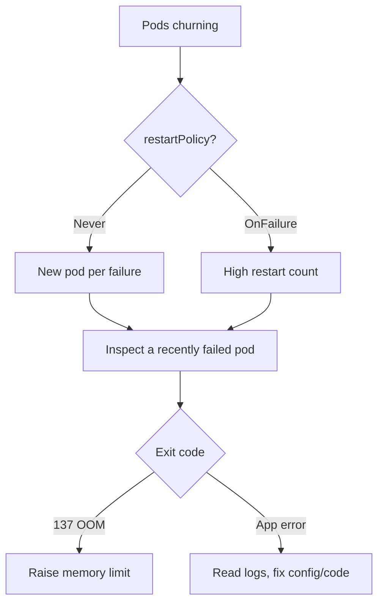

# Job Pods Recreated Loop

> **Severity:** High · **Typical recovery time:** 15–60 min · **Affected versions:** 1.20+

## Error Message

```text
job pods repeatedly deleted and recreated
# kubectl get pods shows a churn of <job>-xxxxx Pods appearing and disappearing
```

## Description

When a Job's Pod template uses `restartPolicy: Never`, every container failure
produces a brand-new Pod rather than restarting the container in place. Under a
persistent failure this looks like a churn of short-lived Pods — created,
failed, deleted (or left as `Error`), recreated — until `backoffLimit` is hit.
With `restartPolicy: OnFailure`, the same container restarts in place instead,
showing a rising restart count.

The recreation loop is the Job controller faithfully retrying a deterministically
failing workload. The danger during an incident is alert noise and wasted
scheduling churn, while the underlying bug (config, code, OOM) goes unaddressed.

## Affected Kubernetes Versions

All batch/v1 versions (1.20+). Jobs accept only `restartPolicy: Never` or
`OnFailure`. `PodFailurePolicy` (GA 1.31) and `podReplacementPolicy` (GA 1.34,
controlling whether replacements wait for full termination) change the
recreation behaviour on newer clusters.

## Likely Root Causes

- Container exits non-zero every run (code/config bug) with `restartPolicy: Never`
- OOMKilled (exit 137) on each attempt, forcing recreation
- Missing dependency/secret so the container never starts successfully
- A startup/init container that always fails
- `podReplacementPolicy: Failed` not set, so replacements spin up eagerly

## Diagnostic Flow



## Verification Steps

Confirm the churn is the same Job recreating Pods (matching `job-name` label),
then capture one failed Pod before it is cleaned up and read its exit reason.

## kubectl Commands

```bash
kubectl get pods -n <namespace> -l job-name=<job> --watch
kubectl describe job <job> -n <namespace>
kubectl get pods -n <namespace> -l job-name=<job> \
  -o jsonpath='{range .items[*]}{.metadata.name}{"\t"}{.status.phase}{"\n"}{end}'
kubectl logs <failed-pod> -n <namespace> --previous
kubectl get events -n <namespace> --sort-by=.lastTimestamp | grep <job>
```

## Expected Output

```text
NAME          READY   STATUS    RESTARTS   AGE
job-7g2k1      0/1     Error     0          12s
job-9p4mz      0/1     Error     0          3s
# describe job:
Pods Statuses: 1 Active / 0 Succeeded / 5 Failed
Last container state: Terminated  Reason: Error  Exit Code: 1
```

## Common Fixes

1. Read `--previous` logs and fix the deterministic failure (config/code)
2. If exit 137, raise `resources.limits.memory` to stop OOMKills
3. Provide the missing secret/ConfigMap/env the container needs
4. Fix or remove the failing init container
5. Use `podFailurePolicy` to stop retrying non-retriable exit codes

## Recovery Procedures

1. Capture a failed Pod's logs immediately (use `--watch` to grab one) — purely
   read-only.
2. Fix the root cause in the image or manifest, then recreate the Job with the
   correction. **Recreating the Job deletes the churning Pods** — blast radius is
   that single Job; other workloads are unaffected.
3. Consider setting `podReplacementPolicy: Failed` to reduce churn while you
   diagnose.
4. Confirm the new Job runs a stable Pod through to `Succeeded`.

## Validation

Pod churn stops, the Job shows a single Pod progressing to `Succeeded`, and
`COMPLETIONS` reaches `N/N` with no new `Failed` Pods.

## Prevention

- Make Job containers idempotent and fail fast with clear errors
- Set memory limits based on real usage to avoid repeat OOMKills
- Validate required env/secrets at startup
- Use `podFailurePolicy` to distinguish bugs from transient faults
- Alert on Job Pod failure rate, not just final Job status

## Related Errors

- [Job BackoffLimitExceeded](./job-backofflimitexceeded.md)
- [Job Not Completing](./job-not-completing.md)
- [Indexed Job Index Failed](./job-indexed-failed.md)

## References

- [Pod backoff failure policy](https://kubernetes.io/docs/concepts/workloads/controllers/job/#pod-backoff-failure-policy)
- [Handling Pod and container failures](https://kubernetes.io/docs/concepts/workloads/controllers/job/#handling-pod-and-container-failures)

## Further Reading

- [DevOps AI ToolKit — Kubernetes guides](https://devopsaitoolkit.com/blog/)
