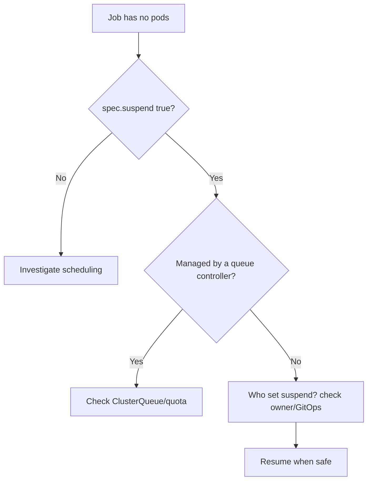

# Job Suspended

> **Severity:** Low · **Typical recovery time:** 2–15 min · **Affected versions:** 1.24+

## Error Message

```text
Normal  Suspended  job-controller  Job suspended
# kubectl describe shows: Suspend: true ; condition Suspended=True (reason JobSuspended)
```

## Description

A Job with `spec.suspend: true` is intentionally paused. The controller does not
create any Pods, and if a running Job is suspended, it **deletes its active
Pods** and resets the start time. The Job sits with condition `Suspended=True`
and zero active Pods. This is a feature, not a bug — it underpins job-queueing
systems like Kueue that admit Jobs only when capacity exists.

During an incident the surprise is usually "my Job never started." If `suspend`
is `true`, that is expected: no Pods will appear until the field is flipped to
`false`. The challenge is figuring out *who or what* set it.

## Affected Kubernetes Versions

The `suspend` field is GA from 1.24 (alpha 1.21, beta 1.22). Suspending a
running Job terminates its Pods; resuming starts fresh. Batch schedulers
(Kueue, Volcano, YuniKorn) commonly toggle this field.

## Likely Root Causes

- Job created with `suspend: true` (queued, awaiting admission)
- A queueing controller (e.g. Kueue) is holding the Job until quota is free
- An operator/automation suspended it during maintenance or a freeze
- A manual pause that was never resumed
- GitOps drift restoring `suspend: true` from source

## Diagnostic Flow



## Verification Steps

Confirm `spec.suspend` is `true` and the condition is `Suspended=True`, then
determine whether a controller or a human set it.

## kubectl Commands

```bash
kubectl get job <job> -n <namespace> -o jsonpath='{.spec.suspend}'
kubectl describe job <job> -n <namespace>
kubectl get job <job> -n <namespace> -o jsonpath='{.status.conditions}'
kubectl get pods -n <namespace> -l job-name=<job>
kubectl get job <job> -n <namespace> -o yaml | grep -iE 'suspend|ownerReferences' -A2
```

## Expected Output

```text
Suspend:  true
Conditions:
  Type       Status  Reason
  Suspended  True    JobSuspended
Pods Statuses: 0 Active / 0 Succeeded / 0 Failed
```

## Common Fixes

1. If suspension was intentional, simply wait — no action needed
2. If managed by Kueue, ensure the workload's ClusterQueue has free quota
3. If suspended by mistake, set `spec.suspend: false` to resume
4. Fix GitOps source if it keeps re-applying `suspend: true`
5. Remove stale automation that suspended and forgot to resume

## Recovery Procedures

1. Confirm it is safe to run the Job now (capacity, maintenance window over).
2. Resume by patching `spec.suspend` to `false`. **Resuming starts Pods and
   consumes resources** — blast radius is the Job's compute footprint; verify
   quota and downstream dependencies first.
3. If a queue controller owns it, let the controller resume it rather than
   overriding, to avoid quota conflicts.
4. Confirm Pods are created and the Job becomes active.

## Validation

`spec.suspend` is `false`, condition `Suspended` is gone, and
`kubectl get pods -l job-name=<job>` shows active Pods progressing to Succeeded.

## Prevention

- Document and label Jobs that are intentionally queue-managed
- Alert on Jobs suspended longer than an expected admission window
- Avoid manual suspends in clusters managed by GitOps (drift)
- Use a proper batch scheduler instead of ad-hoc suspend toggles
- Audit who can patch `suspend` via RBAC

## Related Errors

- [Job Not Completing](./job-not-completing.md)
- [Job Parallelism Stuck](./job-parallelism-stuck.md)
- [CronJob Suspended](../cronjobs/cronjob-suspended.md)

## References

- [Suspending a Job](https://kubernetes.io/docs/concepts/workloads/controllers/job/#suspending-a-job)
- [Jobs documentation](https://kubernetes.io/docs/concepts/workloads/controllers/job/)

## Further Reading

- [DevOps AI ToolKit — Kubernetes guides](https://devopsaitoolkit.com/blog/)
