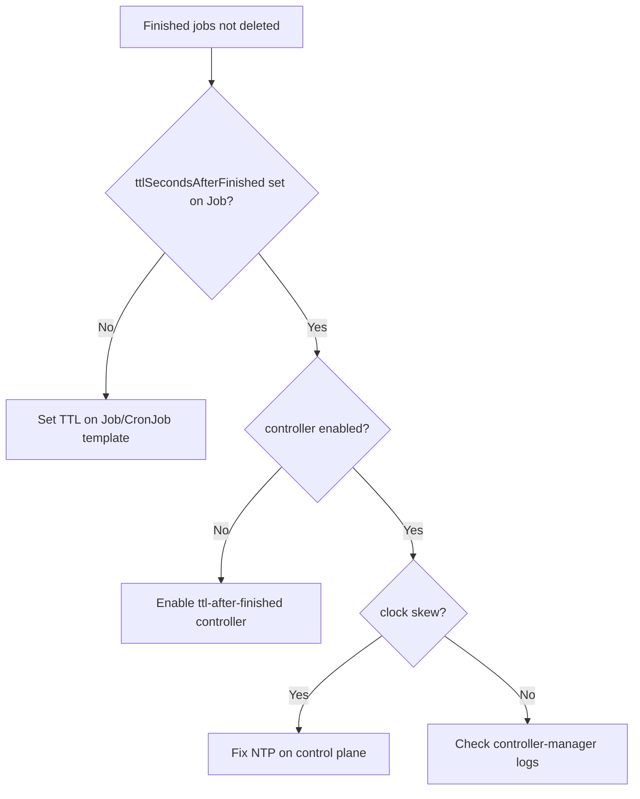

# Finished Job Not Cleaned

> **Severity:** Low · **Typical recovery time:** 5–30 min · **Affected versions:** 1.23+

## Error Message

```text
ttlSecondsAfterFinished not removing job
# Completed Jobs and their Pods accumulate well past their TTL
```

## Description

`spec.ttlSecondsAfterFinished` asks the TTL-after-finished controller (part of
kube-controller-manager) to delete a Job — and cascade-delete its Pods — a set
number of seconds after it reaches `Complete` or `Failed`. When finished Jobs
pile up despite a TTL being set, the cleanup mechanism is not doing its job, and
old Pods/Jobs accumulate, clutter listings, and consume etcd objects.

This is usually environmental: the controller is disabled, the field is missing
or zero, clock skew confuses the TTL math, or the cluster predates the feature's
GA. It is low severity but a steady resource leak if left unchecked.

## Affected Kubernetes Versions

The `TTLAfterFinished` feature is GA in 1.23+ (beta 1.21). On managed clusters
the controller is normally on by default. On self-managed control planes it can
be disabled via `--controllers` flags on kube-controller-manager. Severe node
clock skew can delay or break TTL evaluation.

## Likely Root Causes

- `ttlSecondsAfterFinished` not set on the Job (only set on the CronJob, or not
  inherited the way you expected)
- The `ttl-after-finished` controller disabled in kube-controller-manager
- Feature gate off on a very old (pre-1.21) cluster
- Clock skew between control-plane nodes delaying TTL expiry
- A field value of `0` deleting immediately (looks like "never created")

## Diagnostic Flow



## Verification Steps

Confirm the finished Jobs actually carry a non-zero `ttlSecondsAfterFinished`,
then check that the controller is running and that completion timestamps are sane.

## kubectl Commands

```bash
kubectl get jobs -n <namespace> -o custom-columns=\
NAME:.metadata.name,TTL:.spec.ttlSecondsAfterFinished,STATUS:.status.conditions[0].type
kubectl get job <job> -n <namespace> -o jsonpath='{.status.completionTime}'
kubectl get pods -n kube-system -l component=kube-controller-manager
kubectl logs -n kube-system <kube-controller-manager-pod> | grep -i ttl
kubectl get jobs -A --field-selector status.successful=1
```

## Expected Output

```text
NAME        TTL     STATUS
report-1    <none>  Complete   # no TTL -> never auto-deleted
report-2    100     Complete   # has TTL but lingering -> controller issue
completionTime: 2026-06-29T01:00:00Z
```

## Common Fixes

1. Set `ttlSecondsAfterFinished` on the Job (or the CronJob's `jobTemplate`)
2. Enable the `ttl-after-finished` controller in kube-controller-manager
3. Fix NTP/clock skew across control-plane nodes
4. Upgrade clusters older than 1.21 where the feature is unavailable
5. Avoid `0` unless immediate deletion is truly intended

## Recovery Procedures

1. Confirm the TTL field and controller status using the read-only commands.
2. Add/correct `ttlSecondsAfterFinished` on future Jobs or the CronJob template.
3. For the existing backlog, prune finished Jobs. **Deleting Jobs cascade-deletes
   their Pods and logs** — this is disruptive to log/audit retention; blast
   radius is the deleted Jobs only. Confirm logs are shipped elsewhere first.
4. Re-enabling the controller is a control-plane change; coordinate it as a
   maintenance action on self-managed clusters.

## Validation

New finished Jobs disappear within their TTL window, and the count of completed
Jobs stops growing unbounded. `kubectl get jobs -A` stays bounded over time.

## Prevention

- Always set `ttlSecondsAfterFinished` on Jobs and CronJob `jobTemplate`s
- Keep NTP healthy on control-plane nodes
- Monitor finished-Job count as a leak indicator
- For CronJobs, also tune `successfulJobsHistoryLimit`/`failedJobsHistoryLimit`
- Verify the TTL controller is enabled in cluster bootstrap config

## Related Errors

- [CronJob Jobs Piling Up](../cronjobs/cronjob-jobs-piling-up.md)
- [Job Not Completing](./job-not-completing.md)
- [Job Suspended](./job-suspended.md)

## References

- [TTL after finished](https://kubernetes.io/docs/concepts/workloads/controllers/ttlafterfinished/)
- [Automatic cleanup for finished Jobs](https://kubernetes.io/docs/concepts/workloads/controllers/job/#ttl-mechanism-for-finished-jobs)

## Further Reading

- [Free Kubernetes config validators](https://devopsaitoolkit.com/validators/)
