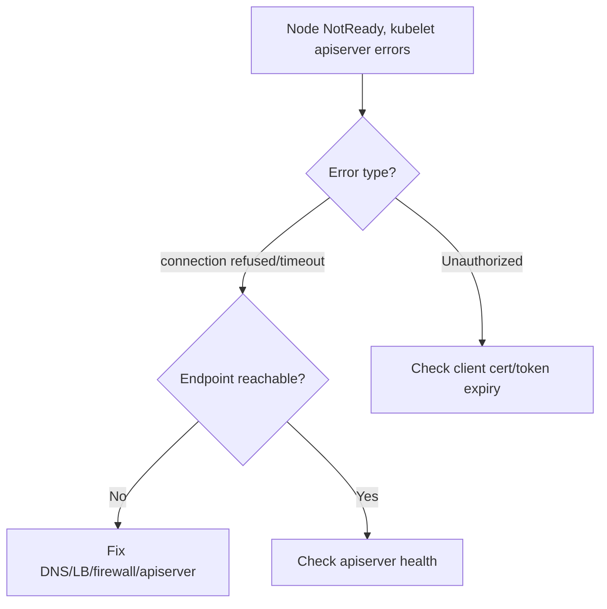

# Kubelet Cannot Connect To API Server

> **Severity:** Critical · **Typical recovery time:** 10–45 min · **Affected versions:** 1.20+

## Error Message

```text
kubelet: Failed to ensure lease exists, will retry ...:
Get "https://10.0.0.1:6443/apis/coordination.k8s.io/v1/namespaces/kube-node-lease/leases/node-1":
dial tcp 10.0.0.1:6443: connect: connection refused
kubelet: ... the server has asked for the client to provide credentials (Unauthorized)
```

## Description

The kubelet must reach the API server continuously to renew its node lease,
post status, and receive pod assignments. When the connection fails — network
unreachable, TLS rejected, or credentials refused — the node lease stops
renewing and the node goes `NotReady` after the lease grace period. Pods on the
node keep running, but no new pods schedule there and existing ones may be
evicted by the node controller.

There are two distinct failure modes in this string. `connection refused` /
`dial tcp` is a network/endpoint problem (apiserver down, wrong endpoint, LB or
firewall). `Unauthorized` is an authentication problem (expired or invalid
client cert / token). Diagnose which one you have before acting.

## Affected Kubernetes Versions

Applies to 1.20+. Node leases (`kube-node-lease`) are the default heartbeat
mechanism. The endpoint comes from the kubelet kubeconfig
(`/etc/kubernetes/kubelet.conf` or bootstrap kubeconfig).

## Likely Root Causes

- API server endpoint wrong/unreachable (DNS, load balancer, firewall, apiserver down)
- Expired or invalid kubelet client certificate/token (Unauthorized)
- Misconfigured `--kubeconfig` / server URL after a control-plane move
- Network partition or `iptables`/security-group block on 6443

## Diagnostic Flow



## Verification Steps

Determine whether the failure is network (refused/timeout) or auth
(Unauthorized), then test reachability and credentials from the node.

## kubectl Commands

```bash
kubectl get nodes
kubectl get --raw='/healthz'
kubectl -n kube-node-lease get leases

# On the node host (read-only):
sudo journalctl -u kubelet --no-pager | grep -iE 'apiserver|lease|unauthorized|refused'
sudo systemctl status kubelet
sudo openssl x509 -enddate -noout -in /var/lib/kubelet/pki/kubelet-client-current.pem
```

## Expected Output

```text
$ kubectl get nodes
NAME     STATUS     ROLES    AGE   VERSION
node-1   NotReady   <none>   60d   v1.29.4

$ sudo journalctl -u kubelet | grep refused
dial tcp 10.0.0.1:6443: connect: connection refused
```

## Common Fixes

1. Restore the API server endpoint: fix DNS/LB/firewall, or correct the server
   URL in the kubelet kubeconfig if the control plane moved.
2. Renew/re-bootstrap the kubelet client certificate when the error is
   `Unauthorized` due to expiry.
3. Bring the API server back if it is actually down (control-plane recovery).

## Recovery Procedures

1. Confirm reachability and apiserver health from the node.
2. For network faults, fix routing/firewall/LB — no node restart needed.
3. For credential faults, re-bootstrap the kubelet cert and **restart the
   kubelet** — blast radius: node-local control loop; pods keep running.
4. If the node stays NotReady past the eviction timeout, **drain and rejoin**
   it — blast radius: its pods reschedule; verify capacity first.

## Validation

`kubectl get nodes` shows `Ready`, the node lease in `kube-node-lease` renews,
and the kubelet log is free of apiserver connection/auth errors.

## Prevention

Use a highly available apiserver endpoint, monitor node lease renewal and cert
expiry, and alert on `NotReady` transitions before mass eviction occurs.

## Related Errors

- [Kubelet Client Certificate Expired](kubelet-client-certificate-expired.md)
- [Kubelet Node Not Found](kubelet-node-not-found.md)
- [Kubelet Failed To Start](kubelet-failed-to-start.md)

## References

- [Heartbeats and node leases](https://kubernetes.io/docs/concepts/architecture/nodes/#heartbeats)
- [Kubelet authentication/authorization](https://kubernetes.io/docs/reference/access-authn-authz/kubelet-authn-authz/)

## Further Reading

- [DevOps AI ToolKit — Kubernetes guides](https://devopsaitoolkit.com/blog/)
