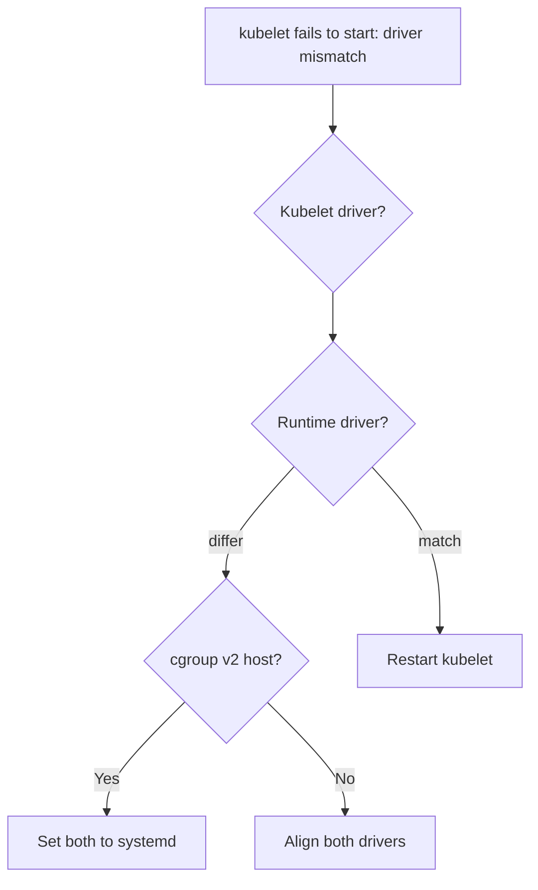

# Kubelet cgroup Driver Mismatch

> **Severity:** Critical · **Typical recovery time:** 10–30 min · **Affected versions:** 1.20+

## Error Message

```text
kubelet: failed to run Kubelet: misconfiguration: kubelet cgroup driver:
"systemd" is different from the container runtime (CRI) cgroup driver: "cgroupfs"
kubelet.service: Main process exited, code=exited, status=1/FAILURE
```

## Description

The kubelet and the container runtime must agree on which cgroup driver manages
container resources: `systemd` or `cgroupfs`. On systemd-based hosts the
recommended driver is `systemd` so a single manager owns the cgroup tree. If
the two disagree, the kubelet refuses to start (or containers get inconsistent
resource accounting), and the node never becomes `Ready`.

This typically appears right after install, an upgrade, or a runtime swap — the
kubelet defaults to `systemd` (1.22+) while containerd/CRI-O is still on
`cgroupfs`, or vice versa. It is a hard configuration error, not a transient
condition.

## Affected Kubernetes Versions

Applies to 1.20+. Since 1.22 the kubelet config default is
`cgroupDriver: systemd`. On cgroup v2 hosts only the `systemd` driver is
supported, so a `cgroupfs` runtime there will always mismatch.

## Likely Root Causes

- Kubelet `cgroupDriver` and runtime `SystemdCgroup` set inconsistently
- containerd `SystemdCgroup = false` while kubelet uses `systemd`
- cgroup v2 host with a runtime still configured for `cgroupfs`
- Leftover `--cgroup-driver` flag conflicting with kubelet config file

## Diagnostic Flow



## Verification Steps

Read both drivers — kubelet config and the runtime config — and confirm they
differ, plus whether the host is on cgroup v1 or v2.

## kubectl Commands

```bash
kubectl get nodes

# On the node host (read-only):
sudo journalctl -u kubelet --no-pager | grep -i 'cgroup driver'
sudo systemctl status kubelet
grep -i cgroupDriver /var/lib/kubelet/config.yaml
grep -i SystemdCgroup /etc/containerd/config.toml
stat -fc %T /sys/fs/cgroup
```

## Expected Output

```text
$ grep -i cgroupDriver /var/lib/kubelet/config.yaml
cgroupDriver: systemd

$ grep -i SystemdCgroup /etc/containerd/config.toml
            SystemdCgroup = false   # <-- mismatch
```

## Common Fixes

1. Set both sides to `systemd`: kubelet `cgroupDriver: systemd` and containerd
   `SystemdCgroup = true` (or CRI-O `cgroup_manager = "systemd"`).
2. On cgroup v2 hosts, always use the `systemd` driver everywhere.
3. Remove any deprecated `--cgroup-driver` kubelet flag so the config file value
   is authoritative.

## Recovery Procedures

1. Align the drivers in both config files.
2. **Restart the container runtime** to apply its config — blast radius:
   node-local; running containers usually survive a containerd restart.
3. **Restart the kubelet** — blast radius: node-local control loop; required to
   pick up the corrected driver and let the node become Ready.
4. If the node still misbehaves, **drain and reboot** to fully reset cgroups —
   blast radius: its pods reschedule; verify capacity first.

## Validation

The kubelet stays running, `kubectl get nodes` shows `Ready`, and the mismatch
error no longer appears in the kubelet log.

## Prevention

Pin the cgroup driver in your node image/automation, validate kubelet and
runtime config together in CI, and standardize on `systemd` (mandatory on
cgroup v2).

## Related Errors

- [Kubelet Failed To Start](kubelet-failed-to-start.md)
- [PLEG Is Not Healthy](kubelet-pleg-not-healthy.md)
- [Node cgroup Driver Mismatch](../nodes/node-cgroup-driver-mismatch.md)

## References

- [Configuring a cgroup driver](https://kubernetes.io/docs/tasks/administer-cluster/kubeadm/configure-cgroup-driver/)
- [Container runtimes](https://kubernetes.io/docs/setup/production-environment/container-runtimes/)

## Further Reading

- [DevOps AI ToolKit — Kubernetes guides](https://devopsaitoolkit.com/blog/)
