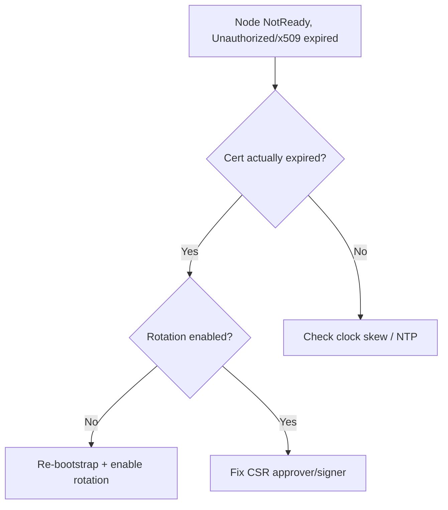

# Kubelet Client Certificate Expired

> **Severity:** Critical · **Typical recovery time:** 15–45 min · **Affected versions:** 1.20+

## Error Message

```text
kubelet: Unable to register node with API server ...:
x509: certificate has expired or is not yet valid: current time ... is after ...
kubelet: ... the server has asked for the client to provide credentials (Unauthorized)
```

## Description

The kubelet authenticates to the API server with a client certificate
(`/var/lib/kubelet/pki/kubelet-client-current.pem`). Normally the kubelet
rotates it before expiry via a client CSR. If rotation was disabled or silently
failed, the cert lapses, the API server rejects every request as
`Unauthorized`, the node lease stops renewing, and the node goes `NotReady`.
Crucially, an expired cert also blocks the kubelet from requesting a *new* one,
so it cannot self-heal.

This is a creeping, often cluster-wide failure: nodes are healthy until their
certs reach end-of-life, then drop out — sometimes many at once if rotation was
broken everywhere. Pods are evicted and the node looks unreachable.

## Affected Kubernetes Versions

Applies to 1.20+. Automatic client-cert rotation
(`rotateCertificates: true`) is the default; the
`kubernetes.io/kube-apiserver-client-kubelet` signer and its auto-approver must
be working for rotation to succeed.

## Likely Root Causes

- Certificate rotation disabled (`rotateCertificates: false`) so cert simply expired
- CSR auto-approver/signer broken, so rotation never completed
- Clock skew making a valid cert appear expired/not-yet-valid
- Long-lived bootstrap cert reached end of life with no rotation configured

## Diagnostic Flow



## Verification Steps

Confirm the on-disk client cert is expired and the failures are `Unauthorized`/
x509, not a network problem, and check node clock.

## kubectl Commands

```bash
kubectl get nodes
kubectl get csr | grep -i pending

# On the node host (read-only):
sudo journalctl -u kubelet --no-pager | grep -iE 'x509|unauthorized|certificate'
sudo openssl x509 -enddate -noout -in /var/lib/kubelet/pki/kubelet-client-current.pem
grep -i rotateCertificates /var/lib/kubelet/config.yaml
date -u
```

## Expected Output

```text
$ sudo openssl x509 -enddate -noout -in /var/lib/kubelet/pki/kubelet-client-current.pem
notAfter=Jun 20 09:00:00 2026 GMT      # in the past

$ sudo journalctl -u kubelet | grep x509
x509: certificate has expired or is not yet valid
```

## Common Fixes

1. Re-bootstrap the kubelet: provide a valid bootstrap token/kubeconfig so it
   can obtain a fresh client cert, then enable `rotateCertificates: true`.
2. Repair the CSR pipeline (auto-approver RBAC, controller-manager signer) so
   future rotations succeed.
3. Correct clock skew with NTP/chrony if the cert is actually valid but appears
   expired.

## Recovery Procedures

1. Confirm expiry and check whether the cause is cluster-wide.
2. Restore a bootstrap kubeconfig and **restart the kubelet** to request a new
   cert — blast radius: node-local control loop; pods keep running.
3. Fix the cluster-wide rotation/signer cause so other nodes do not fall over as
   their certs expire.
4. For a fully wedged node (no bootstrap), **drain and rejoin** it — blast
   radius: its pods reschedule; verify capacity first.

## Validation

`kubectl get nodes` shows `Ready`, the on-disk client cert has a future
`notAfter`, no `Pending` CSRs remain, and the kubelet log is free of x509/
Unauthorized errors.

## Prevention

Keep `rotateCertificates: true`, ensure the CSR approver and signer stay
healthy, sync clocks, and alert on kubelet client-cert expiry well ahead of
`notAfter`.

## Related Errors

- [Kubelet Cannot Connect To API Server](kubelet-cannot-connect-apiserver.md)
- [Kubelet Serving CSR Not Approved](kubelet-serving-csr-not-approved.md)
- [Kubelet Cert Rotation Failed](../nodes/kubelet-client-certificate-rotation-failed.md)

## References

- [Kubelet TLS bootstrapping](https://kubernetes.io/docs/reference/access-authn-authz/kubelet-tls-bootstrapping/)
- [Certificate management with kubeadm](https://kubernetes.io/docs/tasks/administer-cluster/kubeadm/kubeadm-certs/)

## Further Reading

- [DevOps AI ToolKit — Kubernetes guides](https://devopsaitoolkit.com/blog/)
