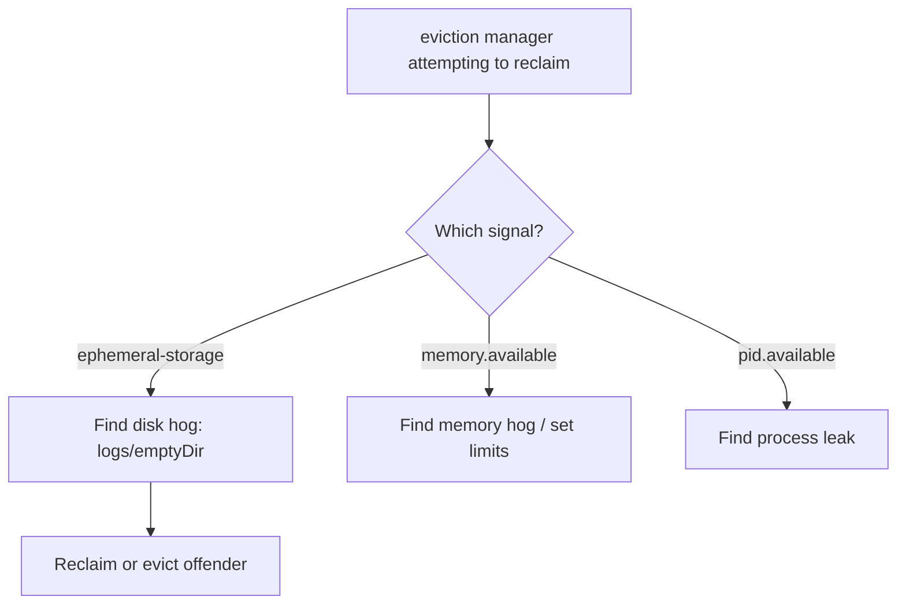

# Kubelet Attempting To Reclaim

> **Severity:** High · **Typical recovery time:** 10–40 min · **Affected versions:** 1.20+

## Error Message

```text
kubelet: attempting to reclaim ephemeral-storage
kubelet: eviction manager: must evict pod(s) to reclaim ephemeral-storage
kubelet: Evicting pod default/web-0 with message: The node was low on resource: ephemeral-storage.
```

## Description

The kubelet eviction manager monitors node resources against soft/hard
thresholds (`evictionHard`/`evictionSoft`) for `memory.available`,
`nodefs.available`, `imagefs.available`, and `pid.available`. When a signal
crosses its threshold the manager first tries to reclaim resources (e.g. image
GC for disk), and if that is insufficient it evicts pods in priority/usage
order, setting a `DiskPressure`, `MemoryPressure`, or `PIDPressure` condition.

`attempting to reclaim ephemeral-storage` is the manager beginning that flow.
If reclaim does not free enough, pods are killed with reason `Evicted`. For
ephemeral-storage the usual driver is container logs or `emptyDir`/writable
layers growing on `nodefs`.

## Affected Kubernetes Versions

Applies to 1.20+. Eviction signals and thresholds are configured via kubelet
config (`evictionHard`, `evictionSoft`, `evictionMinimumReclaim`). The signal
names (`nodefs.available`, `imagefs.available`) are stable across these versions.

## Likely Root Causes

- Container logs or `emptyDir` filling `nodefs` (ephemeral-storage)
- Pods without ephemeral-storage limits writing unbounded data
- Image filesystem near threshold (overlaps with image GC)
- Memory or PID pressure triggering the same eviction machinery

## Diagnostic Flow



## Verification Steps

Identify which eviction signal fired and which pod is consuming the resource
before the kubelet evicts more pods.

## kubectl Commands

```bash
kubectl describe node node-1 | grep -iE 'Pressure|Allocated'
kubectl get events --field-selector reason=Evicted -A --sort-by=.lastTimestamp
kubectl get pods -A -o wide | grep -i evicted

# On the node host (read-only):
sudo journalctl -u kubelet --no-pager | grep -i 'eviction manager'
df -h /var/lib/kubelet
sudo crictl stats
```

## Expected Output

```text
$ kubectl get events --field-selector reason=Evicted -A
NAMESPACE  LAST SEEN  REASON   OBJECT        MESSAGE
default    1m         Evicted  pod/web-0     The node was low on resource: ephemeral-storage.

$ kubectl describe node node-1 | grep Pressure
  DiskPressure   True   ...   KubeletHasDiskPressure
```

## Common Fixes

1. Free `nodefs`: rotate/limit container logs and clear oversized
   `emptyDir`/ephemeral writes.
2. Add `ephemeral-storage` requests/limits so offending pods are capped and
   scheduled correctly.
3. Increase node disk or right-size eviction thresholds if they are too
   aggressive for the workload.

## Recovery Procedures

1. Identify the signal and the top consumer.
2. Reclaim space safely (log rotation, prune images) to clear pressure without
   evicting more pods.
3. Delete the offending pod if it keeps filling disk — blast radius: that
   workload (controller reschedules it).
4. If thresholds were wrong, update kubelet config and **restart the kubelet**
   — blast radius: node-local control loop; running pods are not deleted.

## Validation

The node clears its `DiskPressure`/`MemoryPressure` condition, no new `Evicted`
events appear, and resource availability stays above the eviction thresholds.

## Prevention

Set ephemeral-storage and memory limits on all pods, rotate logs, alert on
`nodefs`/`imagefs` usage, and use `evictionMinimumReclaim` to avoid thrashing.

## Related Errors

- [Kubelet Image GC Failed](kubelet-image-gc-failed.md)
- [Failed To Sync Pod](kubelet-failed-to-sync-pod.md)
- [Orphaned Pod Volume Not Cleaned](kubelet-orphaned-pod-volume.md)

## References

- [Node-pressure eviction](https://kubernetes.io/docs/concepts/scheduling-eviction/node-pressure-eviction/)
- [Local ephemeral storage](https://kubernetes.io/docs/concepts/configuration/manage-resources-containers/#local-ephemeral-storage)

## Further Reading

- [DevOps AI ToolKit — Kubernetes guides](https://devopsaitoolkit.com/blog/)
