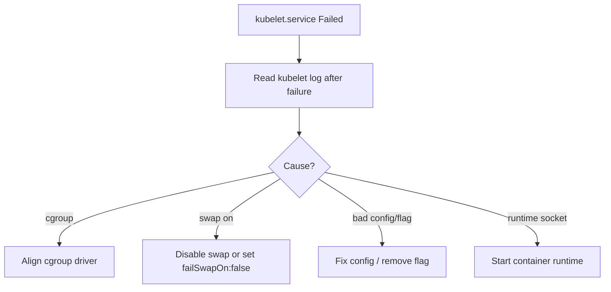

# Kubelet Failed To Start

> **Severity:** Critical · **Typical recovery time:** 10–45 min · **Affected versions:** 1.20+

## Error Message

```text
systemd: kubelet.service: Main process exited, code=exited, status=1/FAILURE
systemd: kubelet.service: Failed with result 'exit-code'.
kubelet: failed to run Kubelet: ...
```

## Description

The kubelet runs as a systemd unit on each node. If it exits non-zero on
startup, systemd reports `Failed with result 'exit-code'` and (depending on
restart policy) crash-loops. A node whose kubelet will not start never becomes
`Ready`: no pods schedule there, and on an existing node the running pods are
eventually evicted by the node controller.

This is a catch-all symptom. The real cause is in the kubelet's own log right
after the systemd failure line — common ones are cgroup driver mismatch, swap
enabled without configuration, an invalid config file/flag, a missing
kubeconfig/CA, or the container runtime socket being unavailable.

## Affected Kubernetes Versions

Applies to 1.20+. Note 1.22+ defaults `cgroupDriver: systemd`; and on 1.28+ the
kubelet fails to start if swap is on unless `failSwapOn: false` /
`NodeSwap` is configured. Deprecated flags removed across releases can also
break startup after upgrades.

## Likely Root Causes

- cgroup driver mismatch between kubelet and runtime
- Swap enabled with `failSwapOn: true` (default)
- Invalid kubelet config file or removed/unknown command-line flag
- Missing kubeconfig, CA, or unreachable container runtime socket

## Diagnostic Flow



## Verification Steps

Read the kubelet log immediately after the systemd failure line to find the
specific startup error.

## kubectl Commands

```bash
kubectl get nodes

# On the node host (read-only):
sudo systemctl status kubelet
sudo journalctl -u kubelet --no-pager -n 100
sudo systemctl status containerd
swapon --show
sudo crictl info
```

## Expected Output

```text
$ sudo systemctl status kubelet
   Active: activating (auto-restart) (Result: exit-code) ...
$ sudo journalctl -u kubelet -n 20
failed to run Kubelet: running with swap on is not supported, please disable swap!
```

## Common Fixes

1. Read the log and fix the specific cause (align cgroup driver, fix/restore
   config file, remove an unknown flag).
2. Disable swap (`swapoff -a` and remove from fstab) or set `failSwapOn: false`
   / enable `NodeSwap` if swap is intended.
3. Ensure the container runtime is running and its socket path matches the
   kubelet's `--container-runtime-endpoint`.

## Recovery Procedures

1. Diagnose from the log before changing anything.
2. Apply the targeted fix (config/flag/swap/runtime).
3. **Restart the kubelet** (`systemctl restart kubelet`) — blast radius:
   node-local control loop; existing containers keep running.
4. If the node remains broken, **drain and reboot** it — blast radius: its pods
   reschedule; verify cluster capacity first.

## Validation

`systemctl is-active kubelet` returns `active`, `kubectl get nodes` shows
`Ready`, and the kubelet log shows a clean startup with no repeated failures.

## Prevention

Pin kubelet config in node images, validate config/flags before upgrades,
disable swap (or configure it deliberately), and alert on kubelet unit restarts.

## Related Errors

- [Kubelet cgroup Driver Mismatch](kubelet-cgroup-driver-mismatch.md)
- [Kubelet Cannot Connect To API Server](kubelet-cannot-connect-apiserver.md)
- [PLEG Is Not Healthy](kubelet-pleg-not-healthy.md)

## References

- [Kubelet configuration](https://kubernetes.io/docs/reference/config-api/kubelet-config.v1beta1/)
- [Swap memory management](https://kubernetes.io/docs/concepts/cluster-administration/swap-memory-management/)

## Further Reading

- [DevOps AI ToolKit — Kubernetes guides](https://devopsaitoolkit.com/blog/)
